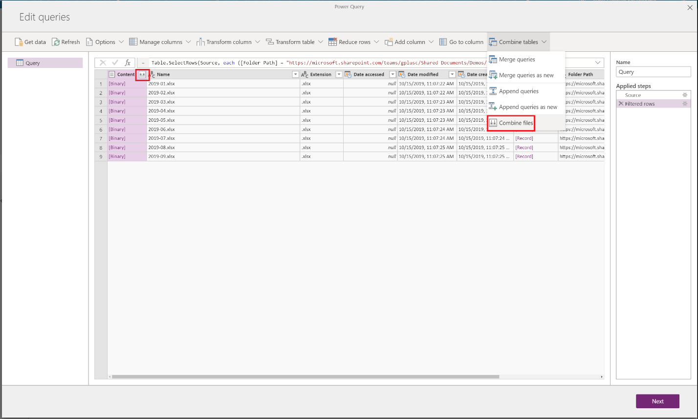
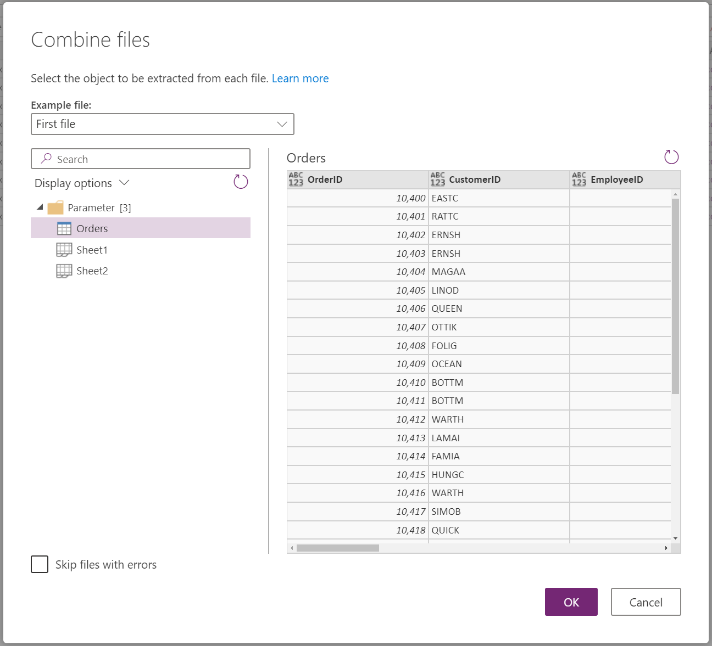
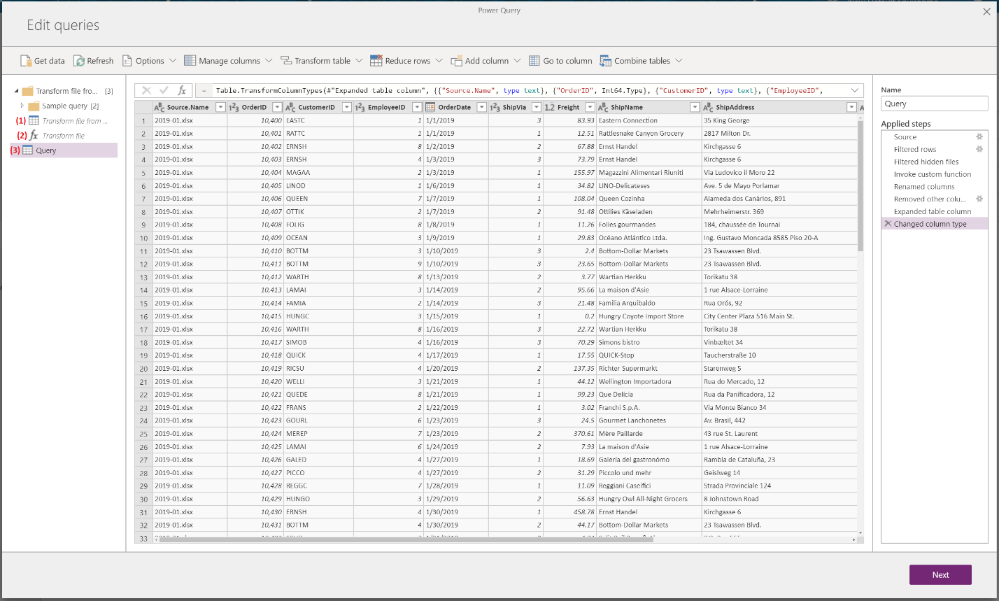

# Combine Files in Power Query

Applies to: Power Query Desktop, Power Query Online

One powerful capability to import data using Power Query is to combine multiple files from a folder, which have the same schema, into a single logical table. 
To start the process of combining files from the same folder, select one of the folder-based connectors (for example, Folder or SharePoint Folder) within Power Query’s **Get Data** dialog.

## Combine files step-by-step experience

Upon specifying the local folder or SharePoint site, you'll be taken into the **Navigator** dialog (in Power Query Desktop) or the **Choose data** screen (in Power Query Online), where you can opt into the “Combine” option.

Alternatively, you can select **Transform Data** to access the Power Query Editor where the list of files can be subset (for example, using filters within the Folder Path or any of the other columns in this table) and then *Combine Files* by selecting the column containing the binaries (for example, Content) and selecting the **Combine Files** button in the Power Query Desktop ribbon (**Home** tab) or the Power Query Online toolbar (under **Combine** menu).

The combine files experience behaves as follows:
* Power Query analyzes each input file, and determines the correct file connector to use in order to open the file contents, such as text, Excel workbook, or JSON file.
* Within the **Combine Files** dialog, Power Query lets you select a specific object from the first file, for example, an Excel worksheet, to extract. 
  * You can also pick a different example file instead of the first file, by using the **Example File** dropdown menu.
  * Optionally, you can exclude files that result in errors from the final output.
  

Power Query then automatically performs the following actions:
1. Creates an exemplar query that performs all the required extraction steps in a single file. It uses the file that was selected as the sample file in the **Combine Files** dialog.
2. Creates a function query that parameterizes the file/binary input to the exemplar query. The exemplar query and the function query are linked, so that changes to the exemplar query are reflected in the function query.
3. Applies the function query to the original query with input binaries (for example, the Folder query) so it applies the function query for binary inputs on each row, then expands the resulting data extraction as top-level columns.
4. Note that in addition to the above queries, a new “Sample query” group is created with two helper queries that reference the sample file used.

Using “Combine Files”, you can easily combine all files within a given folder, as long as they have the same file type and structure (such as the same columns).
In addition, you can easily apply additional transformation or extraction steps by modifying the automatically generated exemplar query, without having to worry about modifying or creating additional function query steps. Any changes to the exemplar query are automatically propagated to the linked function query.

