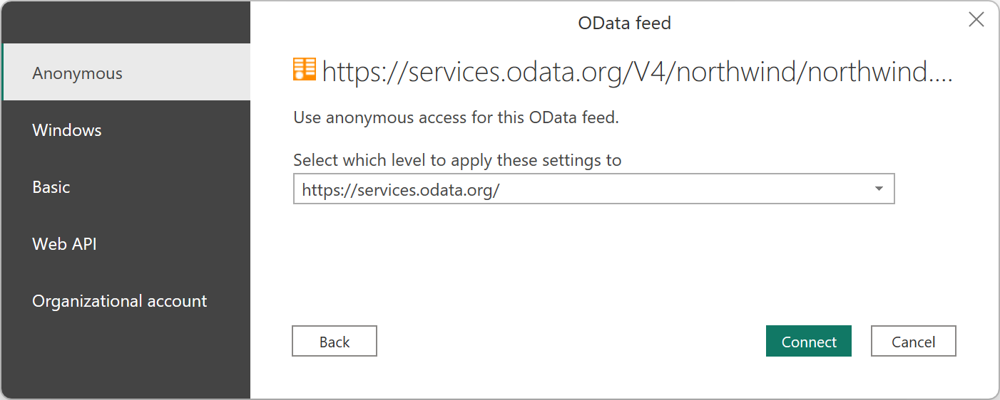
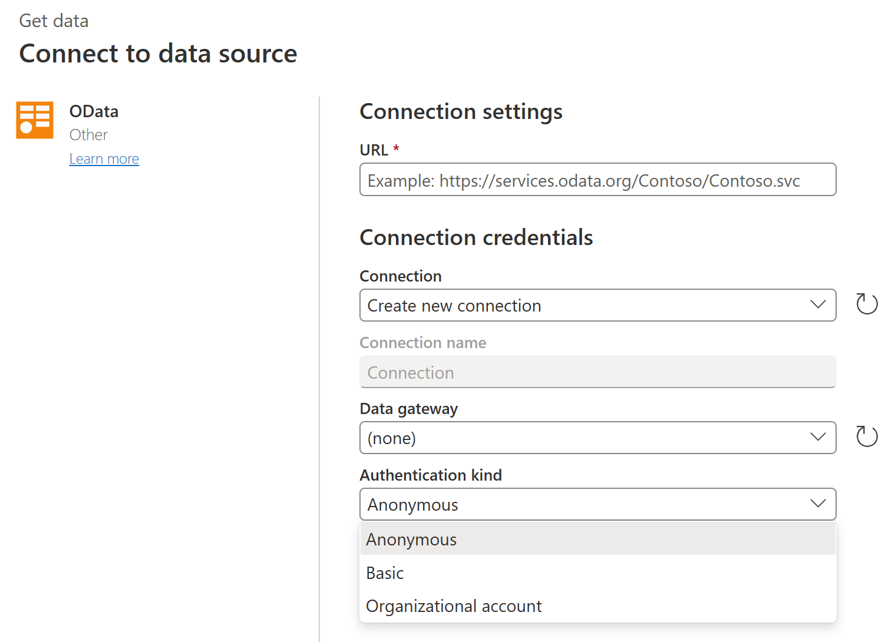
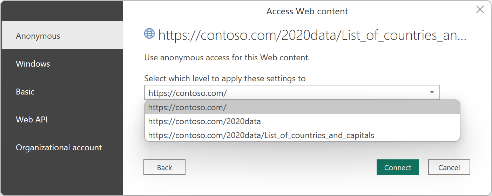
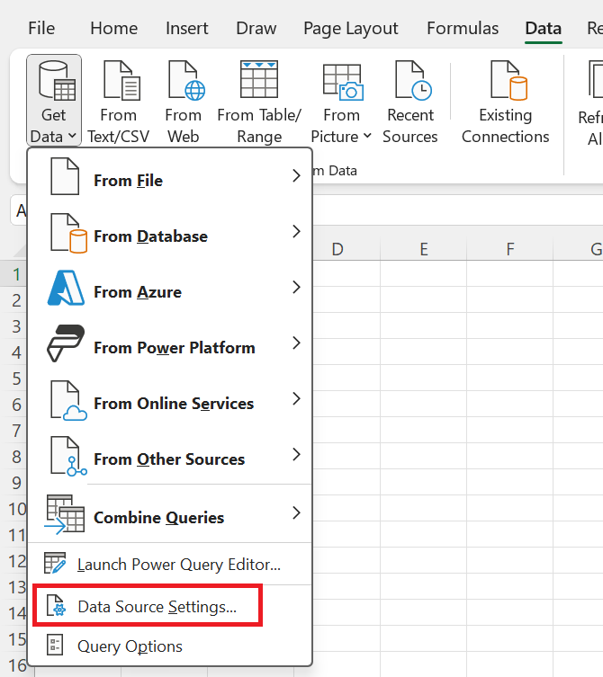

# Authentication with a data source

When you attempt to connect to a data source using a new connector for the first time, you might be asked to select the authentication method to use when accessing the data. After you've selected the authentication method, you won't be asked to select an authentication method for the connector using the specified connection parameters. However, if you need to change the authentication method later, you can do so.

## Select an authentication method

Different connectors show different authentication methods. For example, the OData Feed connector in Power BI Desktop and Excel displays the following authentication method dialog box.

If you're using a connector from an online app, such as the Power BI service or Power Apps, you'll see an authentication method dialog box for the OData Feed connector that looks something like the following image.

As you can see, a different selection of authentication methods is presented from an online app. Also, some connectors might ask you to enter the name of an on-premises data gateway to be able to connect to your data.

## Set the level of the authentication method

In connectors that require you to enter a URL, you'll be asked to select the level to which the authentication method will be applied. For example, if you select the Web connector with a URL of `https://contoso.com/2020data/List_of_countries_and_capitals`, the default level setting for your authentication method will be `https://contoso.com`.

The level you select for the authentication method you chose for this connector determines what part of a URL will have the authentication method applied to it. If you select the top-level web address, the authentication method you select for this connector will be used for that URL address or any subaddress within that address.

However, you might not want to set the top-level address to a specific authentication method because different subaddresses can require different authentication methods. One example might be if you were accessing two separate folders of a single SharePoint site and wanted to use different Microsoft accounts to access each one.

After you've set the authentication method for a connector's specific address, you won't need to select the authentication method for that connector using that URL address or any subaddress again. For example, let's say you select the `https://contoso.com/` address as the level you want the Web connector URL settings to apply to. Whenever you use a [Web connector](connectors/web/web.md) to access any webpage that begins with this address, you won't be required to select the authentication method again.

## Change the authentication method

In some cases, you might need to change the authentication method you use in a connector to access a specific data source.

**To edit the authentication method in Power BI Desktop or Excel**

1. Do one of the following:

    - In Power BI Desktop, on the **File** tab, select **Options and settings** > **Data source settings**.

        

    - In Excel, on the **Data** tab, select **Get Data** > **Data Source Settings**. 

        

2. In the **Data source settings** dialog box, select **Global permissions**, choose the website where you want to change the permission setting, and then select **Edit Permissions**.

3. In the **Edit Permissions** dialog box, under **Credentials**, select **Edit**. 

    

4. Change the credentials to the type required by the website, select **Save**, and then select **OK**.

You can also delete the credentials for a particular website in step 3 by selecting **Clear Permissions** for a selected website, or by selecting **Clear All Permissions** for all of the listed websites.

**To edit the authentication method in online services, such as for dataflows in the Power BI service and Microsoft Power Platform**

1. Select the connector, and then select **Edit connection**.

    

2. Make the required changes, and then select **Next**.
