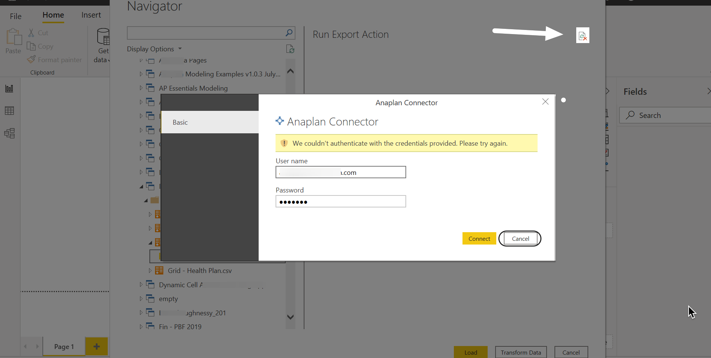
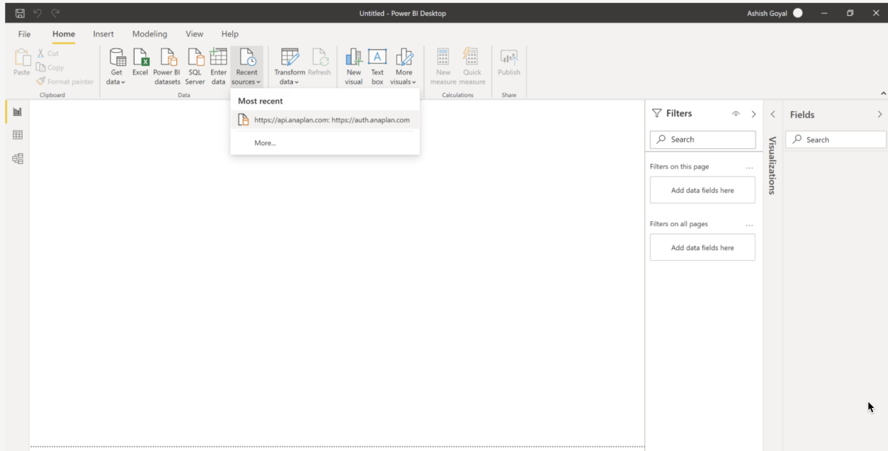
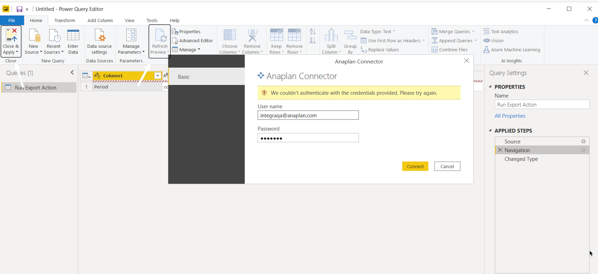
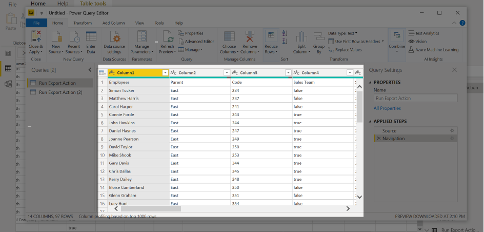

# Anaplan

## Summary

| Item | Description |
| ---- | ----------- |
| Release State | General Availability |
| Products | Power BI (Datasets)|
| Authentication Types Supported | Basic |
| Function Reference Documentation | - |
| | |

## Capabilities supported

The connector runs through Anaplan public data integration APIs and allows you to load all Anaplan models (aside from archived ones) and saved export actions into Power BI.

## Connect to Anaplan from Power Query Desktop

To connect to Anaplan data:

1. Select **Anaplan** from the product-specific data connector list, and then select **Connect**.

2. In the Anaplan Connector Configuration screen, enter the API and Authentication URLs:
  
    - **Anaplan API URL**:  https://api.anaplan.com

    - **Anaplan Auth URL**: https://auth.anaplan.com

    

    After you've entered the API and Auth URL, select **Ok**.

3. Sign in to the connector to verify your access to an Anaplan workspace. 
  
    
  
    Once you've succeeded, select **Connect**.

## Run an export action

The Anaplan connector leverages export actions to download data from your Anaplan model. First, ensure that you have an export action set.

When you run an export action:

-   Only exports that output .csv and .txt files are supported.
-   With every export action run, you need to wait ten minutes to repeat the same export action. The time is calculated from one export run completion until the next export run begins. The 10 minute wait does not apply to different exports.
-   If you don't see the export action in the Power BI connector, check your role and the export actions in your model.

To run an export action, use the **Navigator** dialog to locate your export.

1.  Search your Anaplan models to find and set your export. You can also locate for your model name via the search field.

2.  Check the box next to **ƒx Run Export Action** to select your export.
    *   When you select the **ƒx Run Export Action**, this does not trigger the export run. Instead this selection downloads the last version of the exported Anaplan data for preview.
    *   A preview displays in the right panel. If the Anaplan export is set to **Admins only**, model users may see a blank preview, but the export will run as normal. 
    *   You'll see the preview the next time you set an integration with same export. 

3.  Select **Load** to trigger the export run. The **Load** dialog displays and your data loads.  

## Troubleshooting

If you get a connector related error message, first, try refreshing.

### Credential error in the Navigator

Do one of the following:
-   Clear cache within Power BI (**File**, **Options**, **Clear cache)** and restart the connector, or
-   Select **Cancel** and select **Refresh** (top right).

    

If you still receive a credential error after you clear cache, also clear your recent sources. 

1. Select **Recent sources**

    

1. Select **Remove from list**

    

1. Establish the connection to the export again, and your data refreshes.

### Credential error in the Power Query editor

If you encounter a credential error in the Power Query editor, select **Close & Apply** or **Refresh Preview** to refresh the data. 

Your data will refresh, resolving the error. 

### Power Query expression error

If you encounter a Power Query expression error, select **Refresh Preview** to refresh the data. 

Your data will refresh, resolving the error.

