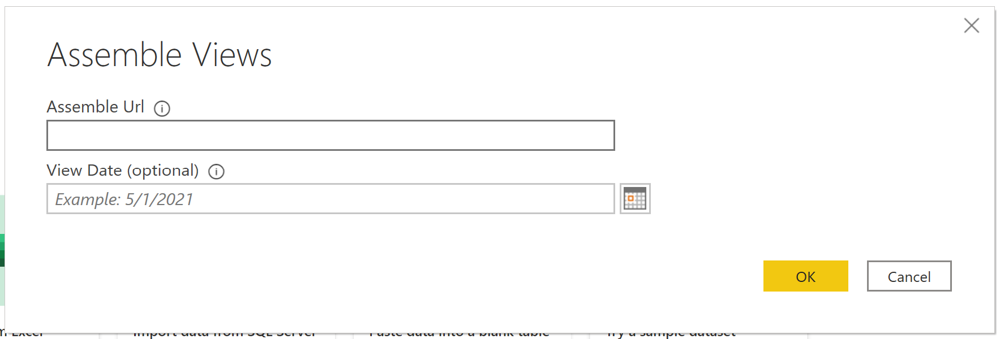
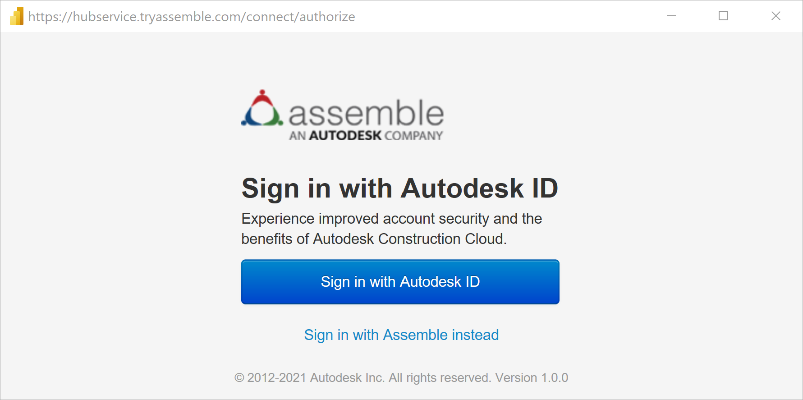
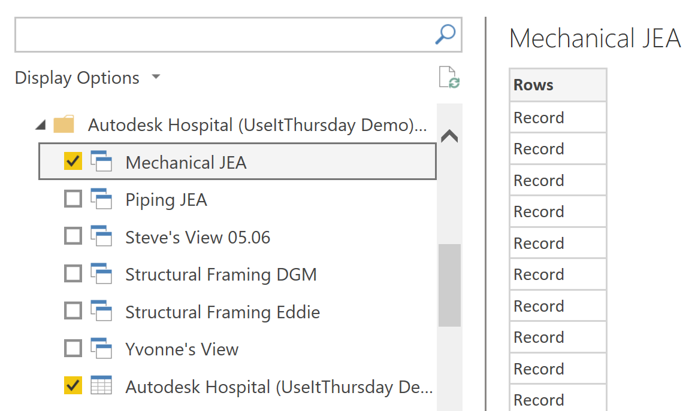
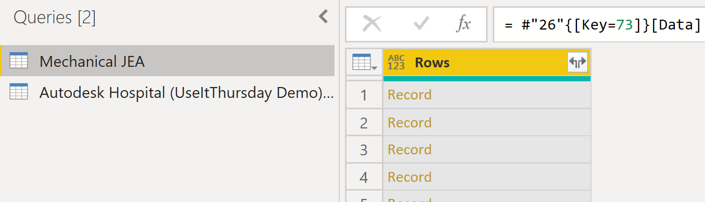
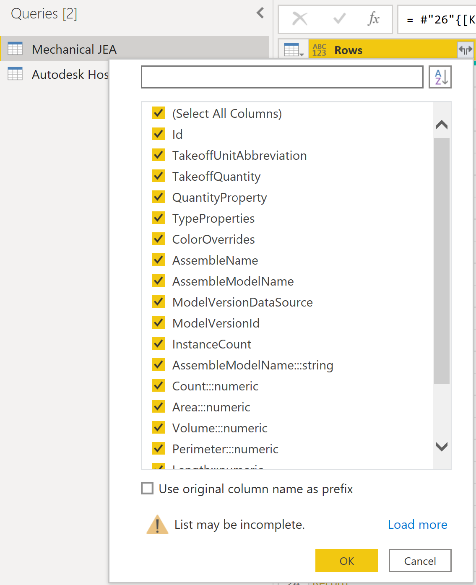
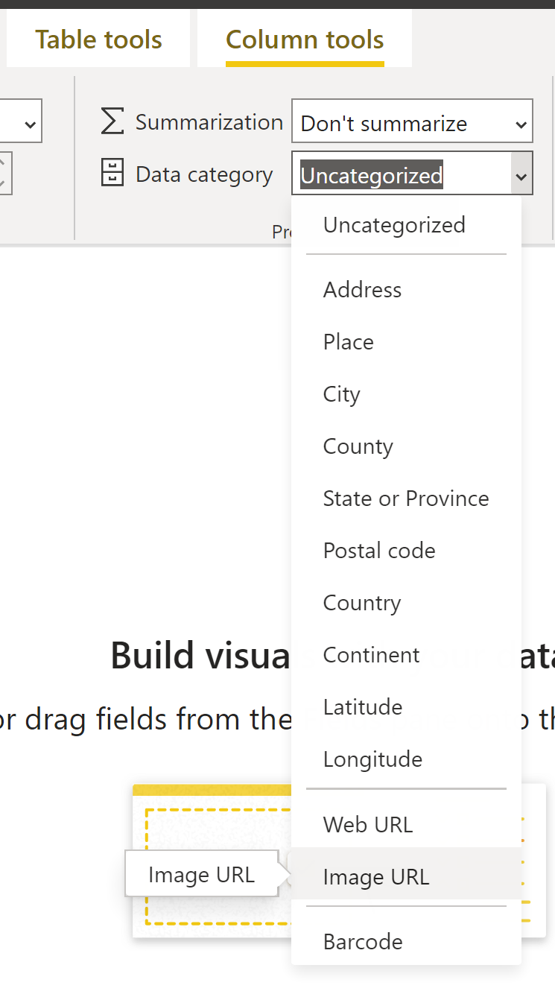

# Assemble Views
 
## Summary

| Item | Description |
| ---- | ----------- |
| Release State | General Availability |
| Products | Power BI (Datasets) Power BI (Dataflows) Power Apps (Dataflows) Excel Dynamics 365 Customer Insights Analysis Services |
| Authentication Types Supported | Autodesk Account |
| Function Reference Documentation | AssembleViews.Contents |

>[!Note]
> Some capabilities may be present in one product but not others due to deployment schedules and host-specific capabilities.

 
## Prerequisites

To use the Assemble Views connector, you must have an Autodesk account username and password and be a member of at least one project in Assemble.

You will also need at least one view associated with the Assemble project.

## Capabilities Supported

* Ability to import data from existing views
   * Optional date parameter **View Date** to import data from a specific point in time
* Import view images

## Connect to Assemble Views from Power Query Desktop

To connect to Assemble data:

1. Select **Assemble Views** from the Online Services data connector list, and then select **Connect**.

2. In **Assemble Views**, enter your sites URL (https://example.tryassemble.com) to sign in.

   a. (Optional) Select a date for the point in time you want to load the data. Leaving this blank will result in the latest data being pulled each time you refresh.
   
   

   b. Once you've entered the URL, select **OK** to continue.

3. Select **Sign in** to sign in to your Autodesk account.

   

   a. Once you've successfully signed in, select **Connect**.

4. In the **Navigator** dialog box, select the Assemble Views you want to load. For each project there is a single item for view images named **"<Your Project> View Thumbnails"**. Select this item if you wish to include images in your report. Select **Transform Data** to transform the data.

   

5. Within the transform window you will see a single column named **Rows**. On the header of the column click the button with two arrows pointing in opposite directions to expand your rows.

   

   a. Uncheck **Use original column name as prefix** and click **OK**. Do this for each view data query you have selected.

   

   b. Click **Close & Apply** to load the few datasets.

6. (Optional) If you have chosen to load images you will need to update the **Data category** for the image field by expanding the **"<Your Project> View Thumbnails"** table and selecting the **Image** field.
   
   a. This should have opened the **Column tools** tab. From here open the **Data category** drop down and select **Image URL**. You can now drag and drop the Image field into your report visuals. 

   

## Known issues and limitations

* Views with greater than 100,000 rows may fail to load depending on the number of fields included in the view. To avoid this limitation we suggest breaking large views into multiple views and either appending the queries within your report or creating relationships in your data model. 

* View images currently only supports thumbnail sized images due to a row size limitation in Power BI.

## Troubleshooting
