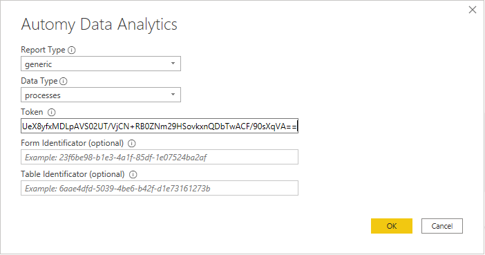
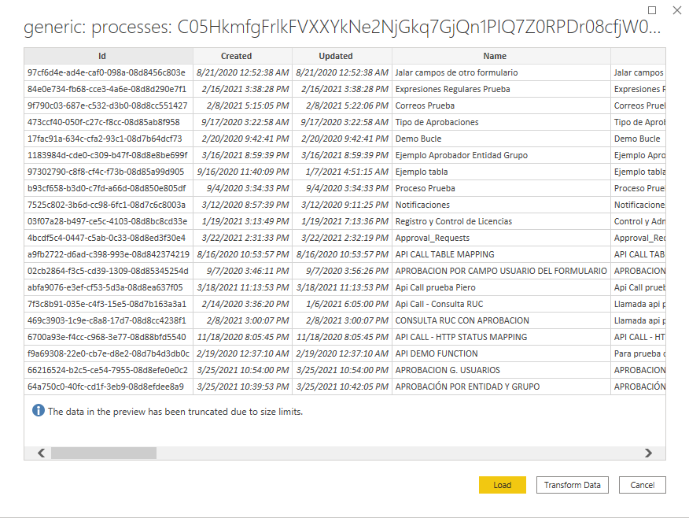

# Automy Data Analytics
 
## Summary

| Item | Description |
| ---- | ----------- |
| Release State | General Availability |
| Products | Power BI Desktop |
| Authentication Types Supported | Automy Report Token |
| | |
## Prerequisites
Before you can sign in to Automy Data Analytics, you must have an Automy Token Report.

 
## Capabilities Supported
* Import

## Connect to Automy Data Analytics data

To connect to Automy Data Analytics data:

1. Select **Get Data** from the **Home** ribbon in Power BI Desktop. Select **Online Services** from the categories on the left, select **Automy Data Analytics**, and then select **Connect**.

   

2. If this is the first time you're getting data through the Automy Data Analytics connector, a third-party notice will be displayed. Select **Don't warn me again with this connector** if you don't want this message to be displayed again, and then select **Continue**.

3. In the Automy Data Analytics window that appears, select the correct parameters to prepared the connection. Select the type of report and data type and completed the token information, following the chart below;and then select **Ok**.

> [!NOTE]
> You can generate an authentication token for reports using the configuration option in Automy.

| Report Type | Data Type | Token  (Is required) | Form Identificator (Is required) | Table Identificator (Is required) |
|-|-|-|-|-|
| generic | environments | Yes | No | No |
| generic | processes | Yes | No | No |
| generic | process-groups | Yes | No | No |
| generic | users | Yes | No | No |
| generic | user-groups | Yes | No | No |
| generic | positions | Yes | No | No |
| generic | entities | Yes | No | No |
| generic, process | requests | Yes | No | No |
| generic, process | action-instances | Yes | No | No |
| generic, process | user-instances | Yes | No | No |
| generic, process | form-instances | Yes | No | No |
| generic, process | form-instance-fields | Yes | No | No |
| generic, process | forms | Yes | No | No |
| generic, process | field-groups | Yes | No | No |
| generic, process | fields | Yes | No | No |
| generic | entity-data | Yes | No | No |
| process | form-data | Yes | Yes | No |
| process | form-table-data | Yes | Yes | No |
| process | execution-steps | Yes | No | No |
| process | instance-approvers | Yes | No | No |

4. You can **Load** the selected table, which brings the entire table into Power BI Desktop, or you can select **Transform Data** to edit the query, which opens Power Query Editor. You can then filter and refine the set of data you want to use, and then load that refined set of data into Power BI Desktop.

## Limitations and issues

You should be aware of the following limitations and issues associated with accessing Automy Data Analytics data.

* Automy Data Analytics has a built-in limit of 2 MM rows returned per Database connection. 

* The default rate limit for an Automy Data Analytics Company is 600 requests per minute per user.

Import from Automy Data Analytics will stop and display an error message whenever the Automy Data Analytics connector hits any of the limits listed above.

For additional guidelines on accessing Automy Data Analytics, contact support@automy.global