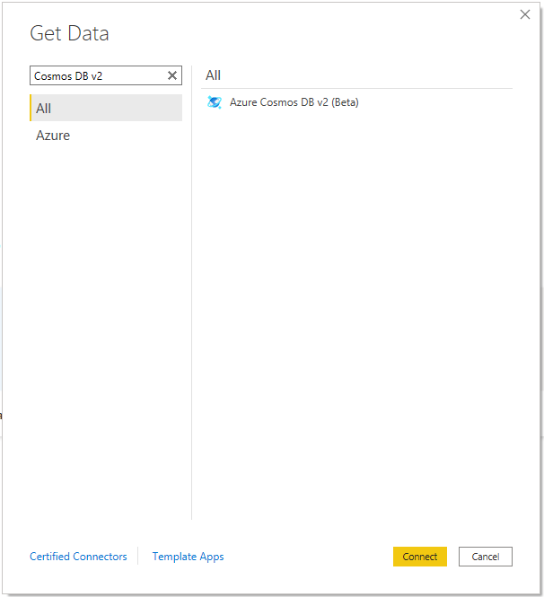
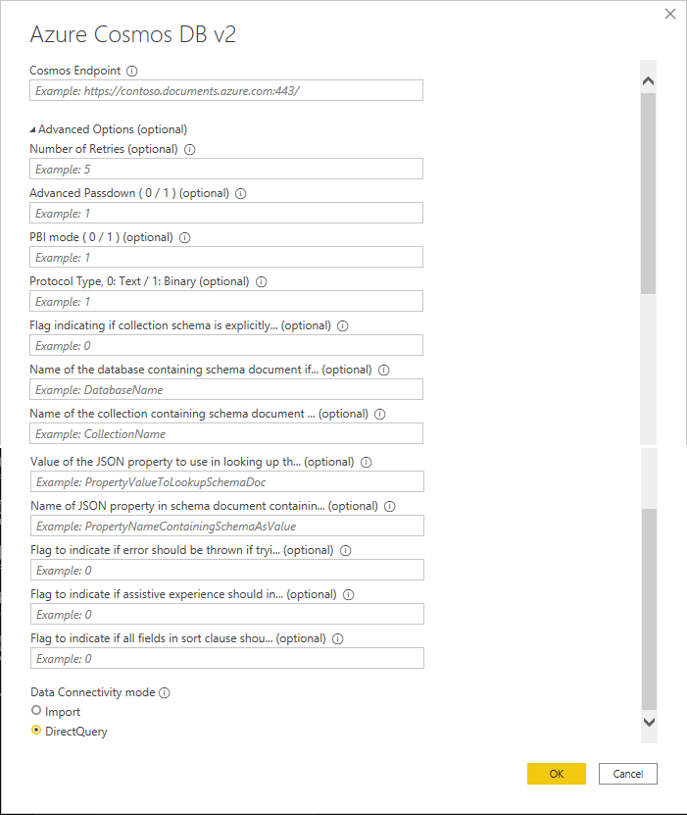
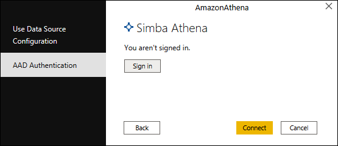
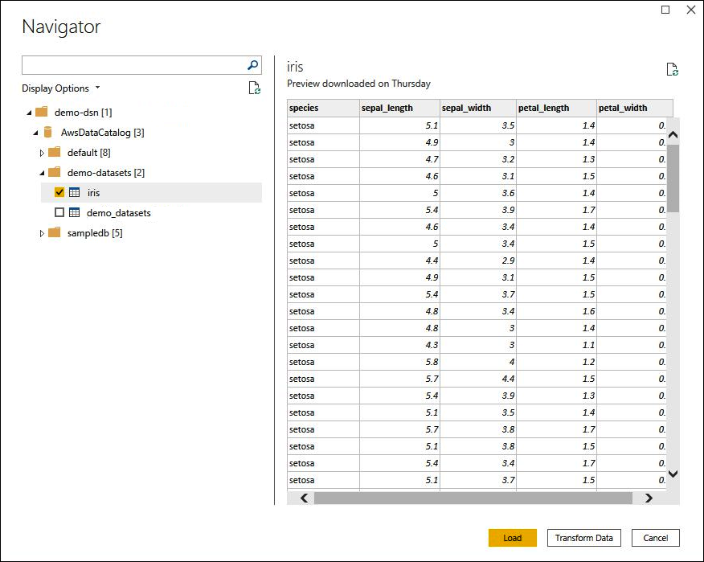
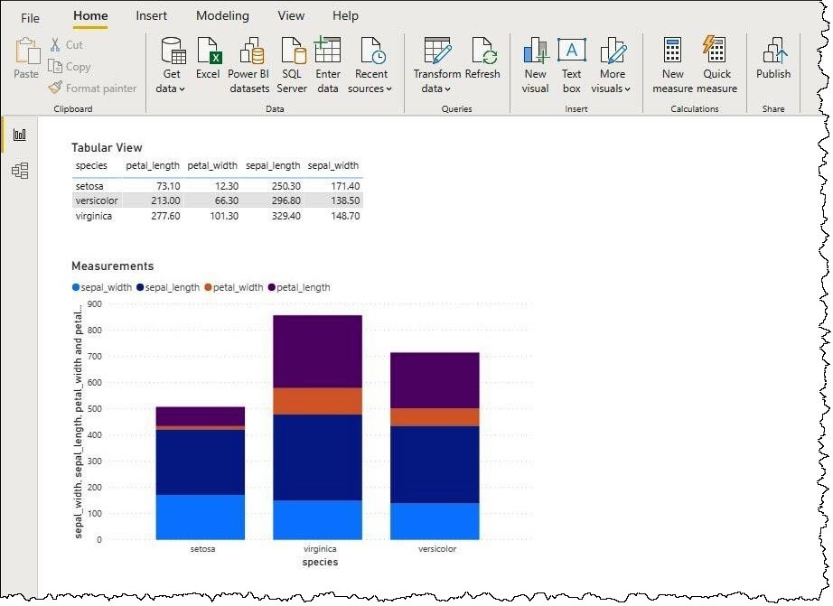

# Azure Cosmos DB v2

## Summary

| Item | Description |
| ---- | ----------- |
| Release State | General Availability |
| Products | Power BI (Datasets) |
| Authentication Types Supported | DSN configuration
  Organizational account |
| | |

## Prerequisites

* An [Azure Cosmos DB](https://azure.microsoft.com/en-us/services/cosmos-db/#overview) account

## Capabilities supported

* Import
* DirectQuery

## Connect to Azure Cosmos DB

To connect to Azure Cosmos DB data:

1. Launch Power BI Desktop.

2. In the **Home** tab, select **Get Data**.

3. In the search box, enter **Cosmos DB v2**.

4. Select **Azure Cosmos DB v2**, and then select **Connect**.

    

5. On the **Azure Cosmos DB v2** connection page, enter the following information:

    * For **Cosmos Endpoint**, enter the URI of the ODBC DSN that you want to use. For instructions on configuring your DSN, go to the [ODBC driver documentation](https://docs.microsoft.com/en-us/azure/cosmos-db/sql/odbc-driver).
    * For **Data Connectivity mode**, choose a mode that's appropriate for your use case, following these general guidelines:
        * For smaller datasets, choose **Import**. When using import mode, Power BI works with Cosmos DB to import the contents of the entire dataset for use in your visualizations.
        * For larger datasets, choose **DirectQuery**. In DirectQuery mode, no data is downloaded to your workstation. While you create or interact with a visualization, Microsoft Power BI works with Athena to dynamically query the underlying data source so that you're always viewing current data. More information: [Use DirectQuery in Power BI Desktop](/power-bi/connect-data/desktop-use-directquery)
    * Customizing Default Options:
        * Number of Retries (NumberOfRetries / NUMBER_OF_RETRIES)
            How many times to retry in case of HTTP Return Codes of
                408 - Request Timeout
                412 - Precondition Failed
                429 - Too Many Requests
        * Advanced Passdown (0 / 1) (DoPassdowns / ADVANCED_PASSDOWN)
            Attempt to Passdown whenever possible
        * PBI mode (0 / 1) (IsPBIContext / PBI_MODE)
            The ODBC Driver’s behavior is tailored towards the PBI flow support
        * Protocol Type, 0: Text / 1: Binary (PROTOCOL)
            The format of the Data exchanged with Cosmos DB (Text or Binary)
        * Schema in a Document
            Flag indicating if collection schema is explicitly stated as a document (SCHEMA_IN_COLLECTION)
            * Name of the database containing schema document if explicitly specified (DB_WITH_SCHEMA)
            * Name of the collection containing schema document if explicitly specified (COLL_WITH_SCHEMA)
            * Name of JSON property to use in looking up the schema document (KC)
            * Value of the JSON property to use in looking up the schema document (KV)
            * Name of JSON property in schema document containing the collection schema (SC)
        * Flag to indicate if error should be thrown if trying to sort more columns than composite index limit (TreatFullSortingMissesAsErrors / TREAT_FULL_SORTING_MISSES_AS_ERRORS)
            Detect whether the target collection has a Composite Index matching the Sorted Sequence of Columns
        * Flag to indicate if assistive experience should interject if optimal composite indices are not defined for Sort Passdown (use in development phase) (IsReportDeveloperModeOn / REPORT_DEVELOPER_MODE_ON)
            When detecting an error at the above 6., prompt whether the JSON of the Composite Index definition will be copied into the clipboard ( which could be pasted into the composite index definition in the Cosmos DB Portal );
        * Flag to indicate if all fields in sort clause should be passed down, otherwise only the field sorted on in PBI report or first field specified in M will be passed down as an optimization (FULL_SORTING_ON)
        * Rest API Version, possible values 2015-12-16, 2018-12-31 (RestApiVersion / )

    

6. Select **OK**.

7. At the prompt to configure data source authentication, select either **Use Data Source Configuration** or **AAD Authentication**. Enter any required sign-in information. Then select **Connect**.

    

    Your data catalog, databases, and tables appear in the **Navigator** dialog box.

    

8. In the **Display Options** pane, select the check box for the dataset that you want to use.

9. If you want to transform the dataset before you import it, go to the bottom of the dialog box and select **Transform Data**. This selection opens the Power Query Editor so that you can filter and refine the set of data you want to use.

10. Otherwise, select **Load**. After the load is complete, you can create visualizations like the one in the following image. If you selected **DirectQuery**, Power BI issues a query to Athena for the visualization that you requested.

    

## Limitations and issues

You should be aware of the following limitations and issues associated with accessing Azure Cosmos DB v2 data.
