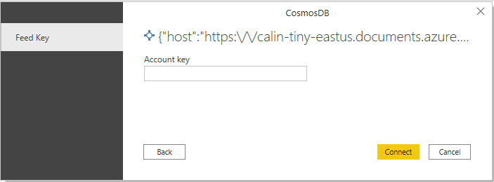
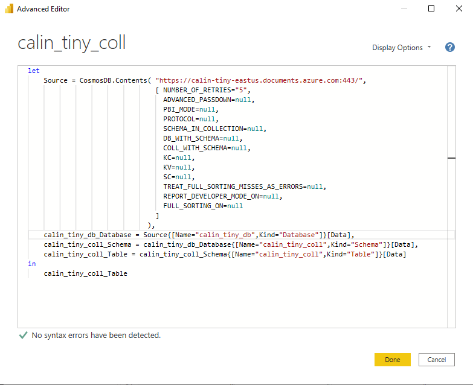

# Azure Cosmos DB v2 (Beta)

## Summary

| Item | Description |
| ---- | ----------- |
| Release State | General Availability |
| Products | Power BI (Datasets) |
| Authentication Types Supported | DSN configuration Organizational account |
| | |

>[!Note]
>The Azure Cosmos DB V2 connector release has been delayed. We recommend continuing to use the Azure Cosmos DB V1 connector. 

## Prerequisites

* An [Azure Cosmos DB](https://azure.microsoft.com/services/cosmos-db/#overview) account

## Capabilities supported

* Import
* DirectQuery

## Connect to Azure Cosmos DB

To connect to Azure Cosmos DB data:

1. Launch Power BI Desktop.

2. In the **Home** tab, select **Get Data**.

3. In the search box, enter **Cosmos DB v2**.

4. Select **Azure Cosmos DB v2**, and then select **Connect**.

    

5. On the **Azure Cosmos DB v2** connection page, for **Cosmos Endpoint**, enter the URI of the Azure Cosmos DB account that you want to use. For **Data Connectivity mode**, choose a mode that's appropriate for your use case, following these general guidelines:

   * For smaller datasets, choose **Import**. When using import mode, Power BI works with Cosmos DB to import the contents of the entire dataset for use in your visualizations.

      >[!Note]
      >For **Import** mode to be setup properly, you need to have both the **Advanced Passdown** and **PBI Mode** advanced options set to **0**. More information: [Connect using advanced options](#connect-using-advanced-options)

   * For larger datasets, choose **DirectQuery**. In DirectQuery mode, no data is downloaded to your workstation. While you create or interact with a visualization, Microsoft Power BI works with Cosmos DB to dynamically query the underlying data source so that you're always viewing current data. More information: [Use DirectQuery in Power BI Desktop](/power-bi/connect-data/desktop-use-directquery)

      >[!Note]
      >For **DirectQuery** mode to be setup properly, you need to have both the **Advanced Passdown** and **PBI Mode** advanced options set to **1**. More information: [Connect using advanced options](#connect-using-advanced-options)

   
6. Select **OK**.

7. At the prompt to configure data source authentication, enter the Account Key. Then select **Connect**.

    

    Your data catalog, databases, and tables appear in the **Navigator** dialog box.

    

8. In the **Display Options** pane, select the check box for the dataset that you want to use.

9. If you want to transform the dataset before you import it, go to the bottom of the dialog box and select **Transform Data**. This selection opens the Power Query editor so that you can filter and refine the set of data you want to use. Also, you could fine-tune the connector options by modifying the passed arguments.

   

10. Otherwise, select **Load**. After the load is complete, you can create visualizations. If you selected **DirectQuery**, Power BI issues a query to Cosmos DB for the visualization that you requested.

## Connect using advanced options

Power Query Desktop provides a set of advanced options that you can add to your query if needed.

The following table lists all of the advanced options you can set in Power Query Desktop.

| Advanced option | Description |
| --------------- | ----------- |
| Number of Retries | How many times to retry if there are HTTP return codes of `408 - Request Timeout`, `412 - Precondition Failed`, or `429 - Too Many Requests`. The default number of retries is 5. |
| Advanced Passdown | Attempt to pass down whenever possible. Set to 0 for false or 1 for true. The default value is 1. |
| PBI mode | Indicates whether the ODBC Driver's behavior is tailored towards the PBI flow support. Set to 0 for false or 1 for true. The default value is 1. |
| Protocol Type | The format of the data exchanged with Cosmos DB. Set to 0 for text or 1 for binary data. The default value is 1. |
| Flag indicating if collection schema is explicitly stated as a document | More information: [Schema in a document](#schema-in-a-document) |
| Name of the database containing schema document if explicitly specified | More information: [Schema in a document](#schema-in-a-document) |
| Name of the collection containing schema document if explicitly specified | More information: [Schema in a document](#schema-in-a-document) |
| Name of JSON property to use in looking up the schema document | More information: [Schema in a document](#schema-in-a-document) |
| Value of the JSON property to use in looking up the schema document | More information: [Schema in a document](#schema-in-a-document) |
| Name of JSON property in schema document containing the collection schema | More information: [Schema in a document](#schema-in-a-document) |
| Flag to indicate if error should be thrown if trying to sort more columns than composite index limit | Detects whether the target collection has a Composite Index matching the Sorted Sequence of Columns. Default value is 1 (true). |
| Flag to indicate if assistive experience should interject if optimal composite indices aren't defined for Sort Passdown | When detecting an error in the six [Schema in a document](#schema-in-a-document) options, prompt whether the JSON of the Composite Index definition will be copied into the clipboard. The contents of the clipboard could then be pasted in the composite index definition in the Cosmos DB Portal. Use this option in the development phase. Default value is 0 (false). |
| Flag to indicate if all fields in sort clause should be passed down | Indicates if all fields in the sort clause should be passed down. Otherwise, only the field sorted on in a Power BI report or the first field specified in M will be passed down as an optimization. Sorting depends on the composite indexes defined for the collection. Currently the Cosmos DB containers have a maximum of eight composite indexes that can be defined. Default value is 0 (false). |
| Rest API Version | Sets the REST API version to use. Possible values are `2015-12-16` or `2018-12-31`. The default value is `2018-12-31`. This value can only be set in an advanced query.|
| | |

## Schema in a document

Flag indicating if collection schema is explicitly stated as a document (default 0, that is, no schema as document)

* Name of the database containing schema document if explicitly specified
* Name of the collection containing schema document if explicitly specified
* Name of JSON property to use in looking up the schema document
* Value of the JSON property to use in looking up the schema document
* Name of JSON property in schema document containing the collection schema

## Instructions, limitations, and known issues

You should be aware of the following instructions, limitations, and known issues associated with accessing the current version of Azure Cosmos DB v2 data.

### Instructions

* When using this connector in import mode, set both **Advanced Passdown** and **PBI Mode** to **0** (ADVANCED_PASSDOWN="0", PBI_MODE="0").
* Don't publish reports on Power BI service that have the Report Developer Mode enabled (REPORT_DEVELOPER_MODE_ON="1").
* Use the following best practices when working with new large collections in DirectQuery mode:
  * Temporarily enable the Report Developer Mode (`REPORT_DEVELOPER_MODE_ON="1"`). Enabling this mode allows the discovery of the Data Layout by loading a very small dataset from Cosmos DB.
  * Once the collection is prepared with the necessary Composite Indexes and the useful Data Engineering aspects related to the Data Shapes are determined, you can switch back to the Regular Mode (`REPORT_DEVELOPER_MODE_ON="0"`) and start the Data Engineering activities targeting the Datasets in their entirety.

### Limitations

* Reports must be filtered on Partition Keys defined on the underlying Cosmos DB Container.
* If you need to sort on more than one column (`FULL_SORTING_ON="1"`), you need to consider that the sorting will be delegated to Cosmos DB, which doesn't sort on fields that aren't part of Composite Indexes.
* To assist with the creation of the necessary Composite Indexes, while designing the report in PBI Desktop, the Report Developer Mode needs to be enabled (`REPORT_DEVELOPER_MODE_ON="1"`), which will prompt to Copy to Clipboard the JSON text that could be pasted in the Cosmos DB Portal when specifying the Cosmos DB Collection Composite Index.

### Known issues in DirectQuery mode

* Reports with more than eight columns won't work in DirectQuery mode.
* Aggregate functions aren't passed down. The effect is that SQL expressions Passing Down COUNT, SUM, and so on, will fail and not display a number.
