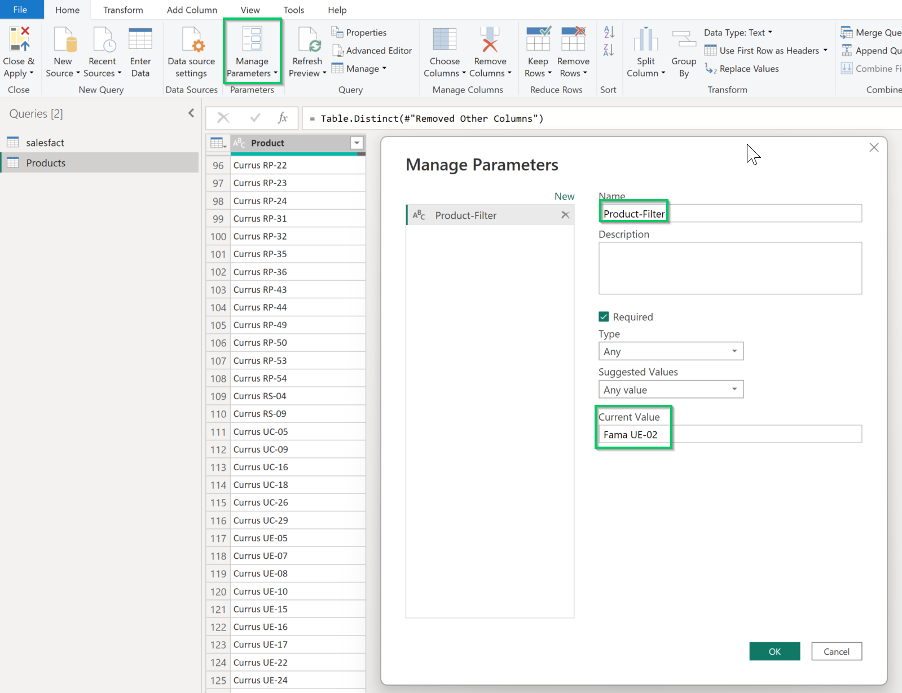
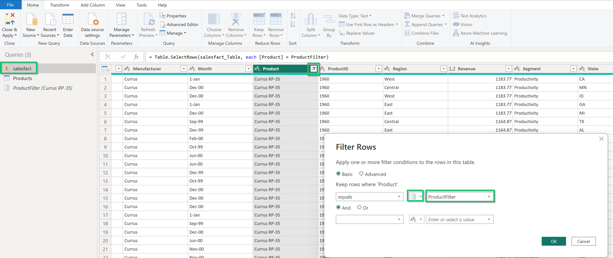
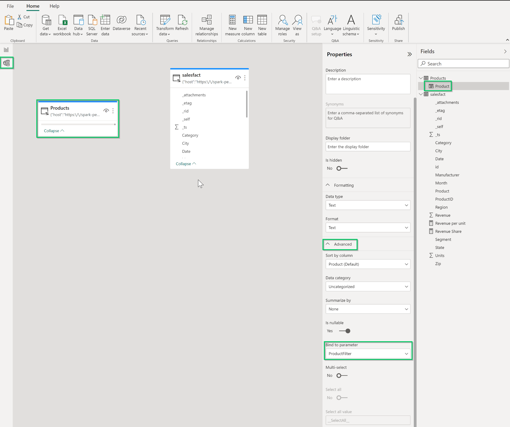

# Azure Cosmos DB v2 (Beta)

## Summary

| Item | Description |
| ---- | ----------- |
| Release State | Beta |
| Products | Datasets and Dataflows (Power BI) |
| Authentication Types Supported | Feed Key |
| | |

## Prerequisites

* An [Azure Cosmos DB](https://azure.microsoft.com/services/cosmos-db/#overview) account

## Capabilities supported

* Import
* DirectQuery

## Connect to Azure Cosmos DB

To connect to Azure Cosmos DB data:

1. Launch Power BI Desktop.

2. In the **Home** tab, select **Get Data**.

3. In the search box, enter **Cosmos DB v2**.

4. Select **Azure Cosmos DB v2 (Beta)**, and then select **Connect**.

    

5. On the **Azure Cosmos DB v2** connection page, for **Cosmos Endpoint**, enter the URI of the Azure Cosmos DB account that you want to use. For **Data Connectivity mode**, choose a mode that's appropriate for your use case, following these general guidelines:

   * For smaller datasets, choose **Import**. When using import mode, Power BI works with Cosmos DB to import the contents of the entire dataset for use in your visualizations.

   * The **DirectQuery** mode will enable **query pushdown** to Cosmos DB container for execution and improves the performance of the connector. For partitioned Cosmos DB containers, **a SQL query with an aggregate function is passed down to Cosmos DB if the query also contains a filter (WHERE clause) on the Partition Key**. For example, if the partition key is defined to be "Product", then a SQL query that can be passed down and be executed on Cosmos DB server can be: 

      SELECT SUM(ColumnName) FROM TableName where Product = 'SampleValue'.

      Note: Use [Azure Synapse Link for Azure Cosmos DB](https://learn.microsoft.com/en-us/azure/cosmos-db/nosql/powerbi-visualize#building-bi-reports-using-azure-synapse-link) if you would like to execute cross-partitioned aggregate functions against the Cosmos DB container.
      
      More information: 

      * [Dataset modes in the Power BI service](https://learn.microsoft.com/en-us/power-bi/connect-data/service-dataset-modes-understand)

      * [Use DirectQuery in Power BI Desktop](/power-bi/connect-data/desktop-use-directquery)

   

6. At the prompt to configure data source authentication, enter the Account Key. Then select **Connect**. Your data catalog, databases, and tables appear in the **Navigator** dialog box. In the **Display Options** pane, select the check box for the dataset that you want to use.

    

8. The most optimal way to specify Partition Key filter (so that the aggregate functions can be pushed down to Cosmos DB) is to use **[dynamic M Parameters](https://learn.microsoft.com/en-us/power-bi/connect-data/desktop-dynamic-m-query-parameters)**. To use dynamic M Parameters, you would **create a dataset with unique Partition Key values**, **create a Parameter**, **add it as filter on main dataset**, **bind it to the unique Partition key datset** and **use it as a Slicer for the main dataset**. Please follow the below steps to enable dynamic M Parameters for Partition Key filtering.

   **a. Create a dataset with unique partition key values**:

      Click **Transform Data** instead of clicking "Load" on the previous Navigator tab to bring up the Power Query Editor. Right click on the Queries dataset and click **Duplicate** to create new dataset. 

   

   
   Rename the new Partition Key dataset, right click on the Cosmos DB Partition Key column ("Product" is the Cosmos DB Partition Key column in this example), click **Remove Other Columns** and then click **Remove Duplicates**.

   
   

   
   **b. Create a Parameter for dynamic filtering**:

   Click on **Manage Parameters** in Power Query editor -> **New Parameter** -> Rename to reflect the filter parameter and input a valid value as **Current Value**.

   

   **c. Apply parameterised filter on main dataset**:

   Click on dropdown icon of Partition Key column -> **Text Filters** -> **Equals** -> **Change Filter type from Text to Parameter** -> Choose the parameter that was created in the above step b. Click on **Close & Apply** on top left corner of Power Query editor.

   

   **d. Create Partition Key values Slicer with Parameter binding**:

   Click on the **Model** tab -> Click on the Partition Key field -> Properties -> Advanced -> **Bind to parameter** -> Choose the parameter that was created in the above step b.

   

   Click on "Report" tab and add a Slicer with the unique Partition Key

   

   **e. Add visualizations and apply Partition Key filter from the Slicer**:

   Since the chosen partition key value on the slicer is bound to the parameter (as done in step d above) and the parameterised filter is applied on the main dataset (as done in step c above), the chosen partition key value will be applied as a filter on the main dataset and the query with the partition key filter will be passed down to Cosmos DB,  in all visualizations.
   

## Advanced options

Power BI Desktop provides a set of advanced options that you can add to your query if needed.

The following table lists all of the advanced options you can set in Power Query Desktop.

| Advanced option | Description |
| --------------- | ----------- |
| Number of Retries | How many times to retry if there are HTTP return codes of `408 - Request Timeout`, `412 - Precondition Failed`, or `429 - Too Many Requests`. The default number of retries is 5. |
| Enable AVERAGE function Passdown | Specifies whether the connector allows pass-down of the AVG aggregate function to the Cosmos DB. The default value is 1 and the connector attempts to pass-down the AVG aggregate function down to Cosmos DB, by default. If the argument contains string, boolean, or null values for the AVG aggregate function, an undefined result set is returned by the Cosmos DB server. When set to value of 0, the AVG aggregate function is not passed down to the Cosmos DB server and the connector handles performing the AVG aggregation operation itself.|
| Enable SORT Passdown for multiple columns | Specifies whether the connector allows multiple columns to be passed down to Cosmos DB when specified in the ORDER BY clause of the SQL query. The default value is 0 and If more than one column is specified in the ORDER BY clause, the connector does not pass-down the columns by default and instead handles performing the order by itself. When set to value of 1, the connector attempts to pass-down multiple columns to Cosmos DB when specified in the ORDER BY clause of the SQL query. To allow multiple columns to be passed down to Cosmos DB, make sure to have composite indexes set on the columns in the respective collections. Please note that for partitioned collections, a SQL Query with Order By will be passed down to Cosmos DB only if the query contains a filter on the partitioned key. Also, if there are more than 8 columns specified in the ORDER BY clause, the connector does not passdown the ORDER BY clause and instead handles the ordering execution itself.|
| | |

## Known issues and limitations

1. For partitioned Cosmos DB containers, **a SQL query with an aggregate function is passed down to Cosmos DB if the query also contains a filter (WHERE clause) on the Partition Key**. If the aggregate query does not contain a filter on Partition Key, the aggregation is performd by the connector

2. The connector does not passdown an aggregate function if it is called upon after TOP or LIMIT is applied. Cosmso DB processes the TOP operation at the end
when processing a query. For example, in the below query, TOP is applied in the sub-query, while the aggregate function is applied on top of that result set:

   SELECT COUNT(1) FROM (SELECT TOP 4 * FROM EMP) E.

3. If DISTINCT is provided in an aggregate function, the connector does not pass the aggregate function down to Cosmos DB if DISTINCT cluase is provided in an aggregate function. When present in an aggregate function, DISTINCT is not supported by the Cosmos DB SQL API.

4. For the SUM aggregate function, Cosmos DB  returns undefined as result set if any of the arguments in SUM are string, boolean, or null. However, in the case of null values, the connector passes the query to Cosmos DB in such a way that it asks the data source to replace a null value with zero as part of the SUM calculation.

5. For the AVG aggregate function, Cosmos DB returns undefined as result set if any of the arguments in SUM are string, boolean, or null. The connector exposes a connection property to disable passing down the AVG aggregate function to Cosmos DB in case this default Cosmos DB behavior needs to be overridden. When AVG passdown is disabled, it is not passed down to Cosmos DB and the connector handles performing the AVG aggregation operation itself. For more information, see EnablePassdownOfAvgAggrFunction on "Advanced options" above.

6. Aggregation passdown is disabled for the following syntax due to server limitations:

      a. When the query is not filtering on a partition key or when the partition key filter uses the OR operator with another predicate at the top level in the WHERE
         clause.

      b. When the query has one or more partition keys appear in a IS NOT NULL clause in the WHERE clause.

7. Filter passdown is disabled for the following syntax due to server limitations:

      a. When the query containing one or more aggregate columns is referenced in the WHERE clause.
