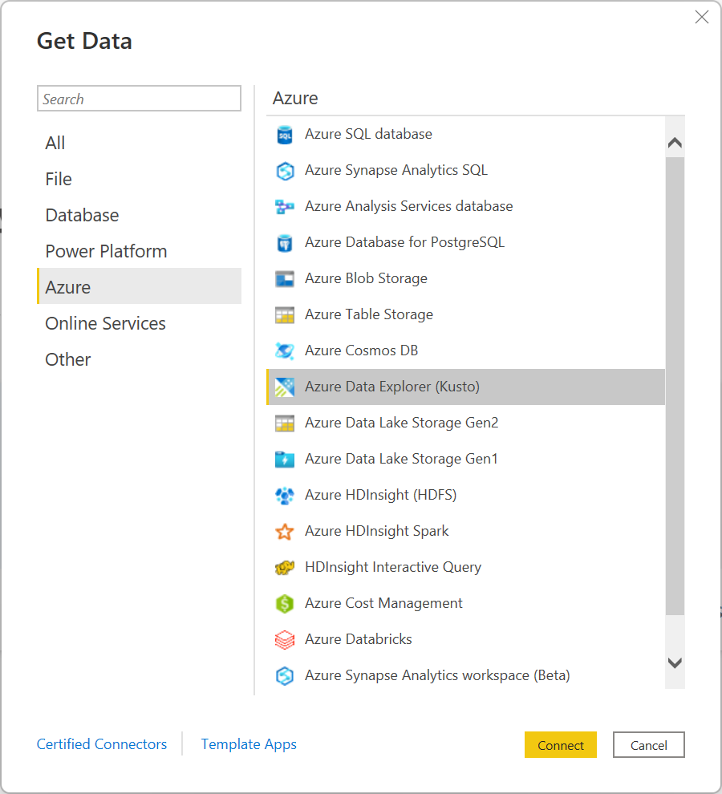
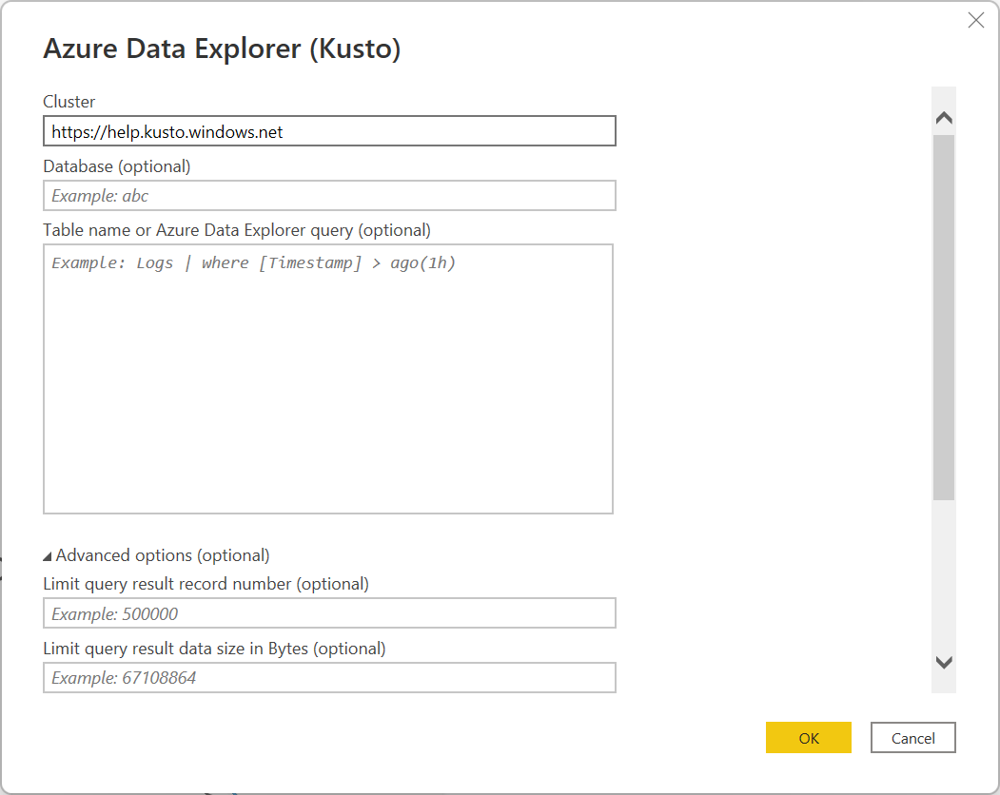
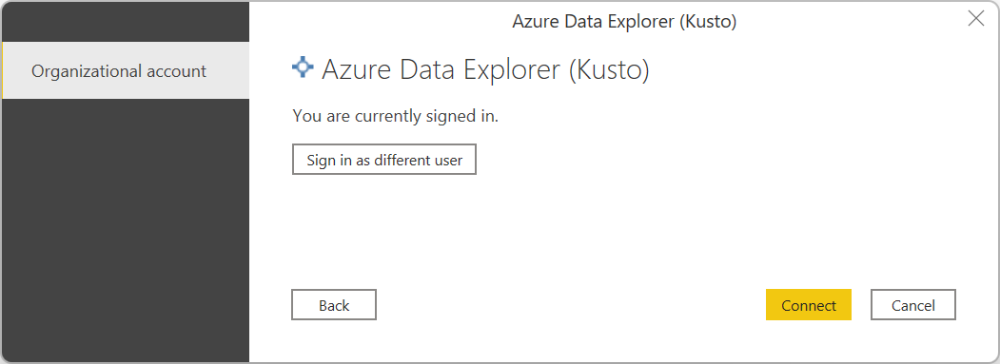
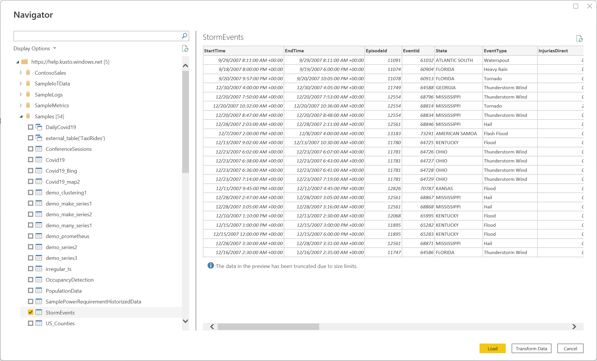
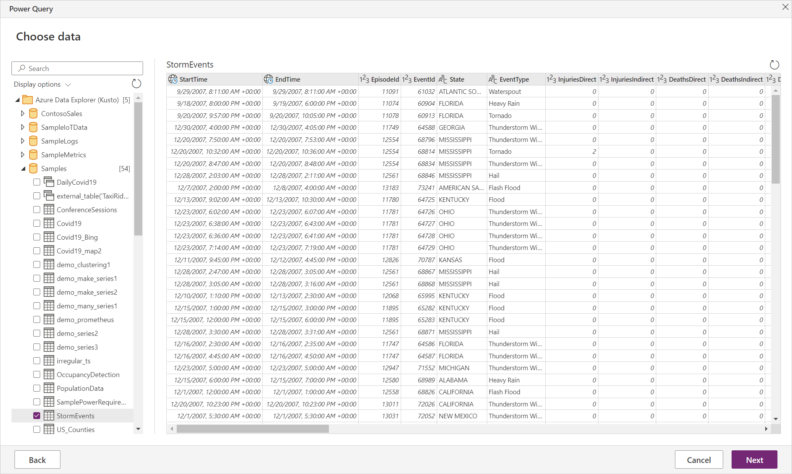
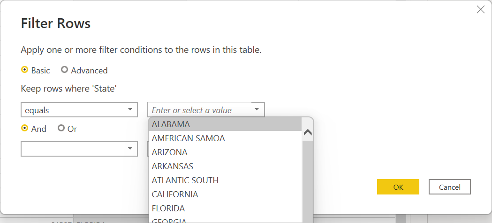

# Azure Data Explorer (Kusto)

## Summary

| Item | Description |
| ---- | ----------- |
| Release State | General Availability |
| Products | Excel<br/>Power BI (Datasets)<br/>Power BI (Dataflows)<br/>Power Apps (Dataflows)<br/>Dynamics 365 Customer Insights |
| Authentication Types Supported | Organizational Account |
| Function Reference Documentation | &mdash; |

>[!Note]
> Some capabilities may be present in one product but not others due to deployment schedules and host-specific capabilities.

## Prerequisites

* An Azure subscription. Go to [Get Azure free trial](https://azure.microsoft.com/pricing/free-trial/).

* An organizational email account that is a member of Azure Active directory. This article uses this account to connect to the [Azure Data Explorer help cluster](https://dataexplorer.azure.com/clusters/help/databases/Samples) samples.

## Capabilities supported

* Import
* DirectQuery (Power BI only)
* Advanced options
  * Limit query result record number
  * Limit query result data size in Bytes
  * Disable result-set truncation
  * Additional set statements

## Connect to Azure Data Explorer from Power Query Desktop

To connect to Azure Data Explorer from Power Query Desktop:

1. In **Get Data**, select **Azure** > **Azure Data Explorer (Kusto)**, and then select **Connect**. More information: [Where to get data](../where-to-get-data.md)

    

2. In **Azure Data Explorer (Kusto)**, provide the name of your Azure Data Explorer cluster. For this example, use `https://help.kusto.windows.net` to access the sample help cluster. For other clusters, the URL is in the form https://_\<ClusterName>_._\<Region>_.kusto.windows.net.

    You can also select a database that's hosted on the cluster you're connecting to, and one of the tables in the database, or a query like `StormEvents | take 1000`.

3. If you want to use any advance options, select the option and enter the data to use with that option. More information: [Connect using advanced options](#connect-using-advanced-options)

   >[!Note]
   >You might need to scroll down to display all of the advanced options and the data connectivity selection.

4. Select either the **Import** or **DirectQuery** data connectivity mode (Power BI Desktop only). More information: [When to use Import or Direct Query mode](#when-to-use-import-or-direct-query-mode)

5. Select **OK** to continue.

    

6. If you don't already have a connection to the cluster, select **Sign in**. Sign in with an organizational account, then select **Connect**.

    

7. In **Navigator**, select the database information you want, then either select **Load** to load the data or **Transform Data** to continue transforming the data in the Power Query editor. In this example, StormEvents was selected in the Samples database.

    [](media/azure-data-explorer/navigator-desktop.png#lightbox)

## Connect to Azure Data Explorer from Power Query Online

To connect to Azure Data Explorer from Power Query Online:

1. Select the **Azure Data Explorer (Kusto)** option from **Choose data source**. More information: [Where to get data](../where-to-get-data.md)

2. In **Connect to data source**, provide the name of your Azure Data Explorer cluster. For this example, use `https://help.kusto.windows.net` to access the sample help cluster. For other clusters, the URL is in the form https://_\<ClusterName>_._\<Region>_.kusto.windows.net.

    You can also select a database that's hosted on the cluster you're connecting to, and one of the tables in the database, or a query like `StormEvents | take 1000`.

   

3. If you want to use any advance options, select the option and enter the data to use with that option. More information: [Connect using advanced options](#connect-using-advanced-options)

4. If needed, select the on-premises data gateway in **Data gateway**.

5. If you don't already have a connection to the cluster, select **Sign in**. Sign in with an organizational account.

6. After you've successfully signed in, select **Next**.

7. In the **Choose data** page, select the database information you want, then either select **Transform Data** or **Next** to continue transforming the data in the Power Query editor. In this example, StormEvents was selected in the Samples database.

   [](media/azure-data-explorer/navigator-online.png#lightbox)

## Connect using advanced options

Both Power Query Desktop and Power Query Online provide a set of advanced options that you can add to your query if needed.

The following table lists all of the advanced options you can set in Power Query Desktop and Power Query Online.

| Advanced option | Description |
| --------------- | ----------- |
| Limit query result record number | The maximum number of records to return in the result. |
| Limit query result data size in Bytes | The maximum data size in bytes to return in the result. |
| Disable result-set truncation | Enable or disable result truncation by using the `notruncation` request option. |
| Additional Set Statements | Sets query options for the duration of the query. Query options control how a query executes and returns results. Multiple Set statements can be separated by semicolons. |

For information about additional advanced options not available in the Power Query UI, go to [Configuring Azure Data Explorer connector options in an M Query](#configuring-azure-data-explorer-connector-options-in-an-m-query).

## When to use Import or Direct Query mode

In Import mode, data is moved to Power BI. In DirectQuery mode, data is queried directly from your cluster.

Use Import mode when:

* Your data set is small.
* You don't need near real-time data.
* Your data is already aggregated or you perform aggregation in Kusto.

Use DirectQuery mode when:

* Your data set is very large.
* You need near real-time data.

To learn more about using DirectQuery, go to [About using DirectQuery in Power BI](/power-bi/connect-data/desktop-directquery-about).

## Tips for using the Azure Data Explorer connector to query data

The following sections include tips and tricks for using Kusto query language with Power Query.

### Complex queries in Power BI

Complex queries are more easily expressed in Kusto than in Power Query. They should be implemented as [Kusto functions](kusto/query/functions/index.md), and invoked in Power BI. This method is required when using **DirectQuery** with `let` statements in your Kusto query. Because Power BI joins two queries, and `let` statements can't be used with the `join` operator, syntax errors might occur. Therefore, save each portion of the join as a Kusto function and allow Power BI to join these two functions together.

### How to simulate a relative date-time operator

Power Query doesn't contain a _relative_ date-time operator such as `ago()`.
To simulate `ago()`, use a combination of [DateTime.FixedLocalNow](/powerquery-m/datetime-fixedlocalnow) and [#duration](/powerquery-m/sharpduration) Power Query M functions.

Instead of this query using the `ago()` operator:

```kusto
    StormEvents | where StartTime > (now()-5d)
    StormEvents | where StartTime > ago(5d)
``` 

Use the following equivalent query:

```powerquery-m
let
    Source = AzureDataExplorer.Contents("help", "Samples", "StormEvents", []),
    #"Filtered Rows" = Table.SelectRows(Source, each [StartTime] > (DateTime.FixedLocalNow()-#duration(5,0,0,0)))
in
    #"Filtered Rows"
```

### Configuring Azure Data Explorer connector options in an M Query

You can configure the options of the Azure Data Explorer connector from the Power Query advanced editor in the M query language. Using these options, you can control the generated query that's being sent to your Azure Data Explorer cluster.

```powerquery-m
let
    Source = AzureDataExplorer.Contents("help", "Samples", "StormEvents", [<options>])
in
    Source
```

You can use any of the following options in your M query:

| Option | Sample | Description |
|---|---|---|
| MaxRows | `[MaxRows=300000]` | Adds the `truncationmaxrecords` set statement to your query. Overrides the default maximum number of records a query can return to the caller (truncation). |
| MaxSize | `[MaxSize=4194304]` | Adds the `truncationmaxsize` set statement to your query. Overrides the default maximum data size a query is allowed to return to the caller (truncation). |
| NoTruncate | `[NoTruncate=true]` | Adds the `notruncation` set statement to your query. Enables suppressing truncation of the query results returned to the caller. |
| AdditionalSetStatements | `[AdditionalSetStatements="set query_datascope=hotcache"]` | Adds the provided set statements to your query. These statements are used to set query options for the duration of the query. Query options control how a query executes and returns results. |
| CaseInsensitive | `[CaseInsensitive=true]` | Makes the connector generate queries that are case insensitive&mdash;queries use the `=~` operator instead of the `==` operator when comparing values. |
| ForceUseContains | `[ForceUseContains=true]` | Makes the connector generate queries that use `contains` instead of the default `has` when working with text fields. While `has` is much more performant, it doesn't handle substrings. For more information about the difference between the two operators, go to [string operators](./kusto/query/datatypes-string-operators.md). |
| Timeout | `[Timeout=#duration(0,10,0,0)]` | Configures both the client and server timeout of the query to the provided duration. |
| ClientRequestIdPrefix  | `[ClientRequestIdPrefix="MyReport"]` | Configures a ClientRequestId prefix for all queries sent by the connector. This allows the queries to be identifiable in the cluster as coming from a specific report and/or data source. |

> [!NOTE]
> You can combine multiple options together to reach the required behavior: `[NoTruncate=true, CaseInsensitive=true]`

### Reaching Kusto query limits

Kusto queries return, by default, up to 500,000 rows or 64 MB, as described in [query limits](kusto/concepts/querylimits.md). You can override these defaults by using **Advanced options** in the  **Azure Data Explorer (Kusto)** connection window:


These options issue [set statements](kusto/query/setstatement.md) with your query to change the default query limits:

* **Limit query result record number** generates a `set truncationmaxrecords`
* **Limit query result data size in Bytes** generates a `set truncationmaxsize`
* **Disable result-set truncation** generates a `set notruncation`

### Case sensitivity

By default, the connector generates queries that use the case sensitive `==` operator when comparing string values. If the data is case insensitive, this isn't the desired behavior. To change the generated query, use the `CaseInsensitive` connector option:

```powerquery-m
let
    Source = AzureDataExplorer.Contents("help", "Samples", "StormEvents", [CaseInsensitive=true]),
    #"Filtered Rows" = Table.SelectRows(Source, each [State] == "aLaBama")
in
    #"Filtered Rows"
```

### Using query parameters

You can use [query parameters](kusto/query/queryparametersstatement.md) to modify your query dynamically.

#### Using a query parameter in the connection details

Use a query parameter to filter information in the query and optimize query performance.

In **Advanced Editor**:

1. Find the following section of the query:

    ```powerquery-m
    Source = AzureDataExplorer.Contents("<Cluster>", "<Database>", "<Query>", [])
    ```

   For example:

    ```powerquery-m
    Source = AzureDataExplorer.Contents("Help", "Samples", "StormEvents | where State == 'ALABAMA' | take 100", [])
    ```

1. Replace the relevant part of the query with your parameter. Split the query into multiple parts, and concatenate them back using an ampersand (&), along with the parameter.

   For example, in the query above, take the `State == 'ALABAMA'` part, and split it to: `State == '` and `'` and place the `State` parameter between them:

    ```kusto
    "StormEvents | where State == '" & State & "' | take 100"
    ```

1. If your query contains quotation marks, encode them correctly. For example, the following query:

   ```kusto
   "StormEvents | where State == "ALABAMA" | take 100"
   ```

   will appear in the **Advanced Editor** as follows with two quotation marks:

   ```kusto
    "StormEvents | where State == ""ALABAMA"" | take 100"
   ```

   It should be replaced with the following query with three quotation marks:

   ```kusto
   "StormEvents | where State == """ & State & """ | take 100"
   ```

#### Use a query parameter in the query steps

You can use a query parameter in any query step that supports it. For example, filter the results based on the value of a parameter.



### Use Value.NativeQuery for Azure Data Explorer features

To use an Azure Data Explorer feature that's not supported in Power Query, use the [Value.NativeQuery](/powerquery-m/value-nativequery) method in Power Query M. This method inserts a Kusto Query Language fragment inside the generated query, and can also be used to give you more control over the executed query.

The following example shows how to use the `percentiles` function in Azure Data Explorer:

```powerquery-m
let
    StormEvents = AzureDataExplorer.Contents(DefaultCluster, DefaultDatabase){[Name = DefaultTable]}[Data],
    Percentiles = Value.NativeQuery(StormEvents, "| summarize percentiles(DamageProperty, 50, 90, 95) by State")
in
    Percentiles
```

### Don't use Power BI data refresh scheduler to issue control commands to Kusto

Power BI includes a data refresh scheduler that can periodically issue queries against a data source. This mechanism shouldn't be used to schedule control commands to Kusto because Power BI assumes all queries are read-only.
