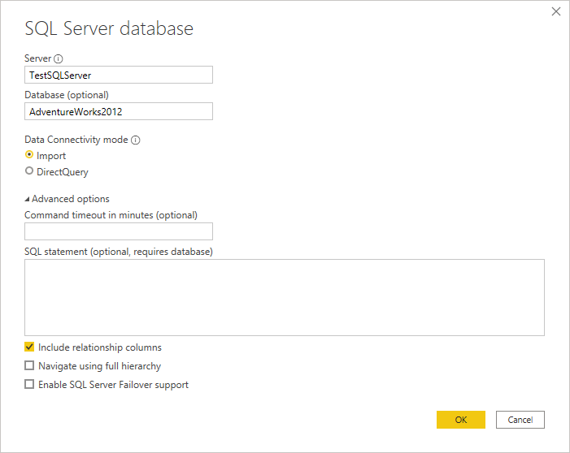
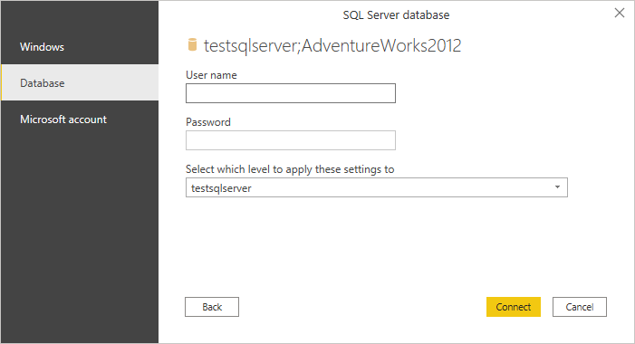
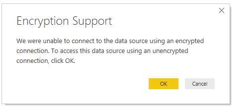
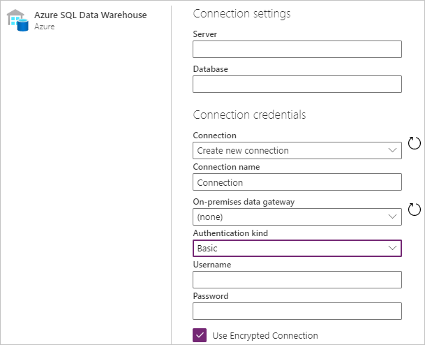

# Azure SQL Data Warehouse
 
## Summary
 
Release State: General Availability

Products: Power BI Desktop, Power BI Service (Enterprise Gateway), Dataflows in PowerBI.com (Enterprise Gateway), Dataflows in PowerApps.com (Enterprise Gateway), Excel

Authentication Types Supported: Database (Username/Password), Windows

Function Reference Documentation: [Sql.Database](https://docs.microsoft.com/powerquery-m/sql-database), [Sql.Databases](https://docs.microsoft.com/en-us/powerquery-m/sql-databases)

>[!Note]
> Some capabilities may be present in one product but not others due to deployment schedules and host-specific capabilities.
 
## Prerequisites

By default, Power BI installs an OLE DB driver for Azure SQL Data Warehouse. However, for optimal performance, we recommend that the customer installs the [SQL Server Native Client](https://docs.microsoft.com/sql/relational-databases/native-client/applications/installing-sql-server-native-client?view=sql-server-ver15) before using the Azure SQL Data Warehouse connector. SQL Server Native Client 11.0 and SQL Server Native Client 10.0 are both supported in the latest version.

 
## Capabilities Supported
* Import
* DirectQuery (Power BI only)
* Advanced options
    * Command timeout in minutes
    * Native SQL statement
    * Relationship columns
    * Navigate using full hierarchy
    * SQL Server failover support
    
## Connect to Azure SQL Data Warehouse

To make the connection, take the following steps:
 
1. Select the **Azure SQL Data Warehouse** option in the connector selection.
 
2. If you're connecting from Power BI desktop or Excel:

   1. In the **SQL Server database** dialog that appears, provide the name of the server and database (optional). 

      

   2. If you're connecting from Power BI Desktop, select either the **Import** or **DirectQuery** data connectivity mode.

   3. Optionally, you may provide a command timeout and a [native query (SQL statement)](native-database-query.md), as well as select whether or not you want to include relationship columns and navigate using full hierarchy. You can also enable SQL Server failover support. Once you're done, select **OK**.

   4. If this is the first time you're connecting to this database, select the authentication type, input your credentials, and select the level to apply the authentication settings to. Then select **Connect**.

      

      >[!Note]
      >  If the connection is not encrypted, you'll be prompted with the following dialog.

       

       Select **OK** to connect to the database by using an unencrypted connection, or follow these [instructions](https://docs.microsoft.com/sql/database-engine/configure-windows/enable-encrypted-connections-to-the-database-engine?view=sql-server-ver15) to set up encrypted connections to Azure SQL Data Warehouse.

3. If you're connecting from an online service:

   1. In the **Azure SQL Data Warehouse** dialog that appears, provide the name of the server and database.

      

   2. If this is the first time you're connecting to this database, select the authentication kind and input your credentials.

   3. If required, select the name of your on-premises data gateway.

   4. If the connection is not encrypted, clear the **Use Encrypted Connection** check box.
 
   4. Select **Next** to continue.

4. In the **Navigator**, select the data you require, then either load or transform the data.
