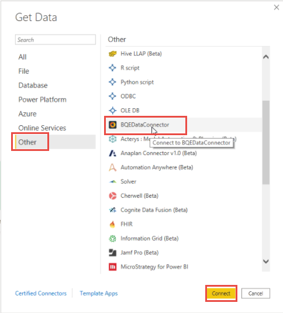
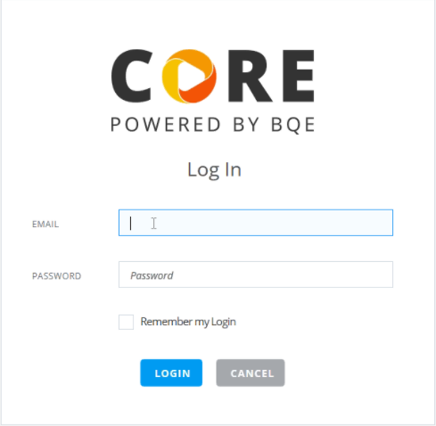
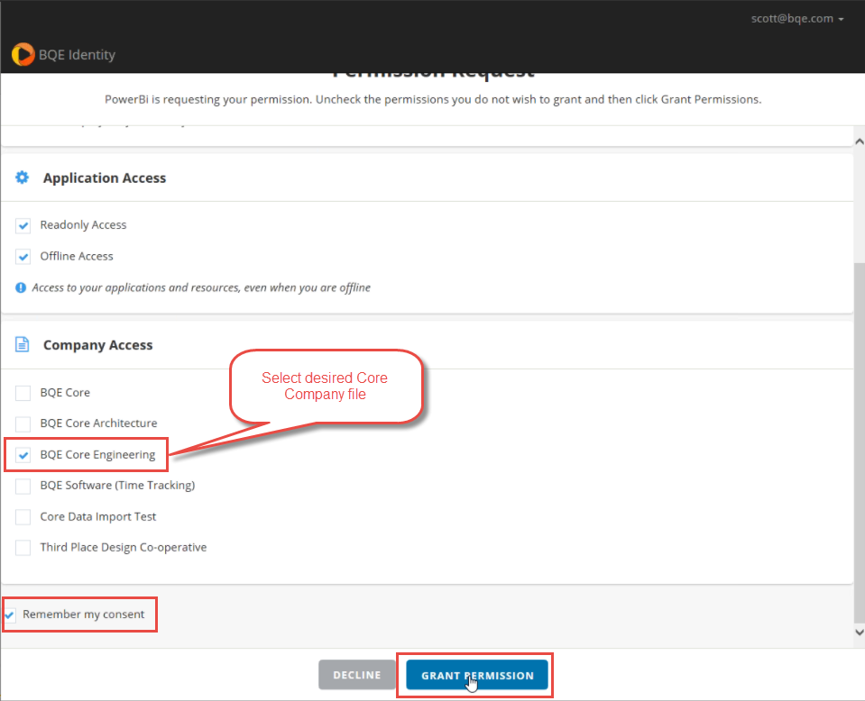

# BQE Core (Beta)

## Summary

| Item | Description |
| ---- | ----------- |
| Release State | (Beta) |
| Products | Power BI (Datasets) |
| Authentication Types Supported | BQE Core Account |
| Function Reference Documentation | - |

## Prerequisites

To use the BQE Core PowerBI connector, you must have a BQE Core account with username and password.

## Capabilities Supported

* Import

## Connect to BQE Core

To use Power BI with Core:

1. Launch Power BI Desktop and enter the **Get Data** experience.

2. Select BQE Core in the list select **Connect**.

3. Select **Sign In**. You will be prompted to log into Core.

 

4. On the login screen, enter your Core email and password. Select **Login**.

5. You will then be prompted to select your Core company file. Select **Grant Permission**.

 

6. Next, select **Connect** and select a module. For reference, review the API Reference under the Core API Documentation.

7. Select from the Navigator the tables to load and select **Transform Data** to enter the Power Query experience. 

