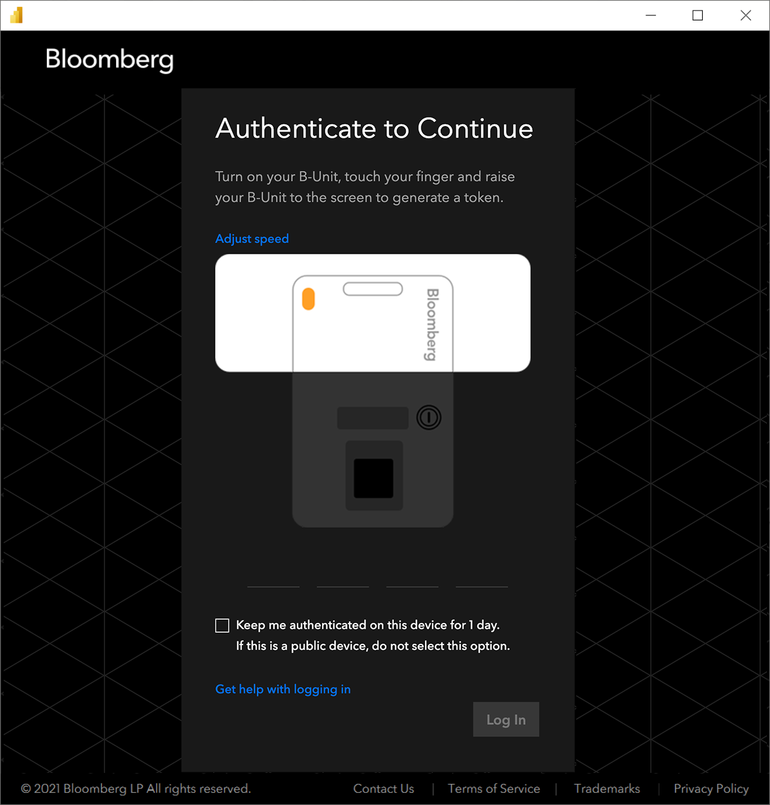

# Bloomberg Data and Analytics
 
## Summary

| Item | Description |
| ---- | ----------- |
| Release State | General Availability |
| Products | Power BI (Datasets) |
| Authentication Types Supported | Organizational account |
| | |

## Prerequisites
Your organization must subscribe to Bloomberg PORT Enterprise and you must be a Bloomberg Anywhere user and have a Bloomberg biometric authentication device (B-Unit).
 
## Capabilities Supported
* Import

## Connect to Bloomberg Data and Analytics

To connect to Bloomberg Data and Analytics:

1. Select **Get Data** from the **Home** ribbon in Power BI Desktop. Select **Online Services** from the categories on the left, select **Bloomberg Data and Analytics**, and then select **Connect**.

   

2. If this is the first time you're connecting to the Bloomberg Data and Analytics connector, a third-party notice will be displayed. Select **Don't warn me again with this connector** if you don't want this message to be displayed again, and then select **Continue**.

3. Enter a Bloomberg Query Language (BQL) query to specify what data you want to get. To learn more about BQL, contact your Bloomberg Sales representative. Select **OK**.

   

4. To sign in to your Bloomberg account, select **Sign in**.

   

5. In the window that appears, provide your credentials to sign in to your Bloomberg account.
If you entered an email address and a password, select **Next**.

   

6. Enter your B-Unit code and select **Log In**.

   

7. Once you've successfully signed in, select **Connect**.

   

Once the connection is established, you will see data available for preview in **Navigator**.

You can **Load** the selected table, or you can select **Transform Data** to edit the query, which opens Power Query Editor. You can then filter and refine the set of data you want to use, and then load that refined set of data into Power BI Desktop.

---

The data included in these materials are for illustrative purposes only. The BLOOMBERG TERMINAL service and Bloomberg data products (the “Services”) are owned and distributed by Bloomberg Finance L.P. (“BFLP”) except (i) in Argentina, Australia and certain jurisdictions in the Pacific islands, Bermuda, China, India, Japan, Korea and New Zealand, where Bloomberg L.P. and its subsidiaries (“BLP”) distribute these products, and (ii) in Singapore and the jurisdictions serviced by Bloomberg’s Singapore office, where a subsidiary of BFLP distributes these products. BLP or one of its subsidiaries provides BFLP and its subsidiaries with global marketing and operational support and service. Certain features, functions, products and services are available only to sophisticated investors and only where permitted. BFLP, BLP and their affiliates do not guarantee the accuracy of prices or other information in the Services. Nothing in the Services shall constitute or be construed as an offering of financial instruments by BFLP, BLP or their affiliates, or as investment advice or recommendations by BFLP, BLP or their affiliates of an investment strategy or whether or not to “buy”, “sell” or “hold” an investment. Information available via the Services should not be considered as information sufficient upon which to base an investment decision. The following are trademarks and service marks of BFLP, a Delaware limited partnership, or its subsidiaries: BLOOMBERG, BLOOMBERG ANYWHERE, BLOOMBERG MARKETS, BLOOMBERG NEWS, BLOOMBERG PROFESSIONAL, BLOOMBERG TERMINAL and BLOOMBERG.COM. Absence of any trademark or service mark from this list does not waive Bloomberg’s intellectual property rights in that name, mark or logo. All rights reserved. © 2021 Bloomberg.
