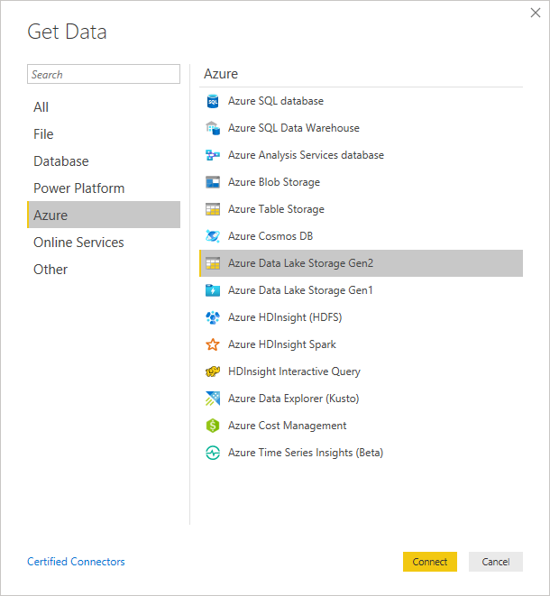
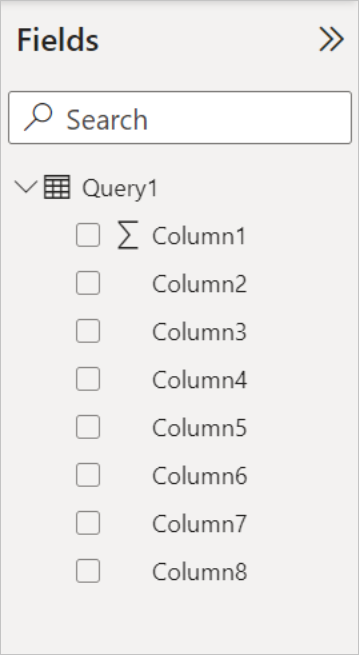
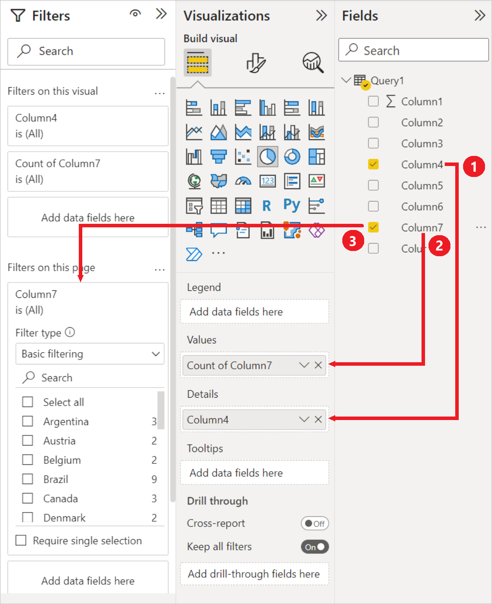
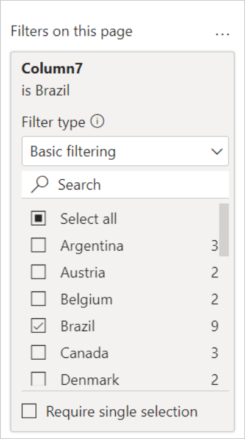

# Analyze data in Azure Data Lake Storage Gen2 by using Power BI

In this article you'll learn how to use Power BI Desktop to analyze and visualize data that is stored in a storage account that has a hierarchical namespace (Azure Data Lake Storage Gen2).

## Prerequisites

Before you begin this tutorial, you must have the following prerequisites:

> [!div class="checklist"]
> * An Azure subscription. See [Get Azure free trial](https://azure.microsoft.com/pricing/free-trial/).
> * A storage account that has a hierarchical namespace. Follow [these](https://docs.microsoft.com/azure/storage/common/storage-account-create) instructions to create one.
> This article assumes that you've created a storage account named `myadlsg2`.
> * You are granted one of the following roles for the storage account: **Blob Data Reader**, **Blob Data Contributor**, or **Blob Data Owner**.
> * A sample data file named `Drivers.txt` located in your storage account.
> You can download this sample from [Azure Data Lake Git Repository](https://github.com/Azure/usql/tree/master/Examples/Samples/Data/AmbulanceData/Drivers.txt), and then upload that file to your storage account.
> * **Power BI Desktop**. You can download this from the [Microsoft Download Center](https://www.microsoft.com/download/details.aspx?id=45331).

## Create a report in Power BI Desktop

1. Launch Power BI Desktop on your computer.
2. From the **Home** tab of the Ribbon, select **Get Data**, and then select **More**.
3. In the **Get Data** dialog box, select **Azure > Azure Data Lake Store Gen2**, and then select **Connect**.

    

4. In the **Azure Data Lake Storage Gen2** dialog box, you can provide the URL to your Azure Data Lake Storage Gen2 account, filesystem, or subfolder using the container endpoint format. URLs for Data Lake Storage Gen2 have the following pattern:

    `https://<accountname>.dfs.core.windows.net/<filesystemname>/<subfolder>`
    
    You can also select whether you want to use the file system view or the Common Data Model folder view.

    Select **OK** to continue.

    

5. If this is the first time you're using this URL address, you'll be asked to select the authentication method. 

   If you select the Organizational account method, select **Sign in** to sign into your storage account. You'll be redirected to your organization's sign in page. Follow the prompts to sign into the account. After you've successfully signed in, select **Connect**.
   
   If you select the Account key method, enter your account key and then select **Connect**.

    

6. The next dialog box shows all files under the URL you provided in step 4 above, including the file that you uploaded to your storage account. Verify the information, and then select **Load**.

    

7. After the data has been successfully loaded into Power BI, you'll see the following fields in the **Fields** tab.

    

    However, to visualize and analyze the data, you might prefer the data to be available using the following fields.

    

    In the next steps, you'll update the query to convert the imported data to the desired format.

8. From the **Home** tab on the ribbon, select **Edit Queries**.

    

9. In the **Query Editor**, under the **Content** column, select **Binary**. The file will automatically be detected as CSV and you should see an output as shown below. Your data is now available in a format that you can use to create visualizations.

    

10. From the **Home** tab on the ribbon, select **Close & Apply**.

    

11. Once the query is updated, the **Fields** tab will show the new fields available for visualization.

    

12. Now you can create a pie chart to represent the drivers in each city for a given country. To do so, make the following selections.

    From the **Visualizations** tab, select the symbol for a pie chart.

    

    In this example, the columns you're going to use are Column 4 (name of the city) and Column 7 (name of the country). Drag these columns from the **Fields** tab to the **Visualizations** tab as shown below.

    

    The pie chart should now resemble the one shown below.

    

13. By selecting a specific country from the page level filters, you can now see the number of drivers in each city of the selected country. For example, under the **Visualizations** tab, under **Page level filters**, select **Brazil**.

    

14. The pie chart is automatically updated to display the drivers in the cities of Brazil.

    

15. From the **File** menu, select **Save** to save the visualization as a Power BI Desktop file.

## Publish report to Power BI service

After you've created the visualizations in Power BI Desktop, you can share it with others by publishing it to the Power BI service. For instructions on how to do that, see [Publish from Power BI Desktop](https://powerbi.microsoft.com/documentation/powerbi-desktop-upload-desktop-files/).

## Troubleshooting

Currently, in Power Query Online, the Azure Data Lake Storage Gen2 connector only supports paths with container, and not subfolder or file.

https://\<accountname\>.dfs.core.windows.net/\<container\> will work, while https://\<accountname\>.dfs.core.windows.net/\<container\>/\<filename\> or https://\<accountname\>.dfs.core.windows.net/\<container\>/\<subfolder\> will fail.
