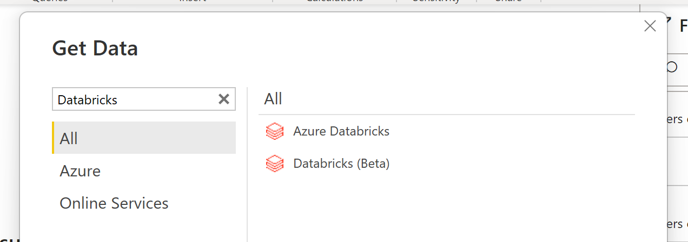
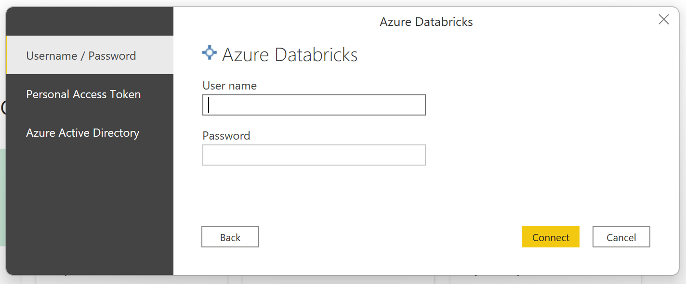
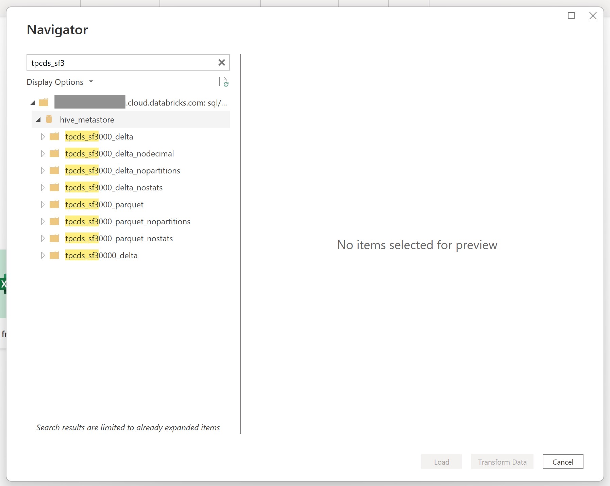

# Databricks

## Summary

| Item | Description |
| ---- | ----------- |
| Release State | Azure Databricks: General Availability Databricks: Beta |
| Products | Power BI (Datasets) Power BI (Dataflows) |
| Authentication Types Supported | Azure Active Directory Organizational Account Personal Access Token |
| | |

>[!Note]
>Some capabilities may be present in one product but not others due to deployment schedules and host-specific capabilities.

## Prerequisites

This connector is for use with a Databricks SQL Warehouse running on either AWS, Azure or GCP. Databricks Community Edition is not supported.

## Capabilities supported

* Import
* DirectQuery (PowerBI only)

## Connect to Azure Databricks or Databricks (AWS or GCP) from Power Query Desktop

To connect from Power BI Desktop, take the following steps:

1. In the Get Data experience, search for **databricks** to shortlist the two Databrick connectors: "Azure Databricks" and "Databricks (Beta)". You should preferentially choose the "Azure Databricks" connector for your Databricks SQL Warehouse (despite the Azure prefix). The generic "Databricks (Beta)" connector is previewing support for OAuth on AWS. Please contact your Databricks representative for guidance before using this connector. 

    

2. You will need to provide the "Server hostname" and "HTTP Path" for your Databricks SQL Warehouse. Refer [here](https://docs.microsoft.com/en-us/azure/databricks/integrations/bi/jdbc-odbc-bi#get-server-hostname-port-http-path-and-jdbc-url) for instructions to look up your "Server hostname" and "HTTP Path". Enter these accordingly. You may optionally supply a default catalog and/or database under **Advanced options**. Select **OK** to continue.

    

3. You will need provide your credentials to authenticate with your Databricks SQL Warehouse. With the "Azure Databricks" connector, you have 3 options for credentials:

    1. Username / Password (useable for GCP).
    2. Personal Access Token (useable for AWS). Refer [here](https://docs.microsoft.com/en-us/azure/databricks/sql/user/security/personal-access-tokens) for instructions on generating a Personal Access Token (PAT).
    3. Azure Active Directory (useable for Azure). Sign into your organizational account via the browser popup.
    
If you are using the "Databricks (Beta)" connector, you have an alternate "OAuth (oidc)" option useable only for Databricks on AWS. 

    

    > [!NOTE]
    > Once you enter your credentials for a particular **Databricks** cluster, Power BI Desktop caches and reuses those same credentials in subsequent connection attempts. You can modify those credentials by going to **File > Options and settings > Data source settings**. More information: [Change the authentication method](../ConnectorAuthentication.md#change-the-authentication-method)

4. Once you successfully connect, the **Navigator** window shows the data available to you on the cluster. You can choose to either **Transform Data** to transform the data using Power Query or **Load** to load the data in Power Query Desktop. 

    

## Connect to Databricks Cloud data from Power Query Online

To connect to Databricks Cloud from Power Query Online, take the following steps:

1. In the Get Data experience, select the **Dataflow** category. (Refer [here](https://docs.microsoft.com/en-us/power-bi/transform-model/dataflows/dataflows-create) for instructions.)

    

2. Add the following fragment to the end of your browser URL: ``?pqo_enableDynamicResourcePath=1`` and reload the page. Now navigate to the available data sources and locate the Databrick connectors. You can also use the Search box to shortlist them. Choose "Azure Databricks" if your Databricks runs in the Azure cloud; for AWS or GCP, choose "Databricks". 

    

3. Enter the "Server hostname" and "HTTP Path" for your Databricks cluster. Refer [here](https://docs.microsoft.com/en-us/azure/databricks/integrations/bi/jdbc-odbc-bi#get-server-hostname-port-http-path-and-jdbc-url) for instructions to look up your "Server hostname" and "HTTP Path". You may optionally supply a default catalog and/or database under **Advanced options**. 

4. Enter the appropriate credentials. For Azure Databricks, you can choose between 1) basic user/password; 2) Personal Access Token (Account key); and 3) Azure Active Directory (AAD). For AWS or GCP, your choice is between 1) basic user/password; 2) Personal Access Token (Account key); and 3) OAuth (Organizational account).

    

5. Once you successfully connect, a **Navigator** window appears and displays the data available on the server. Select your data in the navigator. Then select **Next** to transform the data in Power Query.

    

