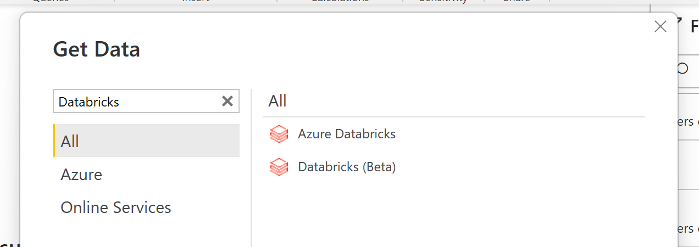
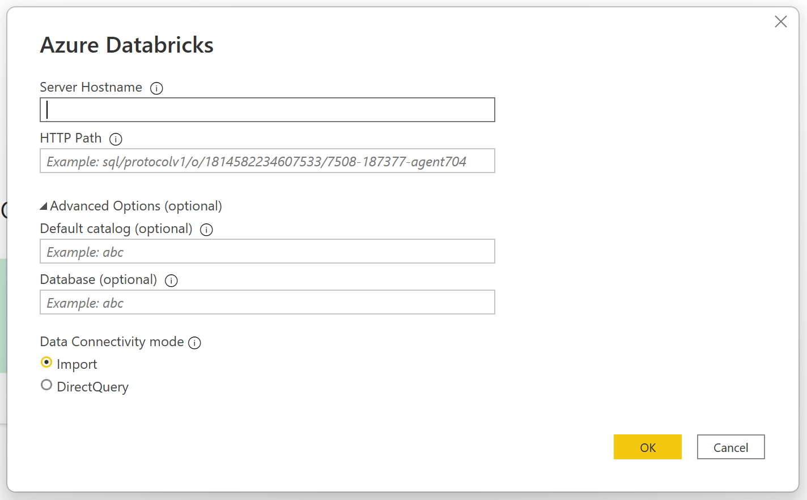
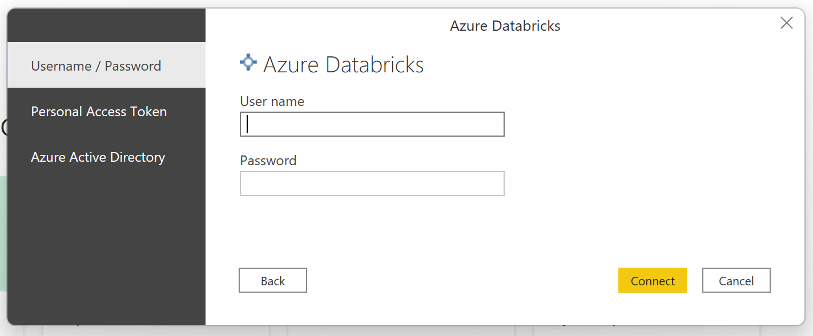
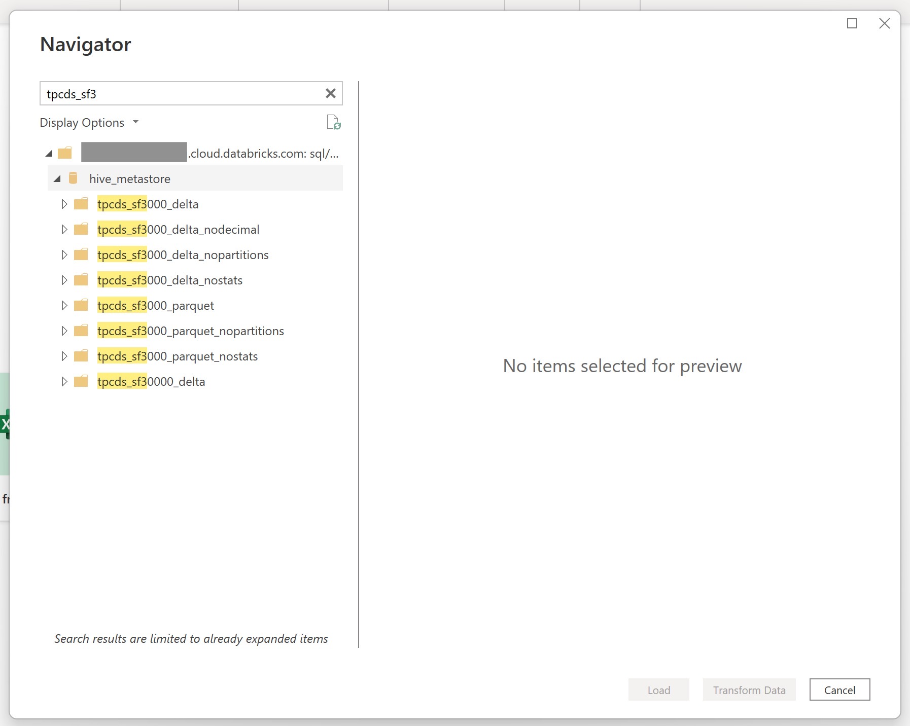
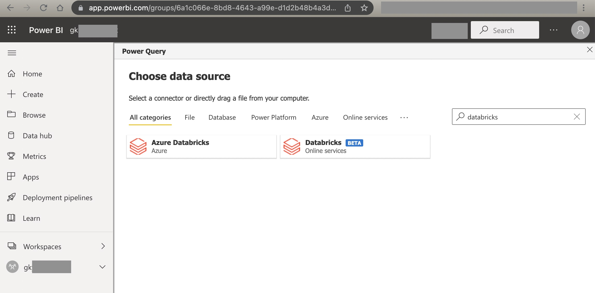
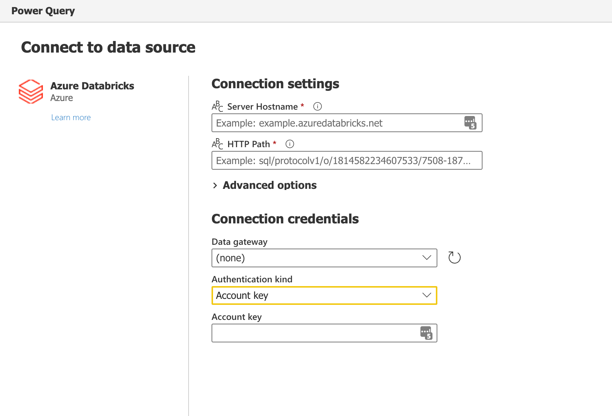
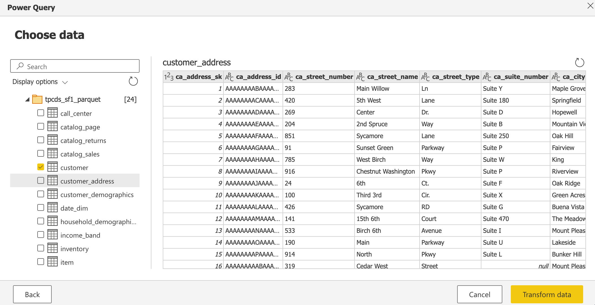

# Azure Databricks

>The following connector article is provided by Databricks, the owner of this connector and a member of the Microsoft Power Query Connector Certification Program. If you have questions regarding the content of this article or have changes you would like to see made to this article, visit the Databricks website and use the support channels there.

## Summary

| Item | Description |
| ---- | ----------- |
| Release State | General Availability |
| Products | Power BI (Datasets) Power BI (Dataflows) |
| Authentication Types Supported | Azure Active Directory Organizational Account Personal Access Token |
| | |

## Capabilities supported

* Import
* DirectQuery (Power BI only)

## Connect to Databricks (AWS, Azure or GCP) from Power Query Desktop

To connect to Databricks from Power Query Desktop, take the following steps:

1. In the Get Data experience, search for **Databricks** to shortlist the Databricks connector, "Azure Databricks". Use the "Azure Databricks" connector for all Databricks SQL Warehouse unless you have been instructed otherwise by your Databricks rep. 

    

2. You will provide the "Server hostname" and "HTTP Path" for your Databricks SQL Warehouse. Refer [here](/azure/databricks/integrations/bi/jdbc-odbc-bi#get-server-hostname-port-http-path-and-jdbc-url) for instructions to look up your "Server hostname" and "HTTP Path". Enter these accordingly. You may optionally supply a default catalog and/or database under **Advanced options**. Select **OK** to continue.

    

3. You will also provide your credentials to authenticate with your Databricks SQL Warehouse. There are three options for credentials:

    1. Username / Password (useable for AWS or GCP). This option is not available if your organization/account uses 2FA/MFA. 
    2. Personal Access Token (useable for AWS, Azure or GCP). Refer [here](/azure/databricks/sql/user/security/personal-access-tokens) for instructions on generating a Personal Access Token (PAT).
    3. Azure Active Directory (useable only for Azure). Sign into your organizational account via the browser popup.
    
    

    > [!NOTE]
    > Once you enter your credentials for a particular **Databricks** SQL Warehouse, Power BI Desktop caches and reuses those same credentials in subsequent connection attempts. You can modify those credentials by going to **File > Options and settings > Data source settings**. More information: [Change the authentication method](../ConnectorAuthentication.md#change-the-authentication-method)

4. Once you successfully connect, the **Navigator** window shows the data available to you on the cluster. You can choose to either **Transform Data** to transform the data using Power Query or **Load** to load the data in Power Query Desktop. 

    

## Connect to Databricks data from Power Query Online

To connect to Databricks from Power Query Online, take the following steps:

1. In the Get Data experience, select the **Database** category. (Refer [here](/power-bi/transform-model/dataflows/dataflows-create) for instructions.) Shortlist the available Databricks connectors with the Search box. Use the "Azure Databricks" connector for all Databricks SQL Warehouse unless you have been instructed otherwise by your Databricks rep.  

    

2. Enter the "Server hostname" and "HTTP Path" for your Databricks SQL Warehouse. Refer [here](/azure/databricks/integrations/bi/jdbc-odbc-bi#get-server-hostname-port-http-path-and-jdbc-url) for instructions to look up your "Server hostname" and "HTTP Path". You may optionally supply a default catalog and/or database under **Advanced options**. 

    

3. You will also provide your credentials to authenticate with your Databricks SQL Warehouse. There are three options for credentials:

    1. Username / Password (useable for AWS or GCP). This option is not available if your organization/account uses 2FA/MFA. 
    2. Account Key (useable for AWS, Azure or GCP). Refer [here](/azure/databricks/sql/user/security/personal-access-tokens) for instructions on generating a Personal Access Token (PAT).
    3. Azure Active Directory (useable only for Azure). Sign into your organizational account via the browser popup.

4. Once you successfully connect, a **Navigator** window appears and displays the data available on the server. Select your data in the navigator. Then select **Next** to transform the data in Power Query.

    
