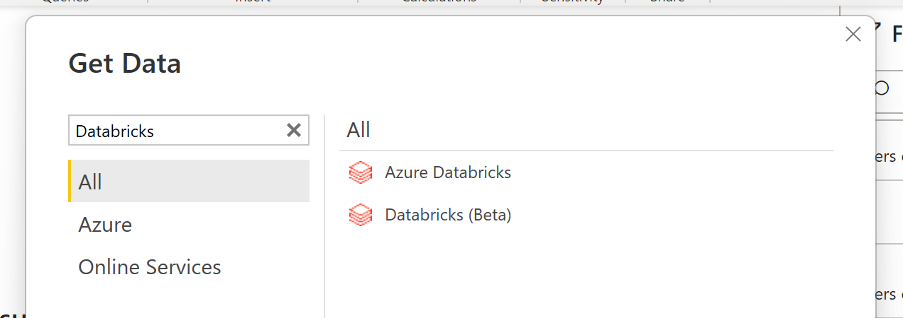
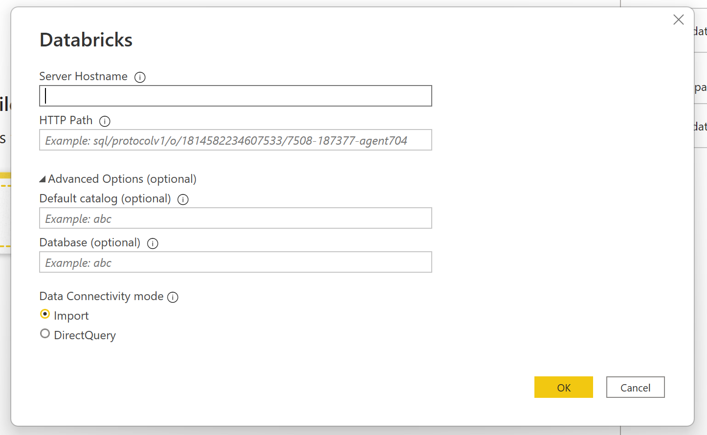
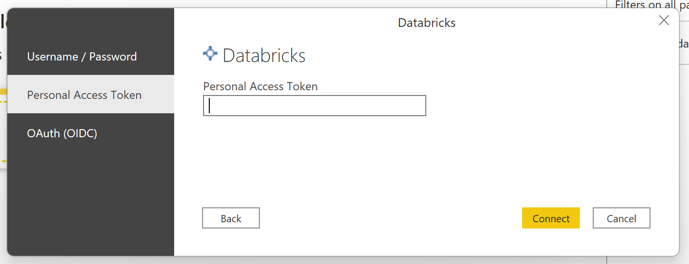
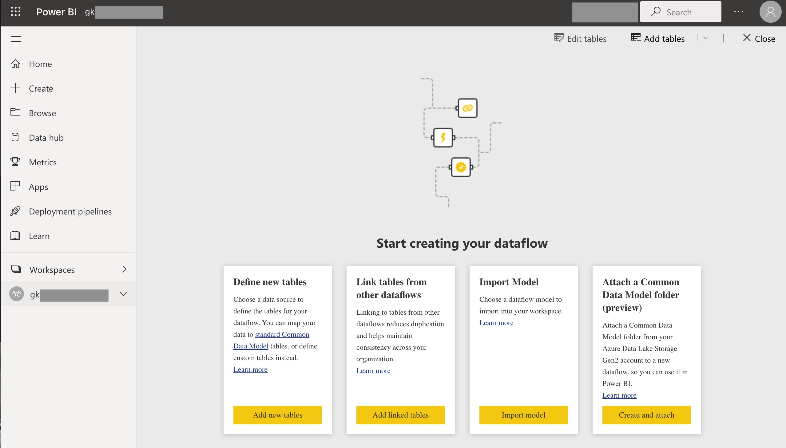
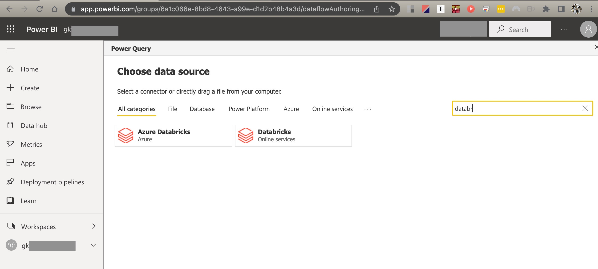
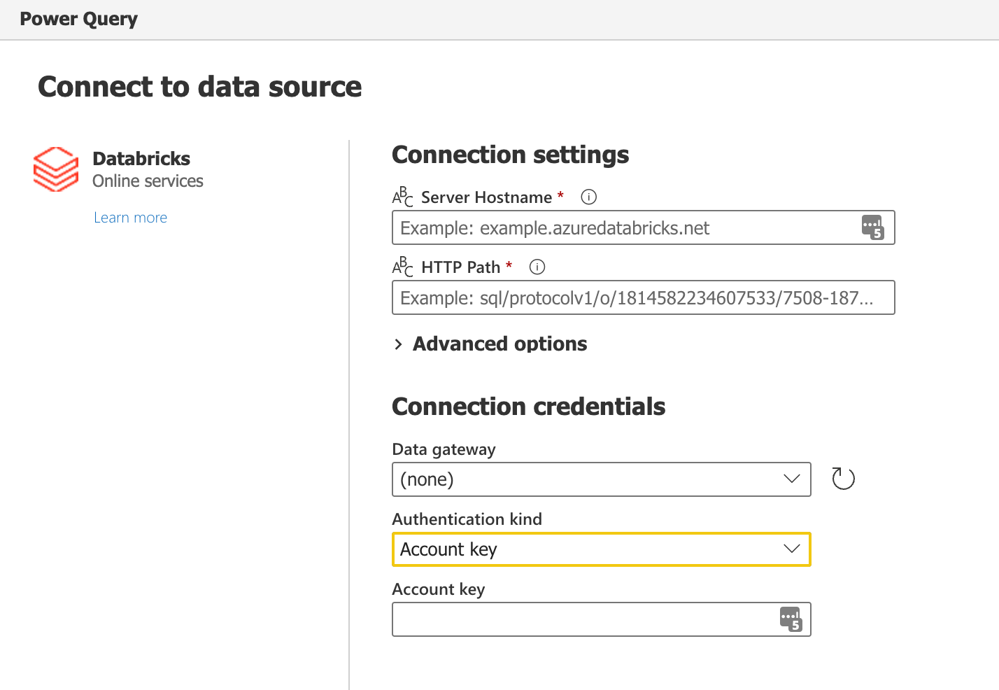

# Databricks Cloud

## Summary

| Item | Description |
| ---- | ----------- |
| Release State | Azure Databricks: General Availability Databricks: Preview |
| Products | Power BI (Datasets) Power BI (Dataflows) |
| Authentication Types Supported | Azure Active Directory Personal Access Token |
| | |

>[!Note]
>Some capabilities may be present in one product but not others due to deployment schedules and host-specific capabilities.

## Prerequisites

You requires either an Azure Databricks account or a paid Databricks Cloud account to use this connector. Databricks Community Edition is not supported.

## Capabilities supported

* Import
* DirectQuery (PowerBI only)

## Connect to Azure Databricks or Databricks Cloud from Power Query Desktop

To connect from Power BI Desktop, take the following steps:

1. In the Get Data experience, search for **databricks** and choose between "Azure Databricks" or "Databricks". If the entry for "Databricks" is marked with a "(Preview)" suffix, contact your Databricks representative for guidance on using the connector. 

    

2. You will need to provide the "Server hostname" and "HTTP Path" for either your Azure Databricks Cluster or Databricks SQL Warehouse. Refer [here](https://docs.microsoft.com/en-us/azure/databricks/integrations/bi/jdbc-odbc-bi#get-server-hostname-port-http-path-and-jdbc-url) for instructions to look up your "Server hostname" and "HTTP Path". Enter these accordingly. You may optionally supply a default catalog and/or database under **Advanced options**. Select **OK** to continue.

    

3. You will need provide your credentials to authenticate with the selected Databricks server. For Azure Databricks, you have a choice between Azure Active Directory (AAD) or Personal Access Token. For Databricks Cloud, only Personal Access Token is supported. Refer [here](https://docs.microsoft.com/en-us/azure/databricks/sql/user/security/personal-access-tokens) for instructions on generating your Personal Access Token (PAT).

    

    > [!NOTE]
    > Once you enter your credentials for a particular **Databricks** server, Power BI Desktop caches and reuses those same credentials in subsequent connection attempts. You can modify those credentials by going to **File > Options and settings > Data source settings**. More information: [Change the authentication method](../ConnectorAuthentication.md#change-the-authentication-method)

4. Once you successfully connect, the **Navigator** window shows the data available to you on the cluster. You can choose to either **Transform Data** to transform the data using Power Query or **Load** to load the data in Power Query Desktop. To use the search box, you must click to open the tree control first.

    

## Connect to Databricks Cloud data from Power Query Online

To connect to Databricks Cloud from Power Query Online, take the following steps:

1. In the Get Data experience, select the **Dataflow** category. (Refer [here](https://docs.microsoft.com/en-us/power-bi/transform-model/dataflows/dataflows-create) for instructions.)

    

2. Add the following fragment to the end of your browser URL: ``?pqo_enableDynamicResourcePath=1`` and reload the page. Now navigate to the available data sources and locate the Databrick connectors. You can also use the Search box to quickly locate them. Choose the appropriate variant of Databricks.

    

3. Enter the "Server hostname" and "HTTP Path" for either your Azure Databricks Cluster or Databricks SQL Warehouse. Refer [here](https://docs.microsoft.com/en-us/azure/databricks/integrations/bi/jdbc-odbc-bi#get-server-hostname-port-http-path-and-jdbc-url) for instructions to look up your "Server hostname" and "HTTP Path". 

4. Enter the appropriate credentials. 

    4.1 For Azure Databricks, you have a choice between Azure Active Directory (AAD) or Personal Access Token. (TODO: Verify)
  
    4.2 For Databricks Cloud, only Personal Access Token is supported. Select "Authentication Kind" of _Account Key_ and enter your PAT as the Account Key.

    

5. Once you successfully connect, a **Navigator** window appears and displays the data available on the server. Select your data in the navigator. Then select **Next** to transform the data in Power Query.

    

