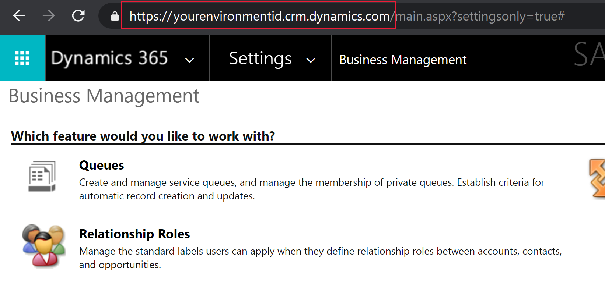
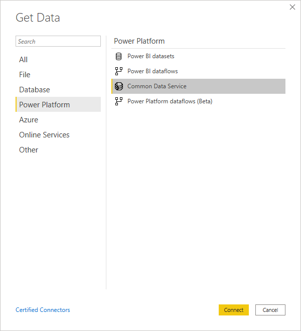
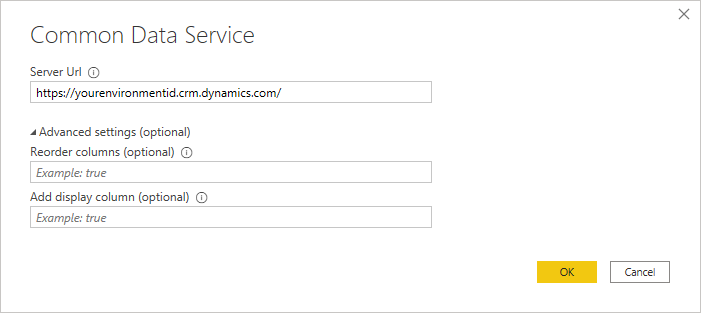
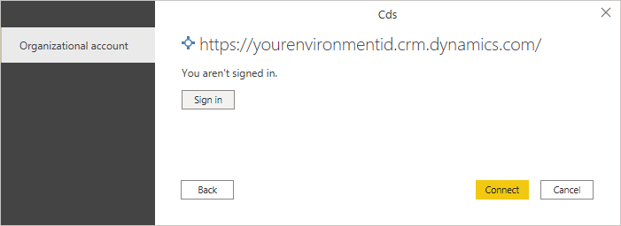
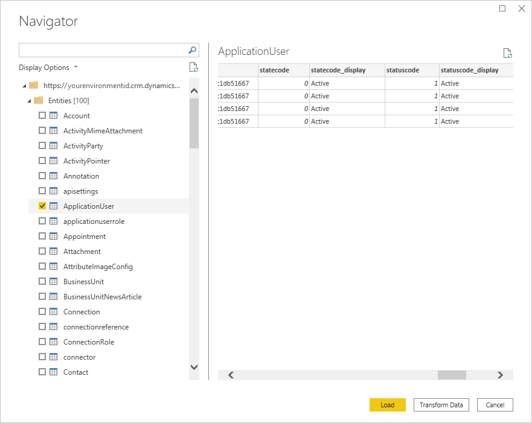

# Dataverse

## Summary

| Item | Description |
| ---- | ----------- |
| Release State | General Availability |
| Products | Power BI (Datasets) Power BI (Dataflows) Dynamics 365 Customer Insights |
| Authentication types | Organizational account |
| | |

## Prerequisites

You must have a Dataverse environment with maker permissions to access the portal, and read permissions to access data within tables.

## Capabilities supported

* Server URL
* Advanced
   * Reorder columns
   * Add display column

## Finding your Dataverse Environment URL

Open [Power Apps](https://make.powerapps.com/?utm_source=padocs&utm_medium=linkinadoc&utm_campaign=referralsfromdoc). In the upper right of the Power Apps page, select the environment you're going to connect to. Select the  settings icon, and then select **Advanced settings**.

In the new browser tab that opens, copy the root of the URL. This root URL is the unique URL for your environment. The URL will be in the format of https://\<*yourenvironmentid*>.crm.dynamics.com/. Make sure not to copy the rest of the URL. Keep this URL somewhere handy so you can use it later, for example, when you create Power BI reports.

## Connect to Dataverse from Power BI Desktop

>[!Note]
> The Power Query Dataverse connector is mostly suited towards analytics workloads, not bulk data extraction. For more information, go to [Alternative Dataverse connections](#alternative-dataverse-connections).

To connect to Dataverse from Power BI Desktop:

1. Select **Get data** from the **Home** tab.

2. In the **Get Data** dialog box, select **Power Platform > Dataverse**, and then select **Connect**.

   

3. Enter the server URL address of the data you want to load.

   

   When the table is loaded in the Navigator dialog box, by default the columns in the table are reordered in alphabetical order by the column names. If you don't want the columns reordered, in the advanced settings enter **false** in **Reorder columns**.

   Also when the table is loaded, by default if the table contains any picklist fields, a new column with the name of the picklist field with **_display** appended at the end of the name is added to the table. If you don't want the picklist field display column added, in the advanced settings enter **false** in **Add display column**.

   When you've finished filling in the information, select **OK**.

4. If this is the first time you're connecting to this site, select **Sign in** and input your credentials. Then select **Connect**.

   

5. In **Navigator**, select the data you require, then either load or transform the data.

   

## Connect to Dataverse from Power Query Online

To connect to Dataverse from Power Query Online:

1. From the **Data sources** page, select **Common Data Service (Legacy)**.

   

2. Enter the server URL address of the data you want to load.

   

3. If necessary, enter an on-premises data gateway if you're going to be using on-premises data (for example, if you're going to combine data from Dataverse and an on-premises SQL Server database).

4. Sign in to your organizational account.

5. When you've successfully signed in, select **Next**.

6. In the navigation page, select the data you require, and then select **Transform Data**.

## Limitations and issues

### Dataverse OData API performance and throttling limits

For information about OData API performance and throttling limits for Dataverse connections, go to [Requests limits and allocations](/power-platform/admin/api-request-limits-allocations). These limitations apply to both the Dataverse connector (which uses the OData API as an implementation detail) and the [OData Feed](odatafeed.md) connector when accessing the same endpoint.

### Table retrieval rate

As a guideline, most default tables will be retrieved at a rate of approximately 500 rows per second using the Dataverse connector. Take this rate into account when deciding whether you want to connect to Dataverse or export to data lake. If you require faster retrieval rates, consider using the Export to data lake feature or Tabular Data Stream (TDS) endpoint. For more information, go to [Alternative Dataverse connections](#alternative-dataverse-connections).

### Alternative Dataverse connections

There are several alternative ways of extracting and migrating data from Dataverse:

* Use the OData connector to move data in and out of Dataverse. For more information on how to migrate data between Dataverse environments using the dataflows OData connector, go to [Migrate data between Dataverse environments using the dataflows OData connector](/powerapps/developer/common-data-service/cds-odata-dataflows-migration).

* Use the **Export to data lake** feature in Power Apps to extract data from Dataverse into Azure Data Lake Storage, which can then be used to run analytics. For more information about the export to data lake feature, go to [Exporting Dataverse data to Azure Data Lake is Generally Available](https://powerapps.microsoft.com/blog/exporting-cds-data-to-azure-data-lake-preview/#:~:text=Exporting%20CDS%20data%20to%20Azure%20Data%20Lake%20is,BI%20reporting%2C%20ML%2C%20Data%20Warehousing%20and%20other%20).

* Use the Tabular Data Stream (TDS) Protocol endpoint to access read-only data in Dataverse. For more information about this preview feature and a video on how it works, go to [Tabular Data Stream (TDS) Protocol endpoint for Dataverse](https://powerapps.microsoft.com/blog/tabular-data-stream-tds-protocol-endpoint-for-common-data-service-cds/).

>[!Note]
> Both the Dataverse connector and the OData APIs are meant to serve analytical scenarios where data volumes are relatively small. The recommended approach for bulk data extraction is “Export to Data Lake”. The TDS endpoint is a better option than the Dataverse connector and OData endpoint, but is currently in Preview.
