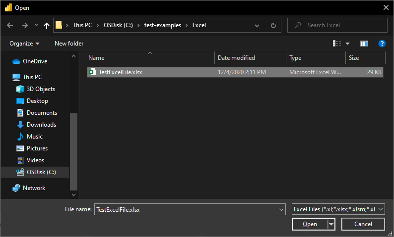
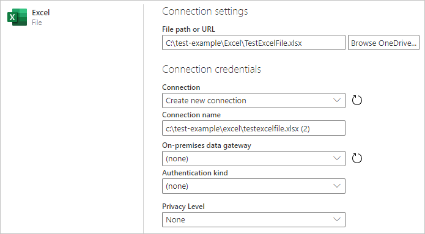

# Excel
 
## Summary

| Item | Description |
| ---- | ----------- |
| Release State | General Availability |
| Products | Power BI (Datasets)<br/>Power BI (Dataflows)<br/>Power Apps (Dataflows)<br/>Excel<br/>Dynamics 365 Customer Insights<br/>Analysis Services |
| Authentication Types Supported | Anonymous (online)<br/>Basic (online)<br/>Organizational account (online) |
| Function Reference Documentation | [Excel.Workbook](https://docs.microsoft.com/powerquery-m/excel-workbook)<br/>[Excel.CurrentWorkbook](https://docs.microsoft.com/powerquery-m/excel-currentworkbook) |
| | |

>[!Note]
> Some capabilities may be present in one product but not others due to deployment schedules and host-specific capabilities.
 
## Prerequisites
In order to connect to a legacy workbook (such as .xls or .xlsb), the Access Database Engine 2010 OLEDB provider is required. To install this provider, go to the [download page](https://go.microsoft.com/fwlink/?LinkID=285987) and install the relevant (32 bit or 64 bit) version. If you don't have it installed, when connecting to legacy workbooks you'll see the following error:

```The 32-bit (or 64-bit) version of the Access Database Engine 2010 OLEDB provider may be required to read this type of file. To download the client software, visit the following site: https://go.microsoft.com/fwlink/?LinkID=285987.```
 
## Capabilities Supported
* Import

## Connect to an Excel workbook from Power Query Desktop

To make the connection from Power Query Desktop:

1. Select the **Excel** option in the connector selection.
2. Browse for and select the Excel workbook you want to load. Then select **Open**.

   

   If the Excel workbook is online, use the [Web connector](web/web.md) to connect to the database.

3. In **Navigator**, select the workbook information you want, then either select **Load** to load the data or **Transform Data** to continue transforming the data in Power Query Editor.

   

## Connect to an Excel workbook from Power Query Online

To make the connection from Power Query Online:

1. Select the **Excel** option in the connector selection.

2. In the Excel dialog box that appears, provide the path to the Excel workbook.

   

3. If necessary, select an on-premises data gateway to access the Excel workbook. 

4. If this is the first time you've accessed this Excel workbook, select the authentication kind and sign in to your account (if needed).

3. In **Navigator**, select the workbook information you want, and then  **Transform Data** to continue transforming the data in Power Query Editor.

   

## Troubleshooting

### Connecting to an online Excel workbook

If you want to connect to an Excel document hosted in Sharepoint, you can do so via the [Web](web/web.md) connector in Power BI Desktop, Excel, and Dataflows, as well as the Excel connector in Dataflows. To get the link to the file:

1. Open the document in Excel Desktop.
2. Open the **File** menu, select the **Info** tab, and then select **Copy Path**.
3. Copy the address into the **File Path or URL** field, and remove the **?web=1** from the end of the address.

### Legacy ACE connector

Power Query reads legacy workbooks (such as .xls or .xlsb) using the Access Database Engine (or ACE) OLEDB provider. Because of this, you may encounter unexpected behaviors when importing legacy workbooks that don't occur when importing OpenXML workbooks (such as .xlsx). Here are some common examples.

#### Unexpected value formatting

Due to ACE, values from a legacy Excel workbook might be imported with less precision or fidelity than you expect. For example, imagine your Excel file contains the number 1024.231, which you have formatted for display as "1,024.23". When imported into Power Query, this value is represented as the text value "1,024.23" instead of as the underlying full-fidelity number (1024.231). This is because, in this case, ACE doesn't surface the underlying value to Power Query, but only the value as it's displayed in Excel.

#### Unexpected null values

When ACE loads a sheet, it looks at the first eight rows to determine the data types of the columns. If the first eight rows aren't representative of the subsequent rows, ACE may apply an incorrect type to that column and return nulls for any value that doesn't match the type. For example, if a column contains numbers in the first eight rows (such as 1000, 1001, and so on) but has non-numerical data in subsequent rows (such as "100Y" and "100Z"), ACE concludes that the column contains numbers, and any non-numeric values are returned as null.

#### Inconsistent value formatting
In some cases, ACE returns completely different results across refreshes. Using the example described in the [formatting section](#unexpected-value-formatting), you might suddenly see the value 1024.231 instead of "1,024.23". This can be caused by having the legacy workbook open in Excel while importing it into Power Query. To resolve this, simply close the workbook.

### Missing or incomplete Excel data
Sometimes Power Query fails to extract all the data from an Excel Worksheet. This is often caused by the Worksheet having **incorrect dimensions** (for example, having dimensions of `A1:C200` when the actual data occupies more than three columns or 200 rows).

#### How to diagnose incorrect dimensions

To view the dimensions of a Worksheet:

1.    Rename the xlsx file with a .zip extension.
1.    Open the file in File Explorer.
1.    Navigate into xl\worksheets.
1.    Copy the xml file for the problematic sheet (for example, Sheet1.xml) out of the zip file to another location.
1.    Inspect the first few lines of the file. If the file is small enough, simply open it in a text editor. If the file is too large to be opened in a text editor, run the following from a Command Prompt: **more Sheet1.xml**.
1.    Look for a `<dimension .../>` tag (for example, `<dimension ref="A1:C200" />`).

If your file has a dimension attribute that points to a single cell (such as `<dimension ref="A1" />`), Power Query uses this to find the starting row and column of the data on the sheet.

However, if your file has a dimension attribute that points to multiple cells (such as `<dimension ref="A1:AJ45000"/>`), Power Query uses this range to find the starting row and column **as well as the ending row and column**. If this range does not contain all the data on the sheet, some of the data won't be loaded.

#### How to fix incorrect dimensions

You can fix issues caused by incorrect dimensions by doing one of the following:

*   Open and re-save the document in Excel. This will overwrite the incorrect dimensions stored in the file with the correct value.
*   Ensure the tool that generated the Excel file is fixed to output the dimensions correctly.
*   Update your M query to ignore the incorrect dimensions. As of the December 2020 release of Power Query, `Excel.Workbook` now supports an `InferSheetDimensions` option. When true, this option will cause the function to ignore the dimensions stored in the Workbook and instead determine them by inspecting the data.

    Here's an example of how to provide this option:

    `Excel.Workbook(File.Contents("C:\MyExcelFile.xlsx"), [DelayTypes = true, InferSheetDimensions = true])`

### Sluggish or slow performance when loading Excel data

Slow loading of Excel data can also be caused by incorrect dimensions. However, in this case, the slowness is caused by the dimensions being much larger than they need to be, rather than being too small. Overly large dimensions will cause Power Query to read a much larger amount of data from the Workbook than is actually needed.

To fix this issue, you can refer to [Locate and reset the last cell on a worksheet](https://support.office.com/en-us/article/locate-and-reset-the-last-cell-on-a-worksheet-c9e468a8-0fc3-4f69-8038-b3c1d86e99e9) for detailed instructions.
