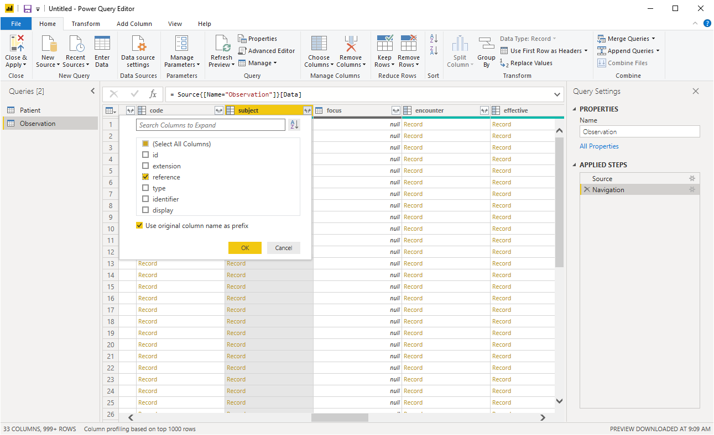
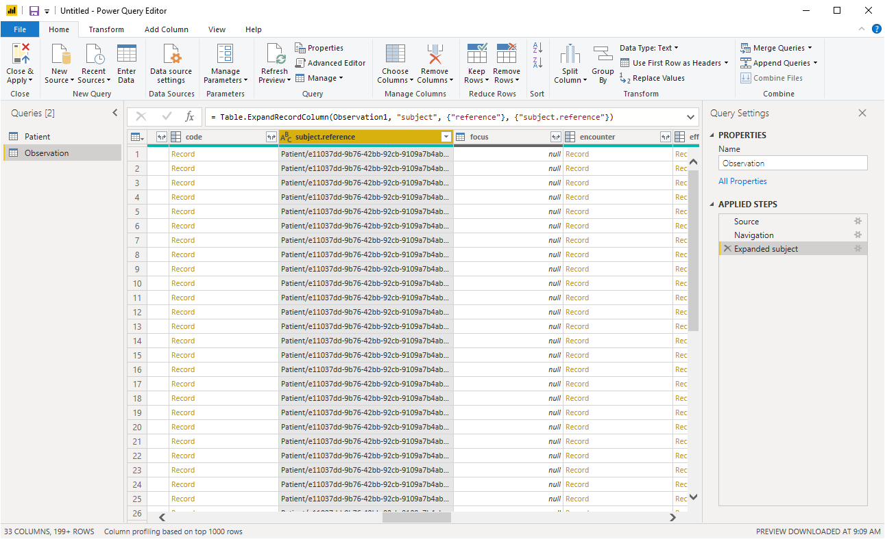
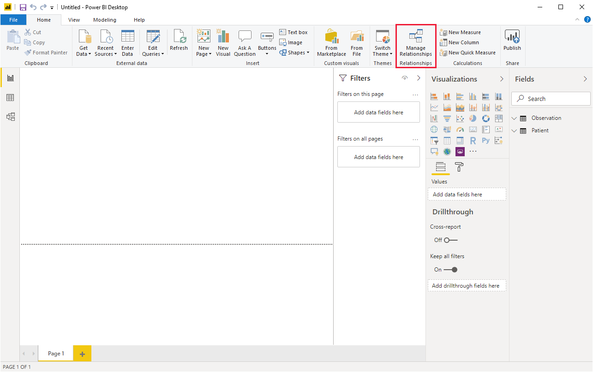

# FHIR Relationships

This article describes how to establish [relationships](/power-bi/desktop-create-and-manage-relationships) between tables that have been imported using the Power Query connector for FHIR.

## Introduction

FHIR resources are related to each other, for example, an `Observation` that references a subject (`Patient`):

```json
{
    "resourceType": "Observation",
    "id": "1234",
    "subject": {
        "reference": "Patient/456"
    }

    // ... Other fields
}
```

Some of the resource reference fields in FHIR can refer to multiple different types of resources (for example, `Practitioner` or `Organization`). To facilitate an easier way to resolve references, the Power Query connector for FHIR adds a synthetic field to all imported resources called `<referenceId>`, which contains a concatenation of the resource type and the resource ID.

To establish a relationship between two tables, you can connect a specific reference field on a resource to the corresponding `<referenceId>` field on the resource you would like it linked to. In simple cases, Power BI will even detect this for you automatically.

## Establishing FHIR relationships in Power BI

In this section, we'll show an example of establishing a relationship between the `Observation.subject.reference` field and the `<referenceId>` field on `Patient`.

1. When importing data, select the **Patient** and **Observation** tables:

    

    Then select **Transform Data**.

1. Expand the **subject** column on `Observation` to reveal `subject.reference`:

    

    After expanding, you should see the list of subject references:

    

1. Make any other modifications you need to the query and save the modified query.

1. Select **Manage Relationships** in the Power BI client:

    

1. Establish the relationship. In this simple example, Power BI will likely have detected the relationship automatically:

    

    If not, you can add it manually:

    

    You can edit the details of the relationship:

    


## Summary

Resources in FHIR are related. These relationships need to be established on data imported with the Power Query connector for FHIR. The `<referenceId>` field is a synthetic field added to all imported FHIR data that will help establish the relationships.

## Next steps

In this article, you've learned how to establish relationships between tables imported with the Power Query connector for FHIR. Next, explore query folding with the Power Query connector for FHIR.

>[!div class="nextstepaction"]
>[FHIR Power Query folding](FHIR-QueryFolding.md)