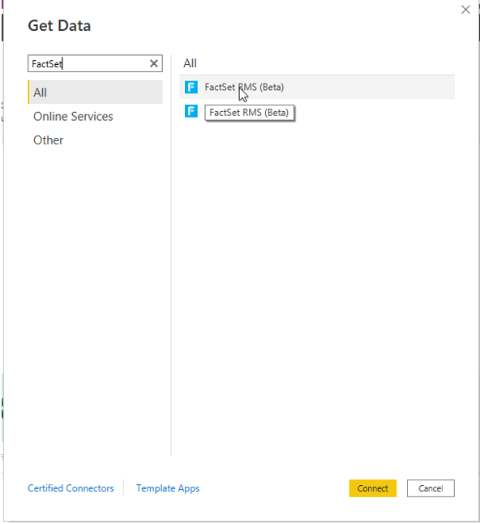
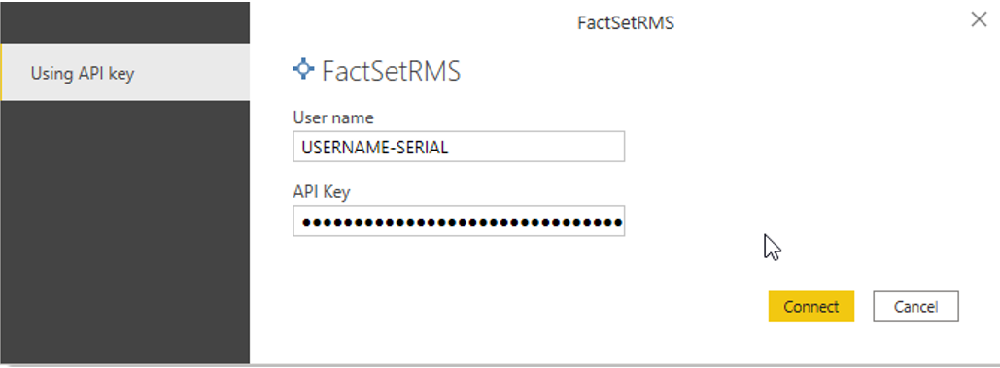
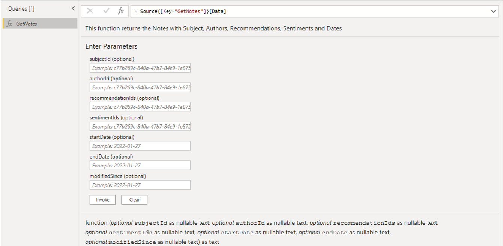
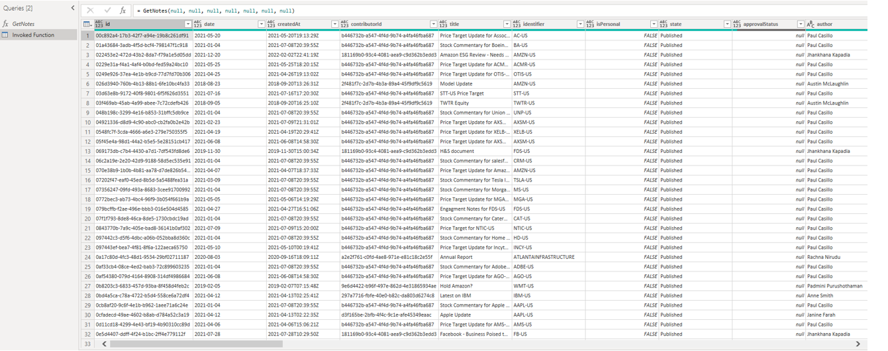

# FactSet RMS (Beta)

## Summary
 
| Item | Description |
| ------- | ------------|
|Release state | Beta |
| Products supported | Power BI (Datasets) |
| Authentication types supported| Basic |
| Function reference docs | https://developer.factset.com/api-catalog/irn-notes-api|

> [!NOTE]
> The following connector article is provided by FactSet, the owner of this connector and a member of the Microsoft Power Query Connector Certification Program. If you have questions regarding the content of this article or have changes you would like to see made to this article, visit the FactSet website and use the support channels there.

## Prerequisites
To start using the FactSet RMS connector, the following prerequisite steps need to be completed. 

* ### Download Power BI - 
    * Please ensure that you are using latest version of Power BI , as latest major update to FactSet Power BI Data connector will only be available there. Any subsequent major or minor version updates will only be available by upgrading Power BI.

* Subscription & Authentication
    * To access FactSet’s IRN, the appropriate subscription is required. Please refer to the FactSet Client Assistance page for more details.

    * With the subscription in place, the next step is to generate the API key from the Developer Portal. Please follow the steps outlined in the “FactSet API keys Authentication v1 documentation” under ‘Authentication’ in the FactSet ‘Support’ dropdown.

## Capabilities supported
* Import

## Connect to FactSet RMS from Power Query Desktop

To import data using FactSet RMS Connector from Power Query Desktop, take the following steps:

1. **Open Power BI Desktop** - 
    On the Power BI Desktop home page, under section “Get Data” -> “More…” 
    

2. **Connect to FactsSetRMS**   - Search for ‘FactSet’ in the ‘Get Data’ pop-up and select the FactSet RMS Connector from the right-hand list.
    

3. **Authentication page** - You will be prompted to enter the Username - Serial and the API key. Please see the FactSet Developer Portal for additional instructions on setting up an API Key

4. **Connector Navigator** - The Connector will open the Power Query Navigator with a list of all functions provided. Please note that all functions may not be available depending on your available subscriptions. Your account team can assist with requirements for access to additional products.

5. **Use Get Functions in the Connector** - Use the Get * Queries to look up parameters for your Notes and create new queries. A form will populate in the query window with parameter fields to narrow your universe and return the relevant data set of interest based on IRN Subject , Author , Date Range , Recommendations and/or Sentiments. Note that the functions contain Get* queries that are common for IRN Notes, Custom Symbols and Meetings APIs.

Below are the Get Functions in the connector -

| Function Name | Function Description |
| --------------- | ----------- |
| GetNotes | Gets all the notes including non-extended text custom fields in the specified date(startDate and endDate) range and can be filtered on subjectId, authorId, recommendationId, sentimentId and modifiedSince. |
| GetNote | Gets Details of a note including note body and extended text custom fields. |
| GetMeetings | Gets all the meetings including non-extended text custom fields in the specified date(startDate and endDate) range and can be filtered on modifiedSince. |
| GetMeeting | Gets Details of a meeting including meeting body and extended text custom fields. |
| GetCustomSymbols | Get list of all custom symbols in your IRN database along with standard field data and non-extended text custom fields data and can be filtered on CustomSymbolTypeName. |
| GetCustomSymbol | Gets details of a custom symbol including symbol description and extended text custom fields.|
|

6. **Result Format** - Results will be returned as a table with notes and custom field 
