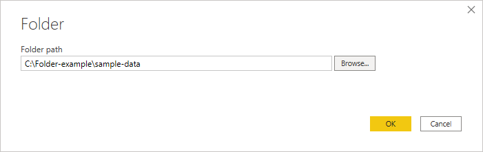
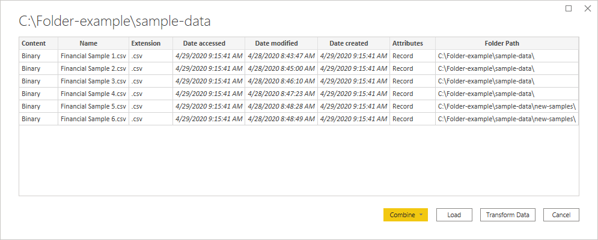
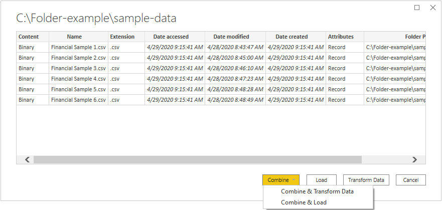
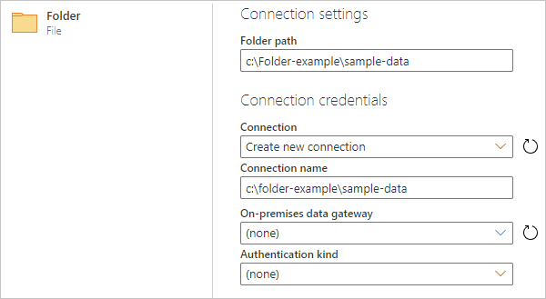

# Folder

## Summary

| Item | Description |
| ---- | ----------- |
| Release State | General Availability |
| Products | Power BI (Datasets) Power BI (Dataflows) Power Apps (Dataflows) Excel Dynamics 365 Customer Insights Analysis Services |
|Authentication Types Supported | Windows |
| Function Reference Documentation | [Folder.Contents](/powerquery-m/folder-contents), [Folder.Files](/powerquery-m/folder-files) |
| | |

## Capabilities supported

* Folder path
* Combine
   * Combine and load
   * Combine and transform

## Connect to a folder from Power Query Desktop

To connect to a folder from Power Query Desktop:

1. Select the **Folder** option in the connector selection.

2. Enter the path to the folder you want to load, or select **Browse** to browse to the folder you want to load. Then select **OK**.

   

   When you select the folder you want to use, the file information about all of the files in that folder are displayed. Also, file information about any files in any subfolders is also displayed.

   

3. Select **Combine & Transform Data** to combine the data in the files of the selected folder and load the data in the Power Query Editor for editing. Select **Combine & Load** to load the data from all of the files in the folder directly into your app. Or select **Transform Data** to load the folder data as-is in the Power Query Editor.

   

>[!Note]
>The **Combine & Transform Data** and **Combine & Load** buttons are the easiest ways to combine data found in the files of the folder you specify. You could also use the **Load** button (in Power BI Desktop only) or the **Transform Data** buttons to combine the files as well, but that requires more manual steps.

## Connect to a folder from Power Query Online

To connect to a folder from Power Query Online:

1. Select the **Folder** option in the connector selection.

2. Enter the path to the folder you want to load.

   

3. Enter the name of an on-premises data gateway that you'll use to access the folder.

4. Select the authentication kind to connect to the folder. If you select the **Windows** authentication kind, enter your credentials.

5. Select **Next**.

6. In the **Navigator** dialog box, select **Combine** to combine the data in the files of the selected folder and load the data into the Power Query Editor for editing. Or select **Transform data** to load the folder data as-is in the Power Query Editor.

   

## Troubleshooting

### Combining files

All of the files in the folder you select are included in the data to be combined. If you have data files located in a subfolder of the folder you select, all of these files are also included. To ensure that combining the file data works properly, make sure that all of the files in the folder and its subfolders have the same schema.

For more information about combining files, see [Combine files in Power Query](../combine-files-overview.md).