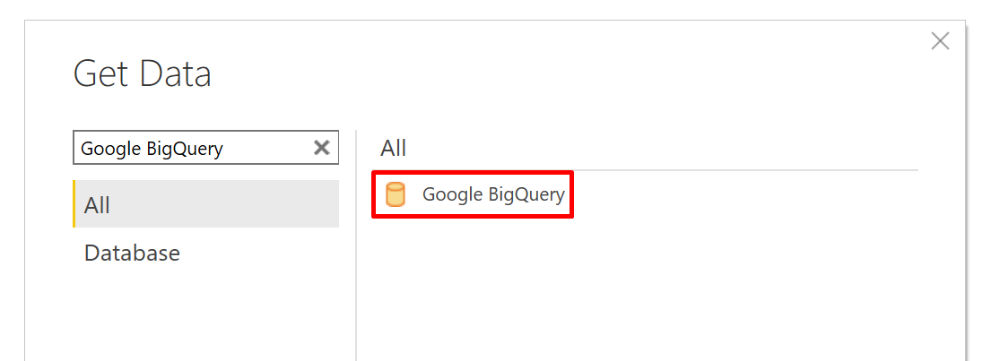
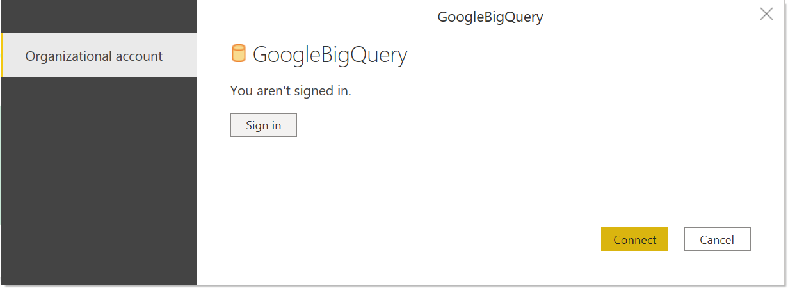
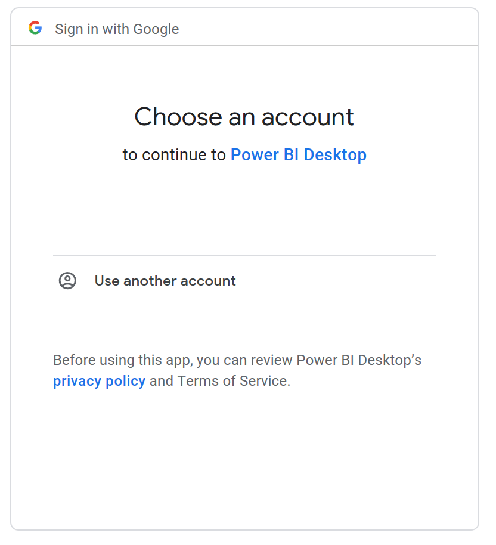
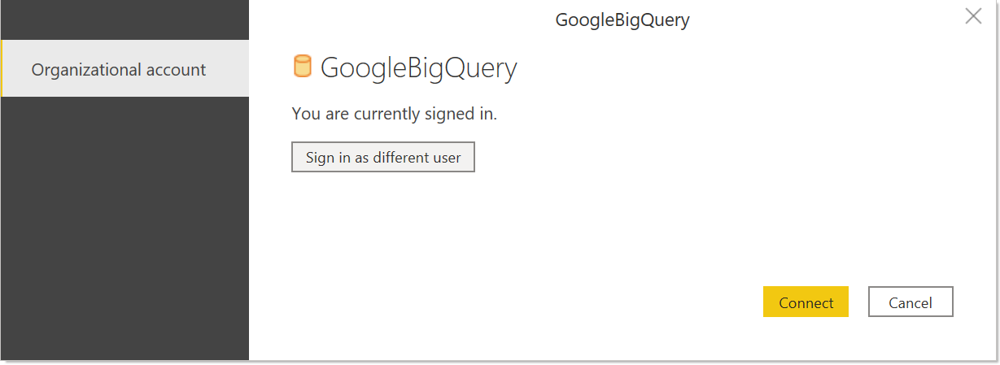

# Google BigQuery
 
## Summary

| Item | Description |
| ---- | ----------- |
| Release State | General Availability |
| Products | Power BI Desktop |
| Authentication Types Supported | Organizational account |
| | |

> [!NOTE]
> Effective July 2021, Google will discontinue support for sign-ins to Google accounts from embedded browser frameworks. Due to this change, you will need to [update](https://powerbi.microsoft.com/downloads/) your Power BI Desktop version to June 2021 to support signing in to Google.

## Prerequisites

You'll need a Google Account to log into Google BigQuery. 

## Capabilities Supported

 * Import

## Connection Instructions

To connect to Google BigQuery, follow these steps:

1) In the Get Data experience, search for and select **Google BigQuery**. 

    

2) The Google BigQuery connector supports connecting through an organizational account. Select **Sign In** to proceed.

    

3) A **Sign in with Google** dialog will appear. Select your Google account and approve connecting to Power BI Desktop.

    

4) Once signed in, select **Connect** to continue.

    

5) The Navigator will now load. Select your data in the Navigator and select either **Transform Data** in Power Query or **Load** into Power BI Desktop.

## Limitations and Considerations

This section describes any limitations or considerations of the Google BigQuery connector.

### Nested Fields

To optimize performance considerations, Google BigQuery performs well with large datasets when denormalized, flattened, and nested. 

The Google BigQuery connector supports nested fields, which are loaded as text columns in JSON format. 

Users should select **Transform Data** and then use the JSON parsing capabilities within the Power Query Editor to extract the data.

* Under the **Transforms** ribbon tab, the **Text Column** category, select **Parse** and then **JSON**.
* Extract the JSON record fields using the **Expand Column** option.

