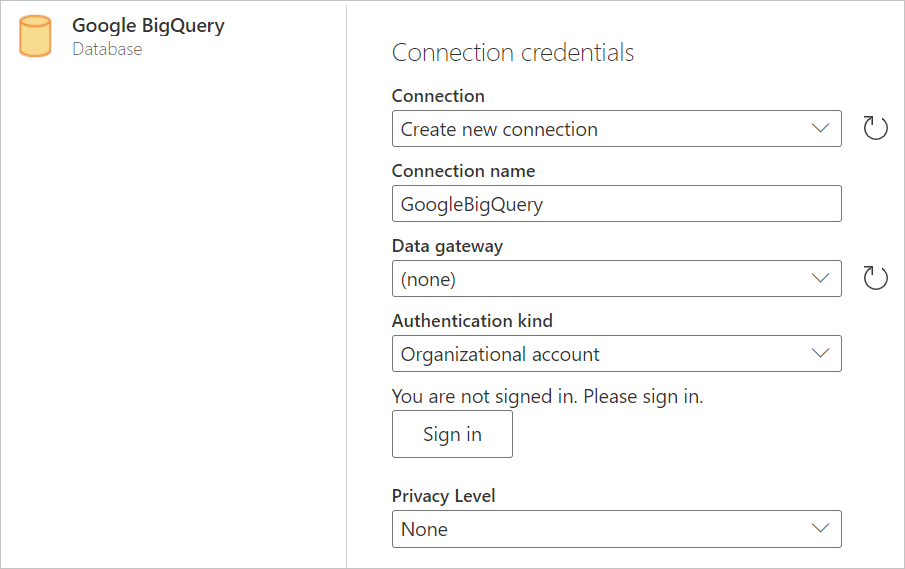
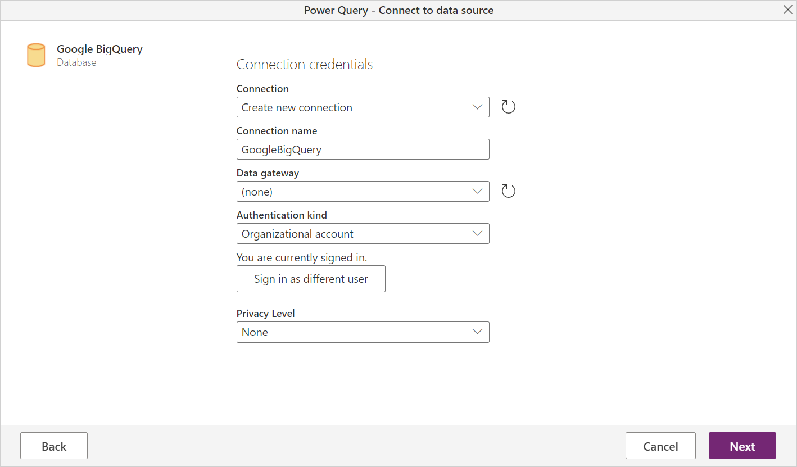
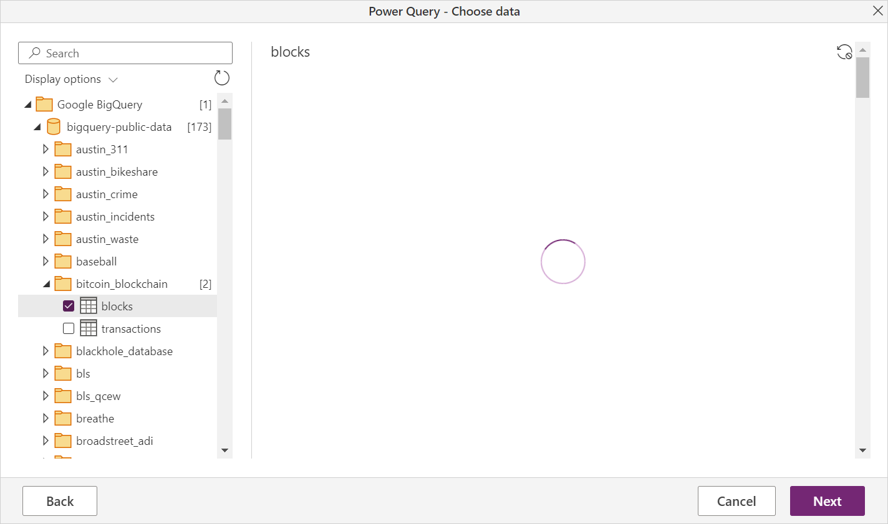

# Google BigQuery

## Summary

| Item | Description |
| ---- | ----------- |
| Release State | General Availability |
| Products | Power BI (Datasets) Power BI (Dataflows) Power Apps (Dataflows) Customer Insights (Dataflows) |
| Authentication Types Supported | Organizational account Service account |
| | |

> [!NOTE]
> Effective July 2021, Google will discontinue support for sign-ins to Google accounts from embedded browser frameworks. Due to this change, you will need to [update](https://powerbi.microsoft.com/downloads/) your Power BI Desktop version to June 2021 to support signing in to Google.

## Prerequisites

You'll need a Google Account to sign in to Google BigQuery.

## Capabilities supported

* Import

## Connect to Google BigQuery data from Power Query Desktop

To connect to Google BigQuery from Power Query Desktop, take the following steps:

1. In the Get Data experience, search for and select **Google BigQuery**.

    

2. The Google BigQuery connector supports connecting through an organizational account or a service account login. In this example, you'll use the organizational account to sign in. Select **Sign In** to proceed.

    

    You can also sign in using a Google service account. In this case, select **Service Account Login** and enter your service account email and your service account JSON key file contents. Then select **Connect**.

3. A **Sign in with Google** dialog appears. Select your Google account and approve connecting to Power BI Desktop.

    

4. Once signed in, select **Connect** to continue.

    

5. Once you successfully connect, a **Navigator** window appears and displays the data available on the server. Select your data in the navigator. Then select either **Transform Data** to transform the data in Power Query or **Load** to load the data in Power BI Desktop.

    

## Connect to Google BigQuery data from Power Query Online

To connect to Google BigQuery from Power Query Online, take the following steps:

1. In the Get Data experience, select the **Database** category and then select **Google BigQuery**.

    

2. In the **Google BigQuery Database** dialog, you may need to either create a new connection or select an existing connection. If you are using on-premises data, select an on-premises data gateway. Then select **Sign in**.

    

3. A **Sign in with Google** dialog appears. Select your Google account and approve connecting.
    >[!NOTE]
    >Although the sign in dialog box says you'll continue to Power BI Desktop once you've signed in, you'll be sent to your online app instead.

    

4. Once signed in, select **Next** to continue.

    

5. Once you successfully connect, a **Navigator** window appears and displays the data available on the server. Select your data in the navigator. Then select **Next** to transform the data in Power Query.

    

## Limitations and considerations

This section describes any limitations or considerations of the Google BigQuery connector.

### Connecting to Google Big Query in Power BI Desktop

For more information about limitations and considerations in connecting to Google Big Query in Power BI, go to [Considerations and limitations](/power-bi/connect-data/desktop-connect-bigquery#considerations-and-limitations).

### Nested fields

To optimize performance considerations, Google BigQuery performs well with large datasets when denormalized, flattened, and nested.

The Google BigQuery connector supports nested fields, which are loaded as text columns in JSON format.

Users should select **Transform Data** and then use the JSON parsing capabilities in the Power Query Editor to extract the data.

1. Under the **Transforms** ribbon tab, the **Text Column** category, select **Parse** and then **JSON**.
2. Extract the JSON record fields using the **Expand Column** option.

### Setting up a Google service account

For more information on setting up or using Google service accounts, go to [Creating and managing service account keys](https://cloud.google.com/iam/docs/creating-managing-service-account-keys) in the Google docs.
