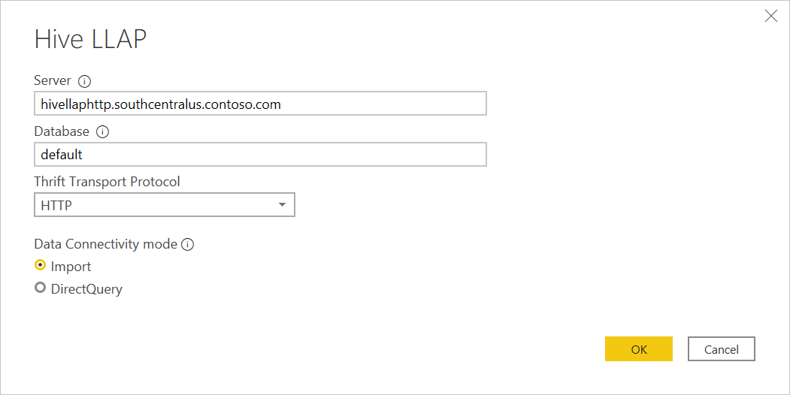
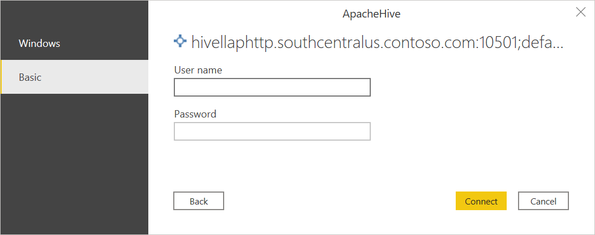
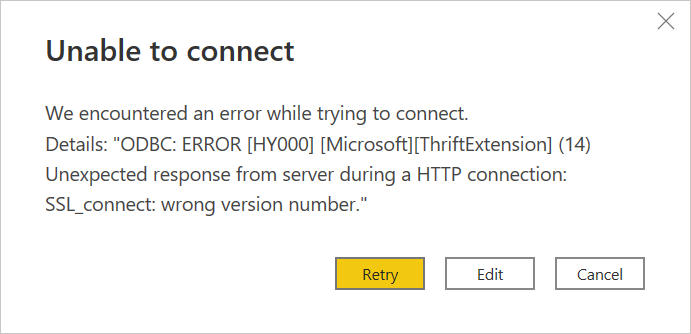

# Hive LLAP

## Summary

| Item                             | Description                                                                  |
| -------------------------------- | ---------------------------------------------------------------------------- |
| Release State                    | General Availability                                                         |
| Products                         | Power BI (Datasets)                                                          |
| Authentication Types Supported   | Basic (Username/Password) Windows                                        |
| Function Reference Documentation | &mdash;                                                                      |
|                                  |                                                                              |

## Prerequisites

An Apache Hive LLAP username and password.

## Capabilities Supported

- Import
- Direct Query
- Thrift Transport Protocol
  - HTTP
  - Standard

## Connect to Hive LLAP data from Power Query Desktop

To connect to an Apache Hive LLAP server:

1. Select the **Hive LLAP** option from **Get Data**.

2. Enter the **URL** to the Adobe Hive LLAP server. You can also enter an optional port number. Typically, the URL looks like `http://[hostname]:[port number]`. The components of the URL are:

   - The `hostname` (for example, `hivellaphttp.southcentralus.contoso.com`) is the hostname or IP address of the Apache Hive server.
   - The `port number` (for example, 10500) is the port number for the Apache Hive server. If the `port number` isn't specified, the default value is 10501 for the HTTP transport protocol and 10500 for the standard transport protocol.

   

3. In **Thrift Transport Protocol**, select either **Standard** for TCP mode, or **HTTP** for HTTP mode.

4. Select either the **Import** or **DirectQuery** data connectivity mode. More information: [Use DirectQuery in Power BI Desktop](/power-bi/connect-data/desktop-use-directquery)

5. Select **OK** to continue.

6. The first time you connect to a data source (identified by each unique URL), you'll be prompted to enter account credentials. Select the appropriate type of authentication and enter your credentials for the connection.

   - **Windows**: Select this authentication type if you want to connect using Windows authentication.
   - **Basic**: Select this authentication type if you want to connect using Apache Hive LLAP authentication. Enter your Apache Hive LLAP **User name** and **Password**.

   More information: [Authentication with a data source.](../ConnectorAuthentication.md)

   

7. Select **Connect** to connect to the Apache Hive LLAP data.

8. In **Navigator**, select the data you require. Then select either **Transform data** to transform the data in Power Query Editor or **Load** to load the data in Power BI Desktop.

   

## Kerberos-based single sign-on (SSO) for Hive LLAP

The Hive LLAP connector now supports Kerberos-based single sign-on (SSO).

To use this feature:

1. Sign in to your Power BI account, and navigate to the **Gateway management** page.

2. Add a new data source under the gateway cluster you want to use.

3. Select the connector in the **Data Source Type** list.

4. Expand the **Advanced Settings** section.

5. Select the option to **Use SSO via Kerberos for DirectQuery queries** or **Use SSO via Kerberos for DirectQuery and Import queries**.

   

More information, [Configure Kerberos-based SSO from Power BI service to on-premises data sources](/power-bi/connect-data/service-gateway-sso-kerberos)

## Troubleshooting

You might come across the following "SSL_connect" error after entering the authentication information for the connector and selecting **Connect**.

If this error occurs:

1. In Power BI Desktop, select **Files** > **Options and settings** > **Data source settings**.

2. In **Data source settings**, select the Hive LLAP source you created, and then select **Edit Permissions**.

   

3. In **Edit Permissions**, under **Encryption**, clear the **Encrypt connections** check box.

   

4. Select **OK**, and then in **Data source settings**, select **Close**.

5. Redo the steps in [Connect to Hive LLAP data from Power Query Desktop](#connect-to-hive-llap-data-from-power-query-desktop).
