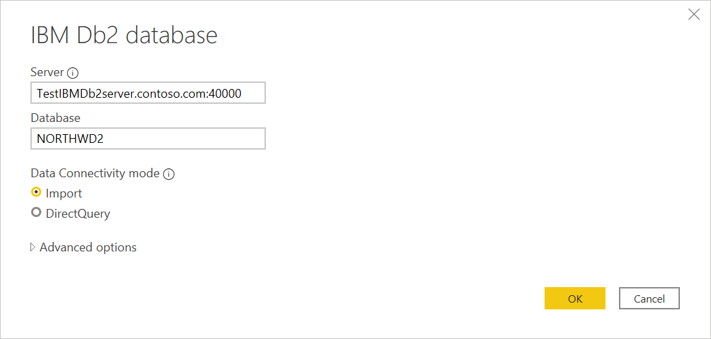
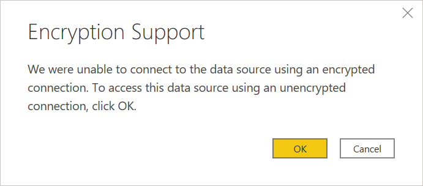

# IBM Db2 database

## Summary

| Item | Description |
| ---- | ----------- |
| Release State | General Availability |
| Products | Power BI (Datasets) Power BI (Dataflows) Power Apps (Dataflows) Excel Dynamics 365 Customer Insights |
| Authentication Types Supported |  |
| Function Reference Documentation |  |
| | |

>[!Note]
> Some capabilities may be present in one product but not others due to deployment schedules and host-specific capabilities.

## Prerequisites

((Enter prerequisites here))

## Capabilities Supported

* Import
* DirectQuery
* Advanced options
  * Driver (IBM or Microsoft)
  * Command timeout in minutes
  * Package collection
  * SQL statement
  * Include relationship columns
  * Navigate using full hierarchy

## Connect to an IBM Db2 database from Power Query Desktop

To make the connection, take the following steps:

1. Select the **IBM Db2 database** option in from **Get Data**.

2. Specify the IBM Db2 server to connect to in **Server**. If a port is required, specify it by using the format *ServerName:Port*, where *Port* is the port number. Also, enter the IBM Db2 database you want to access in **Database**. In this example, the server name and port are `TestIBMDb2server.contoso.com:4000` and the IBM Db2 database being accessed in `NORTHWD2`.

   

3. If you're connecting from Power BI Desktop, select either the **Import** or **DirectQuery** data connectivity mode. The rest of these example steps use the Import data connectivity mode. To learn more about DirectQuery, go to [Use DirectQuery in Power BI Desktop](/power-bi/connect-data/desktop-use-directquery).

   >[!Note]
   > By default, the IBM Db2 database dialog box uses the Microsoft driver during sign in. If you want to use the IBM driver, open **Advanced options** and select **IBM**. More information: [Connect using advanced options](#connect-using-advanced-options)
   >
   > If you select **DirectQuery** as your data connectivity mode, the **SQL statement** in the advanced options will be disabled. DirectQuery currently does not support query push down on top of a native database query for the IBM Db2 connector.

4. Select **OK**.

5. If this is the first time you're connecting to this IBM Db2 database, select the authentication type you want to use, enter your credentials, and then select **Connect**. For more information about authentication, go to [Authentication with a data source](../connectorauthentication.md).

   

   By default, Power Query attempts to connect to the IBM Db2 database using an encrypted connection. If Power Query can't connect using an encrypted connection, an "unable to connect" dialog box will appear. To connect using an unencrypted connection, select **OK**.

   

6. In **Navigator**, select the data you require, then either select **Load** to load the data or **Transform Data** to transform the data.

   

## Connect to an IBM Db2 database from Power Query Online

To make the connection, take the following steps:

1. Select the **IBM Db2 database** option in the **Power Query - Connecto to data source** page.

2. Specify the IBM Db2 server to connect to in **Server**. If a port is required, specify it by using the format *ServerName:Port*, where *Port* is the port number. Also, enter the IBM Db2 database you want to access in **Database**. In this example, the server name and port are `TestIBMDb2server.contoso.com:4000` and the IBM Db2 database being accessed in `NORTHWD2`

3. Select the name of your on-premises data gateway.

   >[!Note]
   > You must select an on-premises data gateway for this connector, whether the IBM Db2 database is on your local network or on a web site.

4. If this is the first time you're connecting to this IBM Db2 database, select the type of credentials for the connection in **Authentication kind**. Choose **Basic** if you plan to use an account that's created in the IBM Db2 database instead of Windows authentication.

5. Enter your credentials.

6. Select **Use Encrypted Connection** if you want to use an encrypted connection, or clear it if you want to use an unencrypted connection.

   

7. Select **Next** to continue.

8. In **Navigator**, select the data you require, then select **Transform data** to transform the data in Power Query Editor.

   

## Connect using advanced options

Power Query provides a set of advanced options that you can add to your query if needed.

The following table lists all of the advanced options you can set in Power Query.

| Advanced option | Description |
| --------------- | ----------- |
| Driver | This option is only available in Power Query Desktop. |
| Command timeout in minutes | If your connection lasts longer than 10 minutes (the default timeout), you can enter another value in minutes to keep the connection open longer. |
| Package collection | |
| SQL statement | For information, go to [Import data from a database using native database query](../native-database-query.md). |
| Include relationship columns | If checked, includes columns that might have relationships to other tables. If this box is cleared, you won’t see those columns. |
| Navigate using full hierarchy | If checked, the navigator displays the complete hierarchy of tables in the database you're connecting to. If cleared, the navigator displays only the tables whose columns and rows contain data. |
| | |

Once you've selected the advanced options you require, select **OK** in Power Query to connect to your IBM Db2 database.

## Troubleshooting

## Next steps

[Optimize Power Query when expanding table columns](../optimize-expanding-table-columns.md)