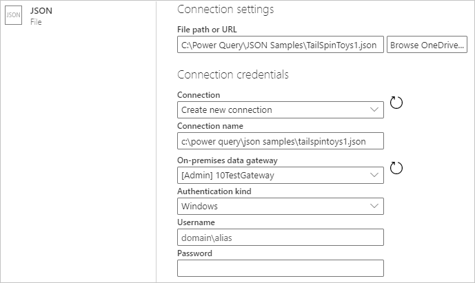
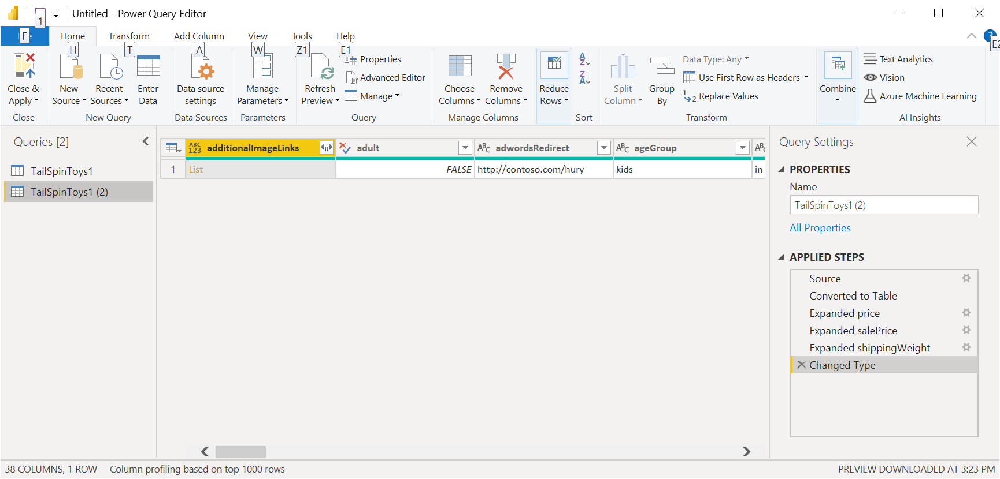

# JSON

## Summary

Release State: General Availability

Products: Power BI Desktop, Power BI Service (Enterprise Gateway), Dataflows in PowerBI.com (Enterprise Gateway), Dataflows in PowerApps.com (Enterprise Gateway), Excel

Authentication Types Supported: Anonymous, Basic (Web only), Organizational Account, Web API (Web only), Windows

Function Reference Documentation: [Json.Document](https://docs.microsoft.com/powerquery-m/json-document)

## Capabilities supported

* Import

## Load from JSON File

To load a local JSON file into either Power BI Desktop or Excel, all you need to do is select the **JSON** option in the connector selection. This will launch a local file browser and allow you to select your JSON file.


To load a local JSON file into an online service, such as Power BI service or Power Apps, you'll need to enter the local path to the JSON file, select an on-premises data gateway, and, if authentication is required, enter your credentials.



Loading the JSON file will automatically launch the Power Query Editor for you to transform the data if you want, or you can simply close and apply. 



JSON data may not always be imported into Power Query as a table. However, you can always use the available Power Query ribbon transforms to convert it to a table.

## Load from the web

To load a JSON file from the web, select the [Web connector](web.md), enter the web address of the file, and follow any credential prompts.

## Troubleshooting

If you see the following message, it may be because the file is invalid, for example, it's not really a JSON file, or is malformed. Or you may be trying to load a JSON Lines file.


If you are trying to load a JSON Lines file, the following sample M code converts all JSON Lines input to a single flattened table automatically:

```
let
    // Read the file into a list of lines
    Source = Table.FromColumns({Lines.FromBinary(File.Contents("C:\json-lines-example.json"), null, null)}),
    // Transform each line using Json.Document
    #"Transformed Column" = Table.TransformColumns(Source, {"Column1", Json.Document})
in
    #"Transformed Column"
```

You'll then need to use an *Expand* operation to combine the lines together.
