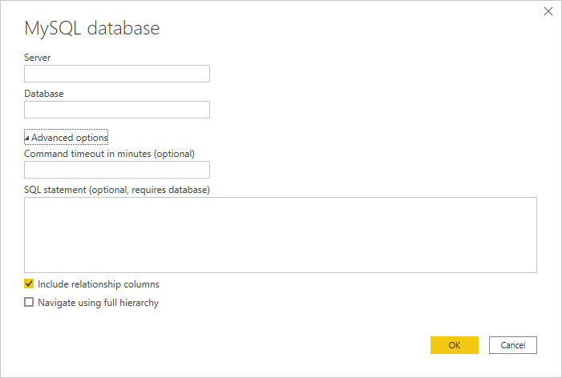
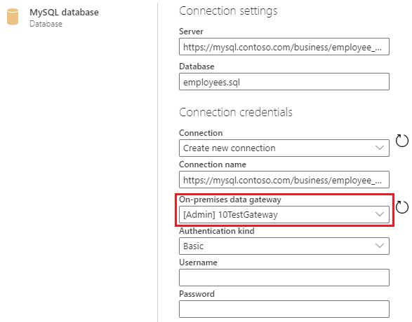

# MySQL database
 
## Summary

| Item | Description |
| ---- | ----------- |
| Release State | General Availability |
| Products | Power BI (Datasets) Power BI (Dataflows) Power Apps (Dataflows) Excel Dynamics 365 Customer Insights Analysis Services |
| Authentication Types Supported | Windows (Power BI Desktop, Excel, online service with gateway), Database (Power BI Desktop, Excel), Basic (online service with gateway) |
| Function Reference Documentation | [MySQL.Database](https://docs.microsoft.com/powerquery-m/mysql-database) |
| | |

>[!Note]
> Some capabilities may be present in one product but not others due to deployment schedules and host-specific capabilities.
 
## Prerequisites

By default, Power BI installs an OLE DB driver for MySQL database. However, for optimal performance, we recommend that the customer installs the [SQL Server Native Client](https://docs.microsoft.com/sql/relational-databases/native-client/applications/installing-sql-server-native-client?view=sql-server-ver15) before using the MySQL database connector. SQL Server Native Client 11.0 and SQL Server Native Client 10.0 are both supported in the latest version.

 
## Capabilities Supported
* Import
* Advanced options
    * Command timeout in minutes
    * Native SQL statement
    * Relationship columns
    * Navigate using full hierarchy
    
## Connect to MySQL database from Power Query Desktop

To make the connection, take the following steps:
 
1. Select the **MySQL database** option in the connector selection.
 
2. In the **MySQL database** dialog, provide the name of the server and database. 

   

3. Select the **Database** authentication type and input your MySQL credentials in the **User name** and **Password** boxes.

   

4. Select the level to apply your credentials to.

5. Once you're done, select **OK**.

   >[!Note]
   > If the connection is not encrypted, you'll be prompted with the following dialog.

   

   Select **OK** to connect to the database by using an unencrypted connection, or follow the [instructions](https://docs.microsoft.com/sql/database-engine/configure-windows/enable-encrypted-connections-to-the-database-engine) to set up encrypted connections to SQL Server.

6. In **Navigator**, select the data you require, then either load or transform the data.

   

## Connect to MySQL database from Power Query Online

To make the connection, take the following steps:

1. Select the **MySQL database** option in the connector selection.
 
2. In the **MySQL database** dialog, provide the name of the server and database.  

   

3. If necessary, include the name of your on-premises data gateway.

4. Select the **Basic** authentication kind and input your MySQL credentials in the **Username** and **Password** boxes.

5. If your connection isn't encrypted, clear **Use Encrypted Connection**.

5. Select **Next** to connect to the database.

6. In **Navigator**, select the data you require, then select **Transform data** to transform the data in Power Query Editor.

## Connect using advanced options

Power Query Desktop provides a set of advanced options that you can add to your query if needed.

The following table lists all of the advanced options you can set in Power Query Desktop.

| Advanced option	| Description |
| --------------- | ----------- |
| Command timeout in minutes | If your connection lasts longer than 10 minutes (the default timeout), you can enter another value in minutes to keep the connection open longer. This option is only available in Power Query Desktop. |
| SQL statement | For information, go to [Import data from a database using native database query](../native-database-query.md). |
| Include relationship columns | If checked, includes columns that might have relationships to other tables. If this box is cleared, you won’t see those columns. |
| Navigate using full hierarchy | If checked, the navigator displays the complete hierarchy of tables in the database you're connecting to. If cleared, the navigator displays only the tables whose columns and rows contain data. |
| | |

Once you've selected the advanced options you require, select **OK** in Power Query Desktop to connect to your MySQL database.
