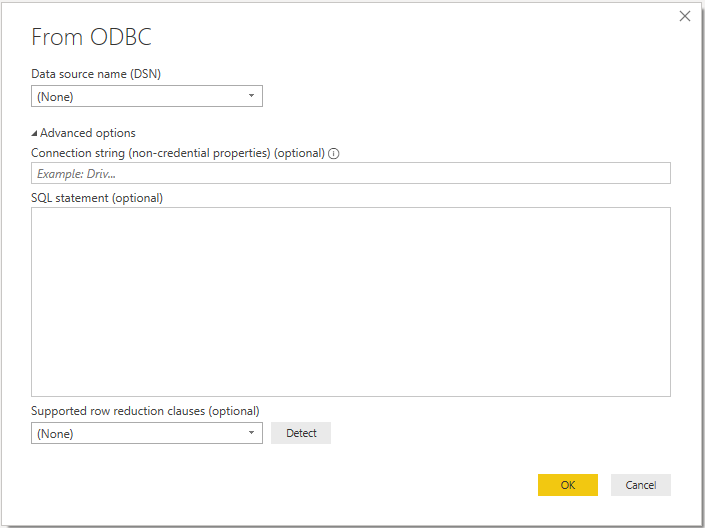

# ODBC
 
## Summary
 
Release State: General Availability

Products: Power BI Desktop, Power BI Service (On-Premise Gateway), Dataflows in PowerBI.com (On-Premise Gateway), Dataflows in PowerApps.com (On-Premise Gateway), Excel, Flow

Authentication Types Supported: Database (Username/Password), Windows, Default or Custom

M Function Reference: [Odbc.DataSource](https://docs.microsoft.com/powerquery-m/odbc-datasource), [Odbc.Query](https://docs.microsoft.com/powerquery-m/odbc-query)

>[!Note]
> Some capabilities may be present in one product but not others due to deployment schedules and host-specific capabilities.
 
## Capabilities Supported
* Import
* Advanced options
  * Connection string (non-credential properties)
  * SQL statement
  * Supported row reduction clauses
    
## Connect to an ODBC data source
Before you get started, make sure you've properly configured the connection in the [Windows ODBC Data Source Administrator](https://docs.microsoft.com/sql/odbc/admin/odbc-data-source-administrator?view=sql-server-ver15). The exact process here will depend on the driver.

To make the connection, take the following steps:
 
1. From the Power Query **Get Data** dialog (or **Data** tab in the Excel ribbon), select **Database > ODBC**.
 
   
 
2. In the **From ODBC** dialog that appears, provide the connection string (optional).

   You may also choose to provide a SQL statement, depending on the capabilities of the driver. Ask your vendor for more information.

3. To enable folding support for [Table.FirstN](https://docs.microsoft.com/powerquery-m/table-firstn), select **Detect** to find supported row reduction clauses, or select from one of the drop down options.

   

   This option is not applicable when using a native SQL statement.

4. Once you're done, select **Connect**. Select the authentication type and input those credentials in the dialogue when prompted.
