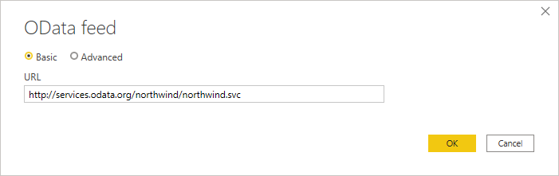
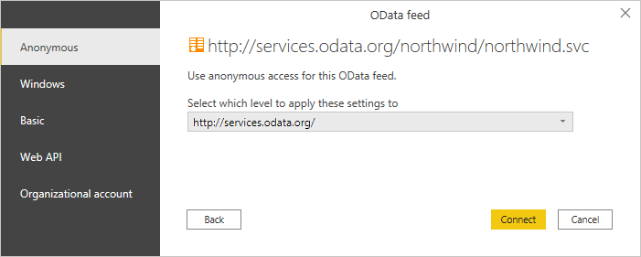
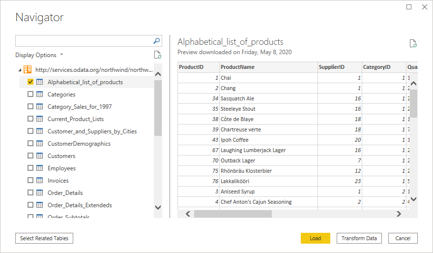
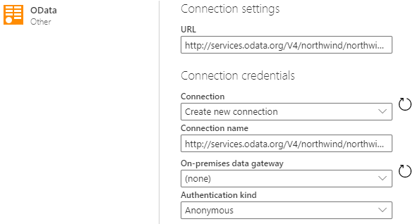

# OData Feed

## Summary

| Item | Description |
| ---- | ----------- |
| Release State | General Availability |
| Products | Power BI (Datasets) Power BI (Dataflows) Power Apps (Dataflows) Excel Dynamics 365 Customer Insights Analysis Services |
| Authentication Types Supported | Anonymous Windows Basic (requires Gateway) Web API Organizational Account |
| Function Reference Documentation | [OData.Feed](/powerquery-m/odata-feed), [ODataOmitValues.Nulls](/powerquery-m/odataomitvalues-nulls) |
| | |

## Capabilities supported

* Basic
* Advanced
   * URL parts
   * Open type columns
* Select related tables

>[!Note]
> Microsoft Graph is not supported. More information: [Lack of Support for Microsoft Graph in Power Query](../connecting-to-graph.md)

## Load data from an OData Feed in Power Query Desktop

To load data from an OData Feed in Power Query Desktop:

1. Select the **OData** or **OData Feed** option in the connector selection. 

2. Choose the **Basic** button and enter a URL address in the text box. This URL should be the root of the OData service you want to connect to. For example, enter `http://services.odata.org/V4/northwind/northwind.svc/`. Then select **OK**.

   

   If the URL address you enter is invalid, a  warning icon will appear next to the **URL** textbox.

3. If this is the first time you're connecting using the OData Feed, select the authentication type, input your credentials (if necessary), and select the level to apply the authentication settings to. Then select **Connect**.

   

4. From the **Navigator** dialog, you can select a table, then either transform the data in the Power Query Editor by selecting **Transform Data**, or load the data by selecting **Load**.

   

   If you have multiple tables that have a direct relationship to one or more of the already selected tables, you can select the **Select Related Tables** button. When you do, all tables that have a direct relationship to one or more of the already selected tables will be imported as well.

## Load data from an OData Feed in Power Query Online

To load data from an OData Feed in Power Query Online:

1. Select the **OData** or **OData Feed** option in the connector selection. 

2. In the OData dialog that appears, enter a URL in the text box.

   
   
3. If this is the first time you're connecting using the OData Feed, select the authentication kind and enter your credentials (if necessary). Then select **Next**.

4. From the **Navigator** dialog, you can select a table, then transform the data in the Power Query Editor by selecting **Transform Data**.

   

   If you have multiple tables that have a direct relationship to one or more of the already selected tables, you can select the **Select Related Tables** button. When you do, all tables that have a direct relationship to one or more of the already selected tables will be imported as well.
   
## Connecting to Microsoft Graph

Connecting to [Microsoft Graph](/graph/overview) REST [APIs](https://graph.microsoft.com) from Power Query isn't recommended or supported. See this [article](../connecting-to-graph.md) for more information.

## Known Issues and Limitations

### Joins

Due to the architecture of OData and other web connectors, joins can be non-performant. While you have the option to use navigation columns when merging between tables from an OData source, you don't have this option when merging with non-Odata sources.
 
If you are seeing performance issues when merging an OData source, you should apply [Table.Buffer](/powerquery-m/table-buffer) to your OData query in the Advanced Editor, before you merge the data.

### Test Connection issues

In cases where you're passing in a URL to the OData connector that's not just the service root, for example, if you have a filter on the URL, when you set up refresh in the service you should select **Skip Test Connection**.

### Authenticating to arbitrary services

Some services support the ability for the OData connector to authenticate with OAuth/AAD authentication out of the box. However, this won't work in most cases.

When attempting to authenticate, if you see the following error:

“We were unable to connect because this credential type isn’t supported for this resource. Please choose another credential type.”

   

Please contact the service owner. They will either need to change the authentication configuration or build a custom connector.