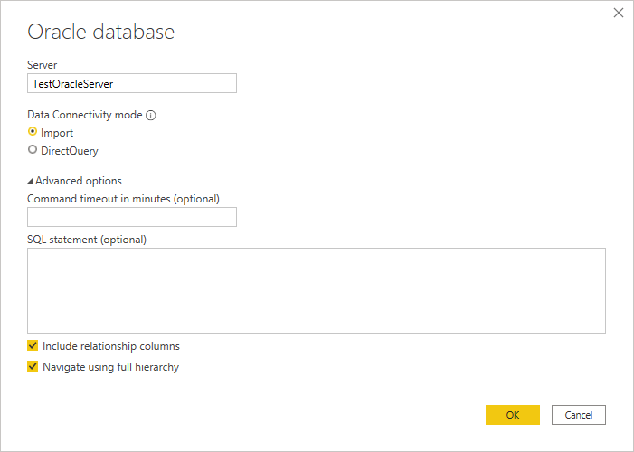
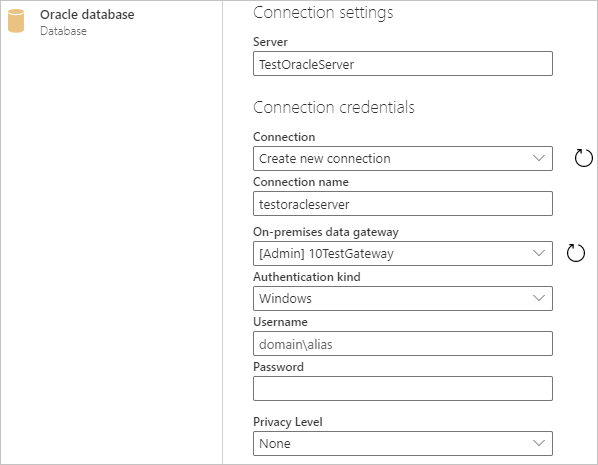

# Oracle database
 
## Summary
 
Release State: General Availability

Products: Power BI Desktop, Power BI Service (Enterprise Gateway), Dataflows in PowerBI.com (Enterprise Gateway), Dataflows in PowerApps.com (Enterprise Gateway), Excel, Dynamics 365 Customer Insights, Analysis Services

Authentication Types Supported: Windows (desktop/online), Database (desktop), Basic (online)

Function Reference Documentation: [Oracle.Database](https://docs.microsoft.com/powerquery-m/oracle-database)

>[!Note]
> Some capabilities may be present in one product but not others due to deployment schedules and host-specific capabilities.

## Prerequisites

Supported Oracle versions:

* Oracle Server 9 and later
* Oracle Data Access Client (ODAC) software 11.2 and later

Before you can connect to an Oracle database using Power Query, you need to install the Oracle client software v8.1.7 or greater on your computer. To install the 32-bit Oracle client software, go to [32-bit Oracle Data Access Components (ODAC) with Oracle Developer Tools for Visual Studio (12.1.0.2.4)](https://www.oracle.com/technetwork/topics/dotnet/utilsoft-086879.html). To install the 64-bit Oracle client, go to [64-bit ODAC 12c Release 4 (12.1.0.2.4) Xcopy for Windows x64](https://www.oracle.com/technetwork/database/windows/downloads/index-090165.html).

>[!Note]
>Choose a version of Oracle Data Access Client (ODAC) which is compatible with your Oracle Server. For instance, ODAC 12.x does not always support Oracle Server version 9. Choose the Windows installer of the Oracle Client. During the setup of the Oracle client, make sure you enable *Configure ODP.NET and/or Oracle Providers for ASP.NET* at machine-wide level by selecting the corresponding checkbox during the setup wizard. Some versions of the Oracle client wizard selects the checkbox by default, others do not. Make sure that checkbox is selected so that Power Query can connect to your Oracle database.

To connect to an Oracle database with the on-premises data gateway, the correct Oracle client software must be installed on the computer running the gateway. The Oracle client software you use depends on the Oracle server version, but will always match the 64-bit gateway. For more information, see [Manage your data source - Oracle](https://docs.microsoft.com/power-bi/connect-data/service-gateway-onprem-manage-oracle).

## Capabilities Supported
* Import
* DirectQuery
* Advanced options
   * Command timeout in minutes
   * SQL statement
   * Include relationship columns
   * Navigate using full hierarchy
    
## Connect to an Oracle database from Power Query Desktop

To make the connection, take the following steps:
 
1. Select the **Oracle database** option in the connector selection.
 
2. Specify the Oracle Server to connect to in **Server**. If a SID is required, specify it by using the format *ServerName/SID*, where *SID* is the unique name of the database. If the *ServerName/SID* format doesn't work, use *ServerName/ServiceName*, where *ServiceName* is the alias you use to connect.

   

   >[!Note]
   > If you are using a local database, or autonomous database connections, you may need to place the server name in quotation marks to avoid connection errors.
   
3. If you're connecting from Power BI Desktop, select either the **Import** or **DirectQuery** data connectivity mode. The rest of these example steps use the Import data connectivity mode. To learn more about DirectQuery, see [Use DirectQuery in Power BI Desktop](https://docs.microsoft.com/power-bi/connect-data/desktop-use-directquery).

4. Optionally, you can provide a command timeout and a [native query (SQL statement)](../native-database-query.md). You can also select whether you want to include relationship columns and navigate using full hierarchy. Once you're done, select **OK**.

5. If this is the first time you're connecting to this Oracle database, you'll be asked to enter your credentials. Select the authentication type you want to use, and then enter your credentials. For more information about authentication, see [Authentication with a data source](../connectorauthentication.md).

   

6. In **Navigator**, select the data you require, then either load or transform the data.

## Connect to an Oracle database from Power Query Online

To make the connection, take the following steps

1. Select the **Oracle database** option in the data sources selection.

2. In the **Oracle database** dialog that appears, specify the Oracle Server to connect to in **Server**. If a SID is required, specify it by using the format *ServerName/SID*, where *SID* is the unique name of the database. If the *ServerName/SID* format doesn't work, use *ServerName/ServiceName*, where *ServiceName* is the alias you use to connect.

   

3. Select the name of your on-premises data gateway.

   >[!Note]
   > You must select an on-premises data gateway for this connector, whether the Oracle database is on your local network or on a web site.

4. If this is the first time you're connecting to this Oracle database, select the type of credentials for the connection in **Authentication kind**. Choose **Basic** if you plan to use an account that's created within Oracle instead of Windows authentication. 

5. Enter your credentials.

6. Select **Next** to continue.

7. In **Navigator**, select the data you require, then either load or transform the data.

## Troubleshooting

You might come across any of several errors from Oracle when the naming syntax is either incorrect or not configured properly:

* ORA-12154: TNS: could not resolve the connect identifier specified.
* ORA-12514: TNS: listener does not currently know of service requested in connect descriptor.
* ORA-12541: TNS: no listener.
* ORA-12170: TNS: connect timeout occurred.
* ORA-12504: TNS: listener was not given the SERVICE_NAME in CONNECT_DATA.

These errors might occur if the Oracle client either isn't installed or isn't configured properly. If it's installed, verify the tnsnames.ora file is properly configured and you're using the proper net_service_name. You also need to make sure the net_service_name is the same between the machine that uses Power BI Desktop and the machine that runs the gateway. For more information, see [Prerequisites](#prerequisites).

You might also come across a compatibility issue between the Oracle server version and the Oracle Data Access Client version. Typically, you want these versions to match, as some combinations are incompatible. For instance, ODAC 12.x does not support Oracle Server version 9.

If you downloaded Power BI Desktop from the Microsoft Store, you might be unable to connect to Oracle databases because of an Oracle driver issue. If you come across this issue, the error message returned is: *Object reference not set.* To address the issue, do one of these steps:

* Download Power BI Desktop from the Download Center instead of Microsoft Store.

* If you want to use the version from Microsoft Store: on your local computer, copy oraons.dll from *12.X.X\client_X* to *12.X.X\client_X\bin*, where *X* represents version and directory numbers.

If you see the error message, *Object reference not set*, in the Power BI Gateway when you connect to an Oracle database, follow the instructions in [Manage your data source - Oracle](https://docs.microsoft.com/power-bi/connect-data/service-gateway-onprem-manage-oracle).

If you're using Power BI Report Server, consult the guidance in the [Oracle Connection Type](https://docs.microsoft.com/sql/reporting-services/report-data/oracle-connection-type-ssrs) article.

## Next steps

[Optimize Power Query when expanding table columns](../optimize-expanding-table-columns.md)
