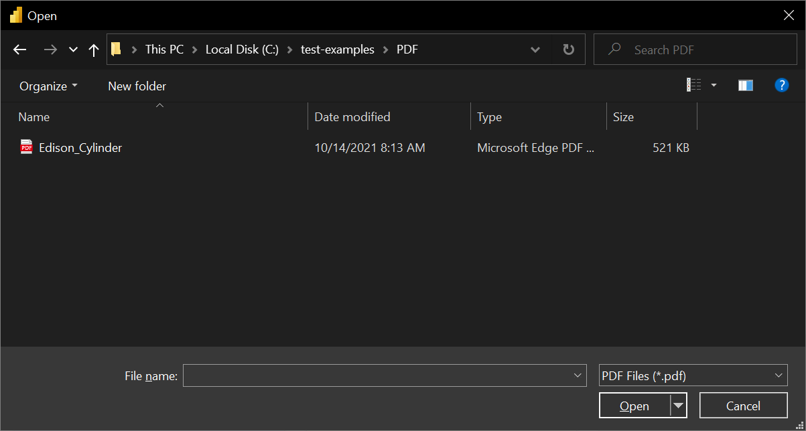
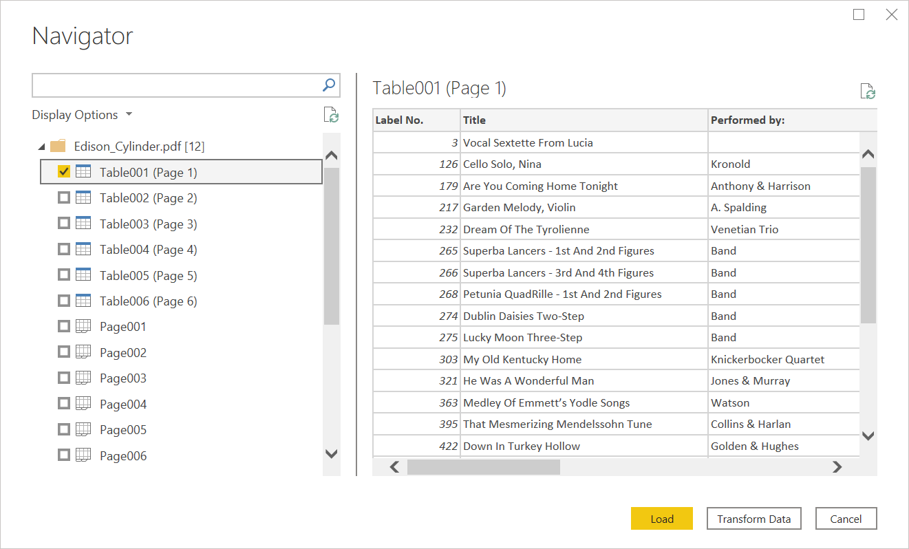

# PDF
 
## Summary

| Item | Description |
| ---- | ----------- |
| Release State | General Availability |
| Products | Power BI (Datasets) Power BI (Dataflows) Power Apps (Dataflows) Excel Dynamics 365 Customer Insights |
| Authentication Types Supported | Anonymous (online) Basic (online) Organizational account (online) Windows (online) |
| Function Reference Documentation | [Pdf.Tables](/powerquery-m/pdf-tables) |
| | |

>[!Note]
> Some capabilities may be present in one product but not others due to deployment schedules and host-specific capabilities.

>[!Note]
> PDF is not supported in Power BI Premium.

## Prerequisites

None.

## Capabilities Supported

* Import

## Connect to a PDF file from Power Query Desktop

To make the connection from Power Query Desktop:

1. Select the **PDF** option in the connector selection.
2. Browse for and select the PDF file you want to load. Then select **Open**.

   

   If the PDF file is online, use the [Web connector](web/web.md) to connect to the file.

3. In **Navigator**, select the file information you want, then either select **Load** to load the data or **Transform Data** to continue transforming the data in Power Query Editor.

   

## Connect to a PDF file from Power Query Online

To make the connection from Power Query Online:

1. Select the **PDF** option in the connector selection.

2. In the PDF dialog box that appears, either provide the file path or the URL to the location of the PDF file. If you're loading a local file, you can also select **Upload file (Preview)** to browse to the local file or drag and drop the file.

   

3. If necessary, select an on-premises data gateway to access the PDF file.

4. If this is the first time you've accessed this PDF file, select the authentication kind and sign in to your account (if needed).

5. In **Navigator**, select the file information you want, and then select **Transform Data** to continue transforming the data in Power Query Editor.

   

## Limitations and considerations

### Accessing large PDF files

Here are some strategies to improve performance and reduce timeouts when accessing large PDF files:
* Try selecting pages one at a time or one small range at a time using the `StartPage` or `EndPage` options, iterating over the entire document as needed.
* If the PDF document is one single, huge table, the `MultiPageTables` option may be collecting very large intermediate values, so disabling it may help.
* Multi-line rows may not be properly identified, so M code may be required to define the pattern, for example using `Table.FillDown` or `Table.Group`.

A full list of options available can be found in the `Pdf.Tables` [documentation](/powerquery-m/pdf-tables).

