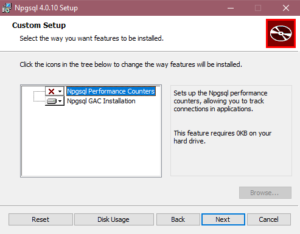
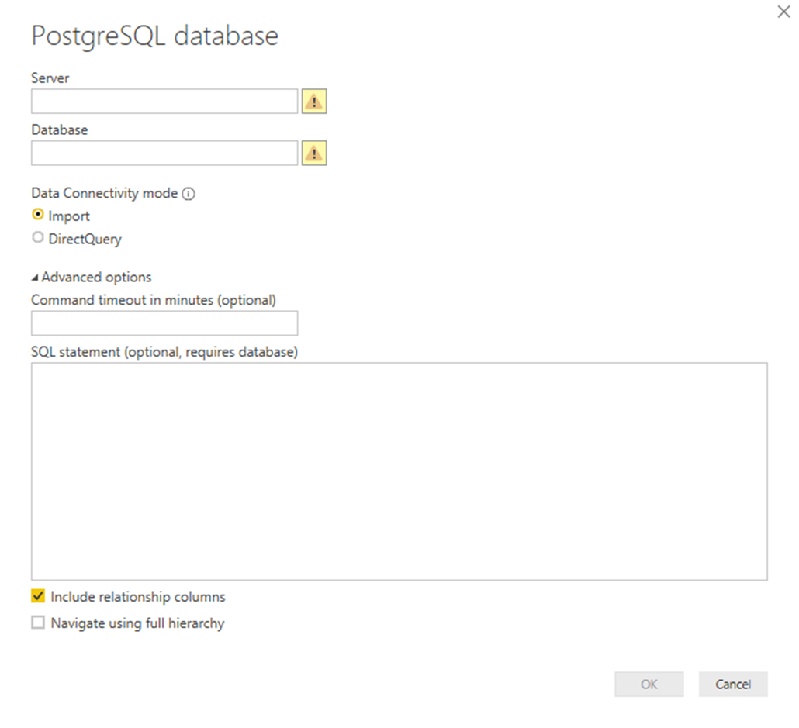

# PostgreSQL

## Summary

Release State: General Availability

Products: Power BI Desktop, Power BI Service (Enterprise Gateway), Dataflows in PowerBI.com (Enterprise Gateway), Dataflows in PowerApps.com (Enterprise Gateway), Excel

Authentication Types Supported: Database (Username/Password)

Function Reference Documentation: [PostgreSQL.Database](https://docs.microsoft.com/powerquery-m/postgresql-database)

> [!Note]
> Some capabilities may be present in one product but not others due to deployment schedules and host-specific capabilities.

## Prerequisites

As of the the December 2019 release, NpgSQL 4.0.10 shipped with Power BI Desktop and no additional installation is required. GAC Installation overrides the version provided with Power BI Desktop, which will be the default. Refreshing is supported both through the cloud in the Power BI Service as well as on premise through the Gateway. In the Power BI service, NpgSQL 4.0.10 will be used, while on premise refresh will use the local installation of NpgSQL, if available, and otherwise use NpgSQL 4.0.10.

For Power BI Desktop versions released before December 2019, you must install the NpgSQL provider on your local machine. To install the NpgSQL provider, go to the [releases page](https://github.com/npgsql/Npgsql/releases) and download the relevant release. The provider architecture (32-bit or 64-bit) needs to match the architecture of the product where you intent to use the connector. When installing, make sure that you select NpgSQL GAC Installation to ensure NpgSQL itself is added to your machine.

**We recommend NpgSQL 4.0.10. NpgSQL 4.1 and up will not work due to .NET version incompatibilities.**

## Capabilities Supported

- Import
- DirectQuery (Power BI only, learn more)
- Advanced options
  - Command timeout in minutes
  - Native SQL statement
  - Relationship columns
  - Navigate using full hierarchy

## Connect to a PostgreSQL database

Once the matching Npgsql provider is installed, you can connect to a PostgreSQL database. To make the connection, take the following steps:

1.  From the Power Query **Get Data** dialog (or **Data** tab in the Excel ribbon), select **Database > PostgreSQL**.

2. In the **PostgreSQL** dialog that appears, provide the name of the server and database. Optionally, you may provide a command timeout and a native query (SQL statement), as well as select whether or not you want to include relationship columns and navigate using full hierarchy. Once you're done, select **Connect**.
3. If the PostgreSQL database requires database user credentials, input those credentials in the dialogue when prompted.

## Native Query Folding

To enable Native Query Folding, set the `EnableFolding` flag to `true` for [Value.NativeQuery()](https://docs.microsoft.com/powerquery-m/value-nativequery) in the advanced editor.

Sample:
`Value.NativeQuery(target as any, query, null, [EnableFolding=true])`

Operations that are capable of folding will be applied on top of your native query according to normal Import or Direct Query logic. Native Query folding is not applicable with optional parameters present in [Value.NativeQuery()](https://docs.microsoft.com/powerquery-m/value-nativequery).

## Troubleshooting

Your native query may throw the following error:

`We cannot fold on top of this native query. Please modify the native query or remove the 'EnableFolding' option.`

A basic trouble shooting step is to check if the query in [Value.NativeQuery()](https://docs.microsoft.com/powerquery-m/value-nativequery) throws the same error with a `limit 1` clause around it:

`select * from (query) _ limit 1`
