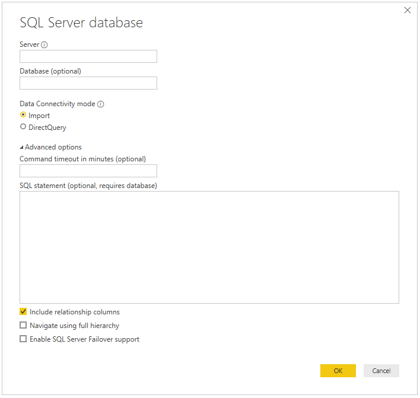

# SQL Server
 
## Summary
 
Release State: General Availability

Products: Power BI Desktop, Power BI Service (Enterprise Gateway), Dataflows in PowerBI.com (Enterprise Gateway), Dataflows in PowerApps.com (Enterprise Gateway), Excel, Flow

Authentication Types Supported: Database (Username/Password), Windows

[M Function Reference](https://docs.microsoft.com/powerquery-m/sql-database)

>[!Note]
> Some capabilities may be present in one product but not others due to deployment schedules and host-specific capabilities.
 
## Prerequisites
By default, Power BI installs an OLE DB driver for SQL Server. However, for optimal performance, we recommend that the customer installs the [SQL Server Native Client](https://docs.microsoft.com/sql/relational-databases/native-client/applications/installing-sql-server-native-client) before using the SQL Server connector. SQL Server Native Client 11.0 and SQL Server Native Client 10.0 are both supported in the latest version.

 
## Capabilities Supported
* Import
* DirectQuery (Power BI only, learn more)
* Advanced options
    * Command timeout in minutes
    * Native SQL statement
    * Relationship columns
    * Navigate using full hierarchy
    * SQL Server failover support
    
## Connect to SQL Server database
To make the connection, take the following steps:
 
1.  From the Power Query **Get Data** dialog (or **Data** tab in the Excel ribbon), select **Database > SQL Server database**.
 

 
2. In the **SQL Server database** dialog that appears, provide the name of the server and database (optional). Optionally, you may provide a command timeout and a native query (SQL statement), as well as select whether or not you want to include relationship columns and navigate using full hierarchy. Once you're done, select **Connect**.
3. Select the authentication type and input those credentials in the dialogue when prompted.

>[!Note]
> If the connection is not encrypted, you'll be prompted with the following dialog.

Select **OK** to connect to the database by using an unencrypted connection, or follow the [instructions](https://docs.microsoft.com/sql/database-engine/configure-windows/enable-encrypted-connections-to-the-database-engine) to setup encrypted connections to SQL Server.

## Troubleshooting

### Always Encrypted columns

Power Query doesn't support 'Always Encrypted' columns.

## Next steps

[Optimize Power Query when expanding table columns](../optimize-expanding-table-columns.md)
