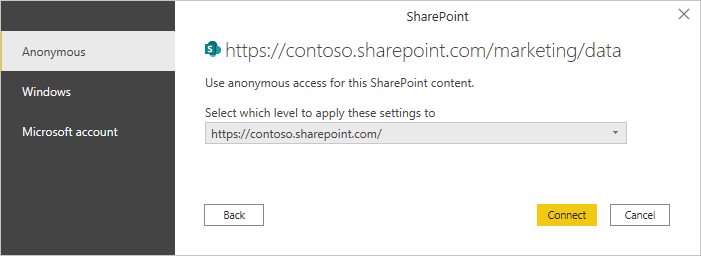
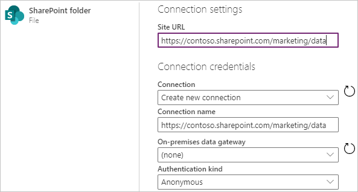
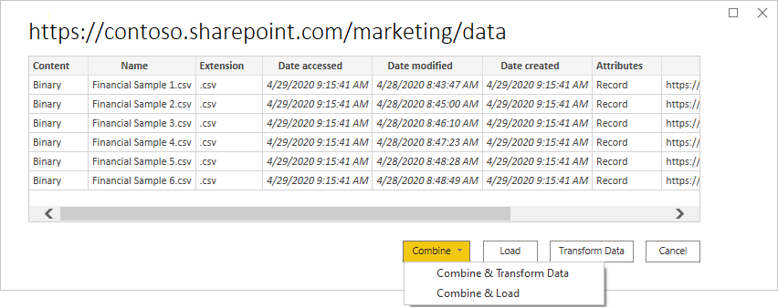
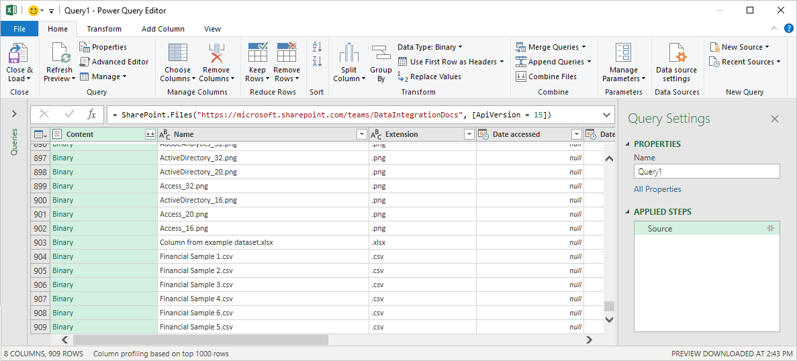
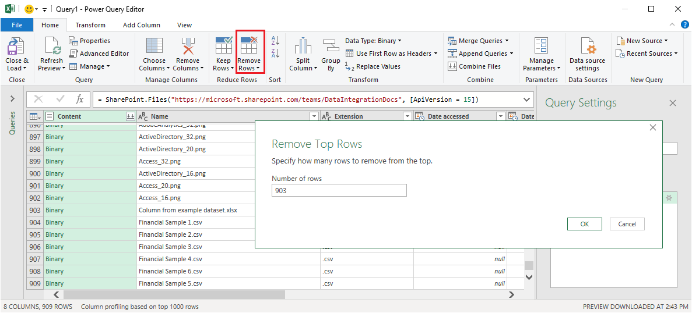

# SharePoint Folder

## Summary

Release State: General Availability

Products: Power BI Desktop, Power BI Service (Enterprise Gateway), Dataflows in PowerBI.com (Enterprise Gateway), Dataflows in PowerApps.com (Enterprise Gateway), Excel

Authentication Types Supported: Anonymous, Microsoft Account, Windows

Function Reference Documentation: [SharePoint.Contents](/powerquery-m/sharepoint-contents), [SharePoint.Files](/powerquery-m/sharepoint-files)

>[!NOTE]
>AAD/OAuth for SharePoint on-premises isn’t supported using the on-premises data gateway. 

## Capabilities supported

* Folder path
* Combine
   * Combine and load
   * Combine and transform

## Connect to a SharePoint folder

To connect to a SharePoint folder:

1. Select the **SharePoint folder** option in the connector selection.

2. Find the address (also known as a URL) of your SharePoint site that contains the folder you want to use. 

   From a page in SharePoint, you can usually get the site address by selecting **Home** in the navigation pane, or the icon for the site at the top, then copying the address from your web browser's address bar.

3. If you're connecting from Power BI desktop or Excel:

   1. Paste the address into the **Site URL** test box in the **SharePoint folder** dialog box. In this case, the site URL is `https://contoso.sharepoint.com/marketing/data`. If the site URL you enter is invalid, a  warning icon will appear next to the URL textbox.

      

   2. If this is the first time you've visited this site address, select the appropriate authentication method. Enter your credentials and chose which level to apply these setting to. Then select **Connect**.

      

      For more information about authentication methods, see [Authentication with a data source](../connectorauthentication.md).

4. If you're connecting from Power Query Online:

    1. Paste the address into the **Site URL** test box in the **SharePoint folder** dialog box. In this case, the site URL is `https://contoso.sharepoint.com/marketing/data`. 

       

    2. If the SharePoint folder is on-premises, enter the name of an on-premises data gateway.

    3. Select the authentication kind, and enter any credentials that are required.

    4. Select **Next**.

5. When you select the SharePoint folder you want to use, the file information about all of the files in that SharePoint folder are displayed. In addition, file information about any files in any subfolders is also displayed.

   

6. Select **Combine & Transform Data** to combine the data in the files of the selected SharePoint folder and load the data into the Power Query Editor for editing. Or select **Combine & Load** to load the data from all of the files in the SharePoint folder directly into your app.

   

>[!Note]
>The **Combine & Transform Data** and **Combine & Load** buttons are the easiest ways to combine data found in the files of the SharePoint folder you specify. You could also use the **Load** button (in Power BI Desktop only) or the **Transform Data** buttons to combine the files as well, but that requires more manual steps.

## Troubleshooting

### Combining files

All of the files in the SharePoint folder you select will be included in the data to be combined. If you have data files located in a subfolder of the SharePoint folder you select, all of these files will also be included. To ensure that combining the file data works properly, make sure that all of the files in the folder and the subfolders have the same schema.

In some cases, you might have multiple folders on your SharePoint site containing different types of data. In this case, you'll need to delete the unnecessary files. To delete these files:

1. In the list of files from the SharePoint folder you chose, select **Transform Data**.

   

2. In the Power Query editor, scroll down to find the files you want to keep.  

   

3. In the example shown in the screenshot above, the required files are the last rows in the table. Select **Remove Rows**, enter the value of the last row before the files to keep (in this case 903), and select **OK**.

   

4. Once you've removed all the unnecessary files, select **Combine Files** from the **Home** ribbon to combine the data from all of the remaining files.

For more information about combining files, see [Combine files in Power Query](../combine-files-overview.md).

### Filename special characters

If a filename contains certain special characters, it may lead to authentication errors due to the filename being truncated in the URL. If you are getting unusual authentication errors, make sure that all of the filenames you're using don't contain any of the following special characters.

`# % $`

If these characters are present in the filename, the file owner must rename the file so that it does NOT contain any of these characters.