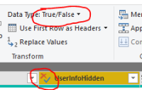

# SharePoint List

## Summary

Release State: General Availability

Products: Power BI Desktop, Power BI Service (Enterprise Gateway), Dataflows in PowerBI.com (Enterprise Gateway), Dataflows in PowerApps.com (Enterprise Gateway), Excel

Authentication Types Supported: Anonymous, Windows, Microsoft Account

Function Reference Documentation: [SharePoint.Contents](/powerquery-m/sharepoint-contents), [SharePoint.Files](/powerquery-m/sharepoint-files), [SharePoint.Tables](/powerquery-m/sharepoint-tables)

>[!Note]
> Some capabilities may be present in one product but not others due to deployment schedules and host-specific capabilities.

>[!NOTE]
>AAD/OAuth for SharePoint on-premises isn’t supported using the on-premises data gateway. 

## Capabilities supported

* Site URL

## Connect to a SharePoint List

To connect to a SharePoint List:

1. In the **Get Data** dialog box, select **SharePoint List**.

2. Find the address (also known as a URL) of your SharePoint site that contains your list. 

   From a page in SharePoint, you can usually get the site address by selecting **Home** in the navigation pane, or the icon for the site at the top, then copying the address from your web browser's address bar.

   Watch a video of this step:
   <iframe width="400" height="300" src="https://www.youtube.com/embed/OZO3x2NF8Ak?start=48&end=90" frameborder="0" allowfullscreen></iframe>

3. Paste the address into the **Site URL** field in the open dialog box.

   

   If the URL address you enter is invalid, a  warning icon will appear next to the **Site URL** textbox.

4. You may or may not see a SharePoint access screen like the following image.  If you don't see it, skip to step 8. If you do see it, select the type of credentials you will use to access your SharePoint site on the left side of the page (in this example, a Microsoft account).

   
   
5. Select the level to you want to apply these sign in settings to.

   

   The level you select for the authentication method determines what part of a URL will have the authentication method applied to it. If you select the top-level web address, the authentication method you select here will be used for that URL address or any sub-address within that address. However, you might not want to set the top URL address to a specific authentication method because different sub-addresses could require different authentication methods. For example, if you were accessing two separate folders of a single SharePoint site and wanted to use different Microsoft Accounts to access each one.
   
   Once you have set the authentication method for a specific web site address, you won't need to select the authentication method for that URL address or any sub-address again. For example, if you select the https://contoso.sharepoint.com/ address in this dialog, any SharePoint site that begins with this address will not require that you select the authentication method again.  

   >[!Note]
   >If you need to change the authentication method because you accidentally entered the incorrect information or are receiving an "unable to connect" message, see [Change the authentication method](#change-the-authentication-method). 

6. Select **Sign In** and enter the user name and password you use to sign in to Microsoft Office 365.

   
   
7. When you finish signing in, select **Connect**.

8. From the **Navigator** dialog, you can select a location, then either transform the data in the Power Query editor by selecting **Transform Data**, or load the data by selecting **Load**.

   

## Troubleshooting

### Use root SharePoint address

Make sure you supply the root address of the SharePoint site, without any subfolders or documents. For example, use link similar to the following: https://contoso.sharepoint.com/teams/ObjectModel/

### Change the authentication method

In some cases, you may need to change the authentication method you use to access a particular SharePoint site. If this is necessary, see [Change the authentication method](../connectorauthentication.md#change-the-authentication-method).

### Inconsistent behavior around boolean data

When using the Sharepoint List connector, Boolean values are represented inconsistently as TRUE/FALSE or 1/0 in Power BI Desktop and Power BI service environments. This may result in wrong data, incorrect filters, and empty visuals.

This issue only happens when the **Data Type** is not explicitly set for a column in the Query View of Power BI Desktop. You can tell that the data type isn't set by seeing the "ABC 123" image on the column and "Any" data type in the ribbon as shown below.

The user can force the interpretation to be consistent by explicitly setting the data type for the column through the Power Query Editor. For example, the following image shows the column with an explicit Boolean type.

## Next steps

[Optimize Power Query when expanding table columns](../optimize-expanding-table-columns.md)