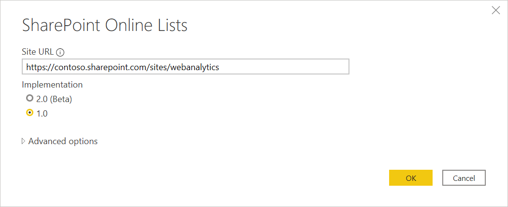
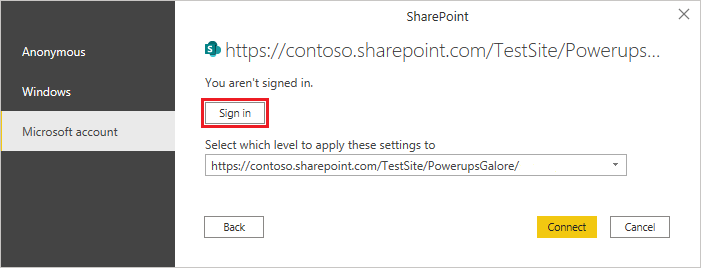
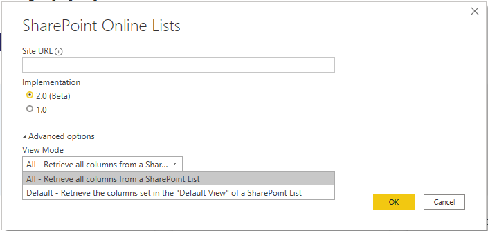
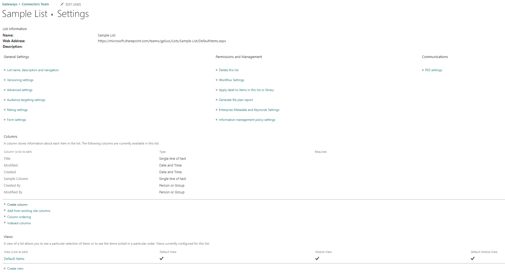
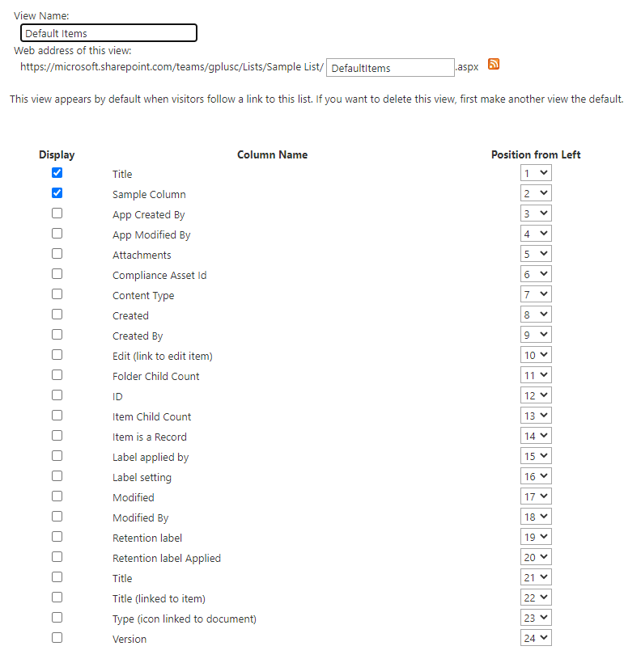

# SharePoint Online List

## Summary

Release State: General Availability

Products: Power BI Desktop, Power BI Service (Enterprise Gateway), Dataflows in PowerBI.com (Enterprise Gateway), Dataflows in PowerApps.com (Enterprise Gateway), Excel

Authentication Types Supported: Anonymous, Windows, Microsoft Account

Function Reference Documentation: [SharePoint.Contents](/powerquery-m/sharepoint-contents), [SharePoint.Files](/powerquery-m/sharepoint-files), [SharePoint.Tables](/powerquery-m/sharepoint-tables)

>[!Note]
> Some capabilities may be present in one product but not others due to deployment schedules and host-specific capabilities.

## Capabilities supported

* Site URL

## Connect to a SharePoint Online List

To connect to a SharePoint Online List:

1. In the **Get Data** dialog box, select **SharePoint Online List**.

2. Find the address (also known as a URL) of your SharePoint site that contains your list. 

   From a page in SharePoint, you can usually get the site address by selecting **Home** in the navigation pane, or the icon for the site at the top, then copying the address from your web browser's address bar.

   Watch a video of this step:
   <iframe width="400" height="300" src="https://www.youtube.com/embed/OZO3x2NF8Ak?start=48&end=90" frameborder="0" allowfullscreen></iframe>

3. Paste the address into the **Site URL** field in the open dialog box.

   

   If the URL address you enter is invalid, a  warning icon will appear next to the **Site URL** textbox.

4. You may or may not see a SharePoint access screen like the following image.  If you don't see it, skip to step 8. If you do see it, select the type of credentials you will use to access your SharePoint site on the left side of the page (in this example, a Microsoft account).

   
   
5. Select the level to you want to apply these sign in settings to.

   

   The level you select for the authentication method determines what part of a URL will have the authentication method applied to it. If you select the top-level web address, the authentication method you select here will be used for that URL address or any sub-address within that address. However, you might not want to set the top URL address to a specific authentication method because different sub-addresses could require different authentication methods. For example, if you were accessing two separate folders of a single SharePoint site and wanted to use different Microsoft Accounts to access each one.
   
   Once you have set the authentication method for a specific web site address, you won't need to select the authentication method for that URL address or any sub-address again. For example, if you select the https://contoso.sharepoint.com/ address in this dialog, any SharePoint site that begins with this address will not require that you select the authentication method again.  

   >[!Note]
   >If you need to change the authentication method because you accidentally entered the incorrect information or are receiving an "unable to connect" message, see [Change the authentication method](#change-the-authentication-method). 

6. Select **Sign In** and enter the user name and password you use to sign in to Microsoft Office 365.

   
   
7. When you finish signing in, select **Connect**.

8. From the **Navigator** dialog, you can select a location, then either transform the data in the Power Query editor by selecting **Transform Data**, or load the data by selecting **Load**.

   
   
## Connect to Sharepoint Online List v2.0 (Beta)

In the October 2020 release of Power BI Desktop, we introduced an updated version of the SharePoint Online List connector. This connector has improved APIs and greater usability, but isn't backwards compatible with usage of the 1.0 connector version.

To access it, you'll enter the same connector screen through step 3 in the previous procedure. However, make sure you select **2.0 (Beta)** under **Implementation** if it isn't already selected.

   

With this update to the connector, we're making available two different views for the same data:

* **All**
* **Default**

The default view is what you'll see when looking at the list online in whichever view you've set as *Default* in your settings. If you edit this view to add or remove either user created or system defined columns, or by creating a new view and setting it as default, this will propagate through the connector.

   

The **All** view includes all user created and system defined columns. You can see what columns are included in the following screen.

   

We look forward to your feedback.


## Troubleshooting

### Use root SharePoint address

Make sure you supply the root address of the SharePoint site, without any subfolders or documents. For example, use link similar to the following: https://contoso.sharepoint.com/teams/ObjectModel/

### Change the authentication method

In some cases, you may need to change the authentication method you use to access a particular SharePoint site. If this is necessary, see [Change the authentication method](../connectorauthentication.md#change-the-authentication-method).

### Timezone issues

When using the SharePoint Online List (v1.0) connector, you may notice that timezone data doesn't match what you would expect from your browser. The SharePoint web-based client performs a local timezone conversion based on the browser's knowledge of the user's timezone.

The backend API for Sharepoint uses UTC time and sends this directly to Power BI. Power BI doesn't convert this, but reports it to the user.

To get time into local time, the user must do the same conversion that the SharePoint client does. An example of the column operations that would do this are:

```
#"Changed Type" = Table.TransformColumnTypes(#"Renamed Columns",{{"Datewithtime", type datetimezone}}),
#"Timezone Shifted" = Table.TransformColumns(#"Changed Type", {"Datewithtime", DateTimeZone.ToLocal})
```

The first operation changes the type to ```datetimezone```, and the second operation converts it to the computer's local time.

### SharePoint Join Limit

_This issue is limited to the SharePoint Online List v2.0 connector._

The SharePoint Online List v2.0 connector uses a different API than the v1.0 connector, and is therefore subject to a maximum of 12 join operations per query, as documented in the [SharePoint Online documentation](https://docs.microsoft.com/sharepoint/install/software-boundaries-and-limits-0?source=docs#list-and-library-limits) under _List view lookup threshold_. This will manifest as sharepoint queries failing when more than 12 columns are accessed simultaneously from a SharePoint list.
