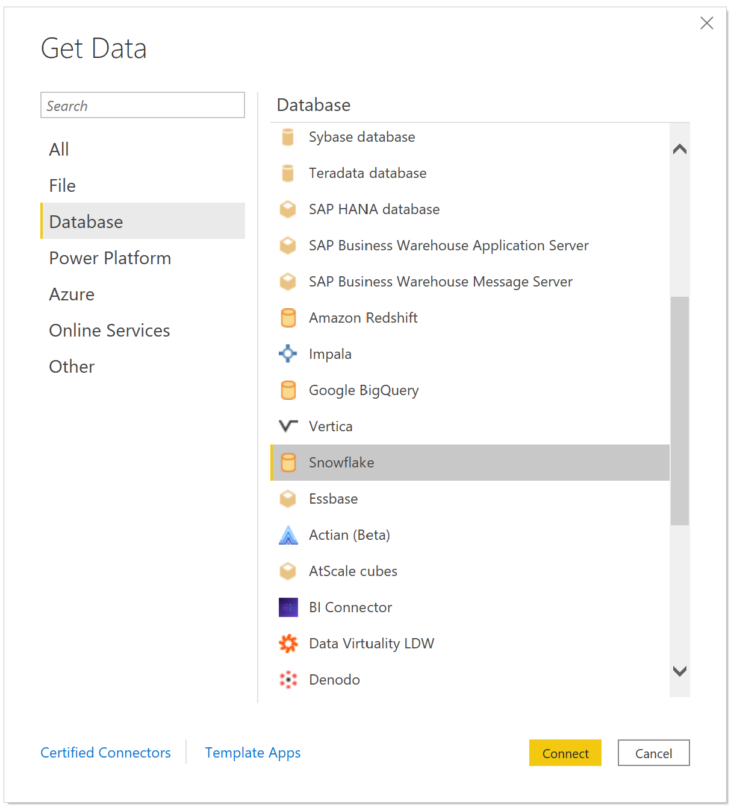
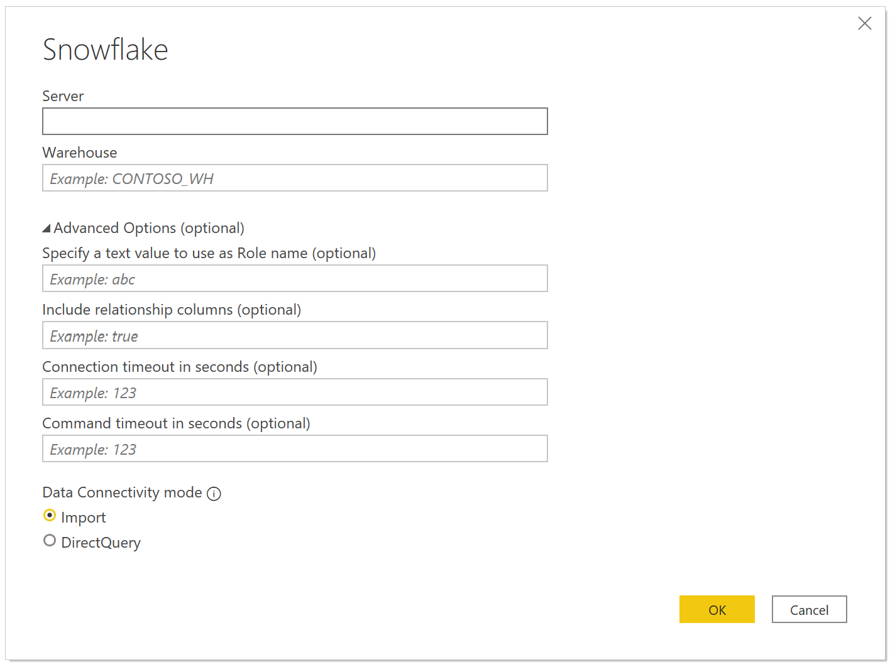
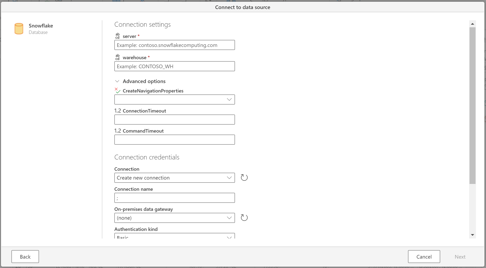

# Snowflake

## Summary

| Item | Description |
| ---- | ----------- |
| Release State | General Availability |
| Products | Power BI (Datasets) Power BI (Dataflows) Power Apps (Dataflows) Excel Dynamics 365 Customer Insights Analysis Services |
| Authentication Types Supported | Database (Username/Password) |
| Function Reference Documentation | [PostgreSQL.Database](https://docs.microsoft.com/powerquery-m/postgresql-database) |
| | |

> [!Note]
> Some capabilities may be present in one product but not others due to deployment schedules and host-specific capabilities.
> 
## Capabilities Supported

- Import
- DirectQuery (Power BI only, learn more)
- Advanced options
  - Specify a text value to use as Role name
  - Command timeout in minutes
  - Native SQL statement
  - Relationship columns
  - Navigate using full hierarchy

## Connect to Snowflake data warehouse from Power BI Desktop

To connect to a **Snowflake** computing warehouse, select **Get Data** from the **Home** ribbon in Power BI Desktop. Select **Database** from the categories on the left, and you see **Snowflake**.

In the **Snowflake** window that appears, type or paste the name of your Snowflake computing warehouse into the box and select **OK**. Note that you can choose to **Import** data directly into Power BI, or you can use **DirectQuery**. You can learn more about [using DirectQuery](desktop-use-directquery.md). Please note that AAD SSO only supports DirectQuery.

When prompted, put in your username and password.

> [!NOTE]
> Once you enter your username and password for a particular **Snowflake** server, Power BI Desktop uses those same credentials in subsequent connection attempts. You can modify those credentials by going to **File > Options and settings > Data source settings**.
> 
> 

If you want to use the Microsoft account option, the Snowflake AAD integration must be configured on the Snowflake side. To do this, read the Getting Started section of the [Snowflake documentation on the topic](https://docs.snowflake.net/manuals/user-guide/oauth-powerbi.html#power-bi-sso-to-snowflake).

Once you successfully connect, a **Navigator** window appears and displays the data available on the server, from which you can select one or multiple elements to import and use in **Power BI Desktop**.

You can **Load** the selected table, which brings the entire table into **Power BI Desktop**, or you can **Edit** the query, which opens **Query Editor** so you can filter and refine the set of data you want to use, and then load that refined set of data into **Power BI Desktop**.

## Connect to a PostgreSQL database from Power Query Online

To make the connection, take the following steps:

1. Select the **Snowflake** option in the connector selection.

2. In the **Snowflake** dialog that appears, provide the name of the server and warehouse.

   

3. Select the Advanced options you wish to use - if there are any not represented in the UI, you can edit them in the **Advanced Options** screen later.

4. Input your Connection credentials including selecting or creating a new connection, which gateway you would like to use, and Username and Password (only Basic is supported in Power Query Online).

5. Select **Next** to connect to the database.

6. In **Navigator**, select the data you require, then select **Transform data** to transform the data in Power Query Editor.

## Advanced Options

Power Query Desktop provides a set of advanced options that you can add to your query if needed.

The following table lists all of the advanced options you can set in Power Query Desktop.

| Advanced option	| Description |
| --------------- | ----------- |
| Connection timeout in seconds | Specifies how long to wait for a response when interacting with the Snowflake service before returning an error. Default is 0 (no timeout).|
| Command timeout in seconds | Specifies how long to wait for a query to complete before returning an error. Default is 0 (no timeout). |
| Role name | Specifies the role that the report uses via the driver. This role must be available to the user, otherwise no role will be set. |
| Include relationship columns | If checked, includes columns that might have relationships to other tables. If this box is cleared, you won’t see those columns. |
| | |

Once you've selected the advanced options you require, select **OK** in Power Query Desktop to connect to your PostgreSQL database.

### Custom Roles

The Snowflake connector supports *Custom Roles* beginning with the February 2021 release of Power BI Desktop.

## Next Steps

To read about configuration of Snowflake for SSO in Snowflake and in the Service, you can read the Power BI article "[Connect to Snowflake in Power BI Service](https://docs.microsoft.com/power-bi/connect-data/service-connect-snowflake)"
