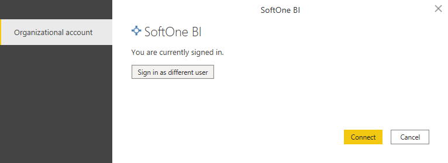
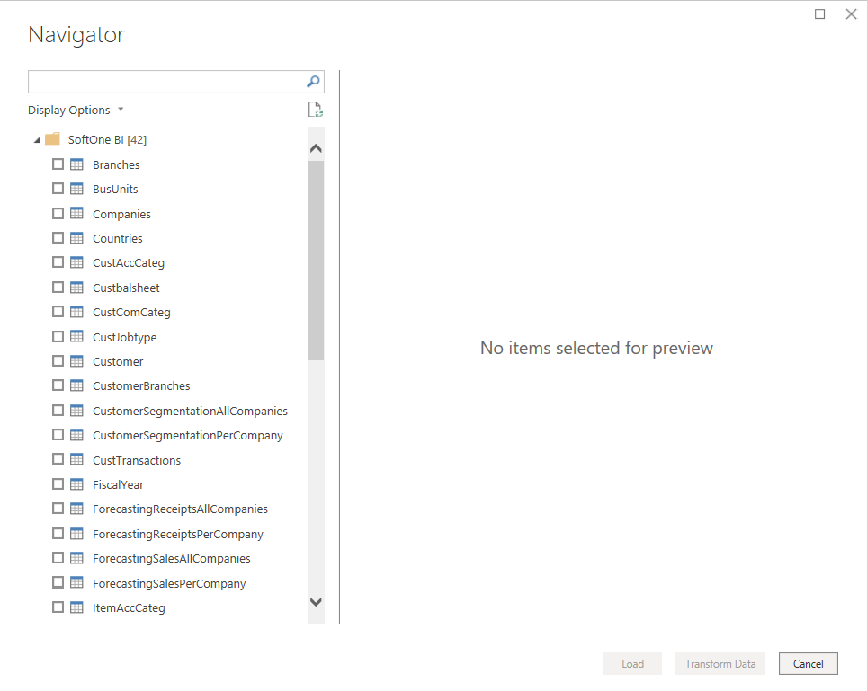
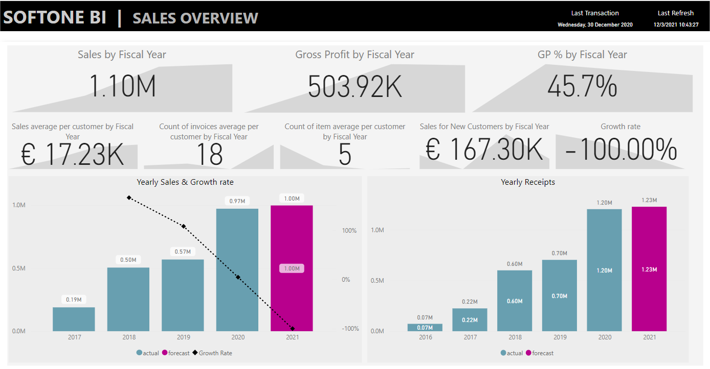

# SoftOne BI (Beta)

>[!Note]
>The following connector article is provided by SoftOne, the owner of this connector and a member of the Microsoft Power Query Connector Certification Program. If you have questions regarding the content of this article or have changes you would like to see made to this article, visit the SoftOne website and use the support channels there.

## Summary

| Item | Description |
| ---- | ----------- |
| Release State | Preview |
| Products | Power BI (Datasets) Power BI (Dataflows) |
| Authentication Types Supported | Basic (Soft1/Atlantis Web Services) |

## Prerequisites

You'll need to have the Soft1 ERP/CRM or Atlantis ERP product installed with a licensed SoftOne BI connector module. A web account must be configured in the application with access to the SoftOne BI Connector service. This account information and your installation serial number will be validated during authentication by the SoftOne BI connector.

The SoftOne BI connector is supported from Soft1 Series 5 version 500.521.11424 or later and Atlantis ERP version 3.3.2697.1 or later.

## Capabilities supported

* Import

## Connection instructions 

SoftOne provides many templates as Power BI template files (.pbit) that you can use or customize which will provide you with a start to your BI project. For example, Sales & Collections, and Finance.

To connect in Power BI Desktop using a new report, follow the steps below. If you're connecting from a report created using one of the SoftOne BI templates, see [Using a provided template](#using-a-provided-template) later in this article.

### Connect to your Soft1 or Atlantis data store from scratch

To load data from your installation with Power Query Desktop:

1. Select **Get Data > More... > Online Services** in Power BI Desktop and search for **SoftOne BI**. Select **Connect**.

    > [!div class="mx-imgBorder"]
    > 

1. Select **Sign in**. An authentication form will display.

    > [!div class="mx-imgBorder"]
    > 

    >[!NOTE]
    >- If you enter incorrect credentials, you'll receive a message stating that your sign in failed due to invalid credentials.
    >- If the SoftOne BI Connector is not activated, or the Web Account that you're using is not configured with the service, you'll receive a message stating that access is denied because the selected module is not activated.

1. After signing in with SoftOne Web Services, you can connect to your data store.

    > [!div class="mx-imgBorder"]
    > 

    Selecting **Connect** will take you to the navigation table and display the available tables from the data store from which you may select the data required.

5. In the navigator, you should now see the tables in your data store. Fetching the tables can take some time.

    > [!div class="mx-imgBorder"]
    > 

    You must have uploaded the data from your Soft1 or Atlantis installation (per the product documentation) to see any tables. If you haven't uploaded your data, you won't see any tables displayed in the Navigation Table.

    > [!div class="mx-imgBorder"]
    > 

    In this case, you'll need to go back to your application and upload your data.

### Using a provided template

1. Open the selected template, Power BI Desktop will attempt to load the data from the data store, and will prompt for credentials. 

    > [!div class="mx-imgBorder"]
    > 

2. Select **Sign in** and enter your credentials (Serial number, username, and password).

    > [!div class="mx-imgBorder"]
    > 

3. Once you're authenticated, select **Connect**. 

    > [!div class="mx-imgBorder"]
    > 

    Power BI Desktop will fetch the data from the data store.

5. After the refresh has completed, you're ready to start customizing the report or to publish it as is to the Power BI Service.

    > [!div class="mx-imgBorder"]
    > 

> [!IMPORTANT]
> If you're working with more than one Soft1/Atlantis installation, then when switching between data stores, you must clear the SoftOne BI credentials saved by Power BI Desktop.

