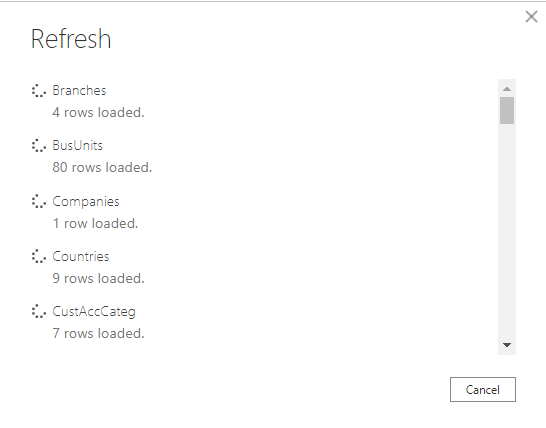

# SoftOne BI

## Summary

| Item | Description |
| ---- | ----------- |
| Release State | Preview |
| Products | Power BI (Datasets) |
| Authentication Types Supported | Basic (Soft1/Atlantis Web Services) |

## Prerequisites

You will need to have the Soft1 ERP/CRM or Atlantis ERP product installed with a licensed SoftOne BI connector module. A web account must configured in the application with access to the SoftOne BI Connector service - this account (Username and Password) and your installation serial number will be used during authentication by the SoftOne BI connector.

The SoftOne BI connector is supported from Soft1 Series 5 version 500.521.11424 or later and Atlantis ERP version 3.3.2697.1 or later.

## Capabilities supported

* Import

## Connection instructions 

Softone provides a number of templates as Power BI template files (.pbit) (e.g., Sales & Collections, Finance) that you can use as is or customize which will provide you with a great start to your BI project. 

To connect in Power BI Desktop from using a new report follow the steps below. If you are connecting from a report created using one of the SoftOne BI templates the please refer to: [Using a provided template](#Using-a-provided-template)

### Connect to your Soft1 or Atlantis data store from scratch

To load data from your installation with Power Query Desktop:

1. Select **Get Data > More... > Online Services** in Power BI Desktop and search for **SoftOne BI**.

2. Then select **Connect**, and then **Sign in**.

3. An authentication form will display 

>[!NOTE]
>* If you enter incorrect credentials, you will receive a message on the login form that your login failed due to invalid credentials.
>* If the SoftOne BI Connector is not activated, or the Web Account that you are using is not configured with the service, you will receive a message that access is denied because the selected module is not activated.

4. After signing in via SoftOne Web Services, you can connect to your data store.

Pressing **Connect** will take you to the Navigation Table which will display the available tables from the data store from which you may select the data required.

5. In the Navigator you should now see the tables in your data store. Fetching the tables can take a few seconds.

>[!NOTE]
> You must have uploaded the data from your Soft1 or Atlantis installation (per the product documentation) to see any tables. If you have not uploaded your data, you will not see any tables displayed in the Navigation Table.
>
>
>
> You will need to go back to your application and upload your data.

### Using a provided template

1. Open the selected template, Power BI Desktop will attempt to load the data from the data store, and will prompt for credentials. 

2. Select **Sign in** and enter your credentials (Serial Number, Username and Password).

3. Once you are authenticated, press **Connect**. 

4. Power BI Desktop will fetch the data from the data store.

5. Once the refresh has completed, you are ready to start customizing the report or to publish it as is to the Power BI Service.

For example:

[!IMPORTANT]
If you are working with more that one Soft1/Atlantis installation, then when switching between data stores, you must clear the SoftOne BI credentials saved by Power BI Desktop.

