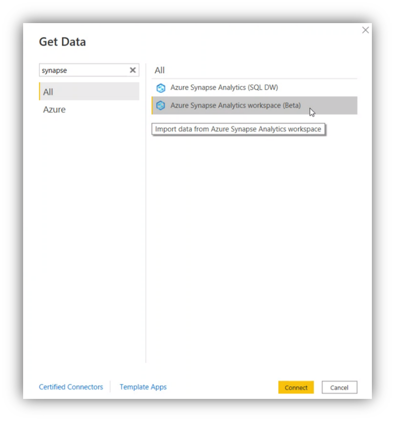

# Synapse Workspaces (Beta)
 
## Summary

| Item | Description |
| ---- | ----------- |
| Release State | Public Review |
| Products | Power BI (Datasets) |
| Authentication Types Supported | Organizational account Service account |
| | |

>[!Note]
> This Synapse Workspaces connector does not replace the Synapse Alalytics (DW) connector. This connector makes exploring data in Synapse workspaces more accecable. Some capabilities not be present in this connector, including Native Query and Direct Query support.

>[!Note]
> This Synapse Workspaces connector supports access to all data in your Synapse Workspace, including Synapse Serverless, Synapse on-demand and Spark tabels.

## Prerequisites

Before you can sign in to Synapse workspaces, you must have sccess to Azure Synapse Analytics Workspace [Access Control Instructions].

## Capabilities Supported

* Import

## Connect to Synapse Workspaces data from Power Query Desktop

To connect to Synapse Workspaces data:

1. Select **Get Data** from the **Home** ribbon in Power BI Desktop. Select **Synapse Workspaces**. Then select **Connect**.

   

2. To sign in to your Synapse account, select **Sign in**.

3. In the **Sign in with Microsoft** window that appears, provide your credentials to sign in to your Synapse account. Then select **Next**.

4. Once you've successfully signed in, select **Connect**.

Once the connection is established, you’ll see a list of the workspaces you have access to. Drill through the workspaces, databases and tables.

You can **Load** the selected table, which brings the entire table into Power BI Desktop, or you can select **Transform Data** to edit the query, which opens Power Query Editor. You can then filter and refine the set of data you want to use, and then load that refined set of data into Power BI Desktop.

## Troubleshooting

### I do not see my Synapse workspace in the conenctor.

The Synapse Connector is using the [Azure RBAC](https://docs.microsoft.com/azure/role-based-access-control/overview) to find the Synapse Worspaces you have access to. 

If your access is only defined in the [Synapse RBAC](https://docs.microsoft.com/azure/synapse-analytics/security/synapse-workspace-synapse-rbac), you might not see the workspace.

Make sure your access is defined by Azure RBAC to ensure all Synapse workspaces will show.

