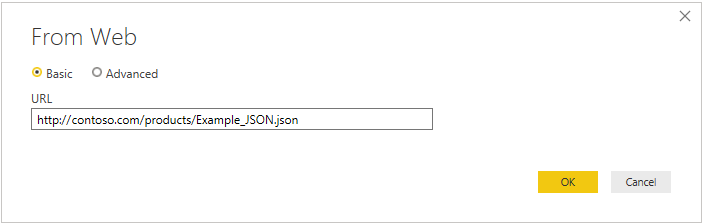

# Web

## Summary

Release State: General Availability

Products: Power BI Desktop, Power BI Service (Enterprise Gateway), Dataflows in PowerBI.com (Enterprise Gateway), Dataflows in PowerApps.com (Enterprise Gateway), Excel

Authentication Types Supported: Anonymous, Windows, Basic, Web API, Organizational Account

Function Reference Documentation: [Web.Page](https://docs.microsoft.com/powerquery-m/web-page), [Web.BrowserContents](https://docs.microsoft.com/powerquery-m/web-browsercontents)

## Prerequisites

* Internet Explorer 10

## Capabilities supported

* Basic
* Advanced
   * URL parts
   * Command timeout
   * HTTP request header parameters

## Load Web data using a basic URL

To load data from a website using a basic URL:

1. Select **Get Data > Web** in Power BI or **From Web** in the **Data** ribbon in Excel. 

2. Choose the **Basic** button and enter a URL address in the text box. For example, enter `https://en.wikipedia.org/wiki/List_of_states_and_territories_of_the_United_States`. Then select **OK**.

   

   If the URL address you enter is invalid, a warning icon () will appear next to the **URL** textbox.

3. Select the authentication method to use for this website. In this example, select **Anonymous**. Then select the level to you want to apply these settings to&mdash;in this case, **https://en.wikipedia.org/**. Then select **Connect**.

   

   The level you select for the authentication method determines what part of a URL will have the authentication method applied to it. If you select the top-level web address, the authentication method you select here will be used for that URL address or any sub-address within that address. However, you might not want to set the top URL address to a specific authentication method because different sub-addresses could require different authentication methods. For example, if you were accessing two separate folders of a single SharePoint site and wanted to use different Microsoft Accounts to access each one.
   
   Once you have set the authentication method for a specific web address, you won't need to select the authentication method for that URL address or any sub-address again. For example, if you select the https://en.wikipedia.org/ address in this dialog, any web page that begins with this address will not require that you select the authentication method again.  

   >[!Note]
   >If you need to change the authentication method later, see [Changing the authentication method](#changing-the-authentication-method). 

4. From the **Navigator** dialog, you can select a table, then either transform the data in the Power Query editor by selecting **Transform Data**, or load the data by selecting **Load**.

   

   The right side of the **Navigator** dialog displays the contents of the table you select to transform or load. If you are uncertain which table contains the data you are interested in, you can select the **Web View** tab to see the entire contents of the Web page. The web view lets you see the entire contents of the web site, and emphasizes each of the tables that have been detected on that site. You can select the check box above the emphasized table to obtain the data from that table.

   On the lower left side of the **Navigator** dialog, you can also select the **Add table using examples** button. This selection presents an interactive window where you can preview the content of the Web page and enter sample values of the data you want to extract. For more information on using this feature, see [Get webpage data by providing examples](https://docs.microsoft.com/power-bi/desktop-connect-to-web-by-example).

## Load Web data using an advanced URL

When you select **Get Data > From Web**, in most instances you'll enter URLs in the Basic setting. However, in some cases you may want to assemble a URL from its separate entries, set a timeout for the browser, or provide individualized URL header data. In this case, in the **From Web** dialog, select the **Advanced** option.

Use the **URL parts** section of the dialog to assemble the URL you want to use to get data. The first part of the URL in the **URL parts** section most likely would consist of the scheme, authority, and path of the URI (for example, http://contoso.com/products/). The second text box could include any queries or fragments that you would use to filter the information provided to the web site. If you need to add more than one entry, select **Add part** to add another URL fragment text box. As you enter each part of the URL, the complete URL that will be used when you select **OK** is displayed in the **URL preview** box.

Depending on how long the POST request takes to process data, you may need to prolong the time the request continues to stay connected to the web site. In this case, you can use the optional **Command timeout in minutes** to extend the time you stay connected to the web site (in minutes).

You can also add specific request headers to the POST you send to the web site using the optional **HTTP request header parameters** drop-down box. 
<!-- The following table describes the request headers you can select. 

| Request Header | Description |
| --- | --- |
| Accept | Specifies the response media types that are acceptable. |
| AcceptCharset | Indicates which character sets are acceptable in the textual response content. |
| AcceptEncoding | Indicates what response content codings are acceptable in the response. |
| AcceptLanguage | Indicates the set of natural languages that are preferred in the response. |
| Allow | Lists the set of methods supported by the target resource. |
| Authorization | Provides credentials containing the authentication information of the user for the resource being requested. |
| CacheControl | Specifies directives that specifies behavior that prevents caches from adversely interfering with a request or response. |
| Connection | Indicates the desired control options for the current connection. |
| ContentEncoding | Indicates what encoding has been applied to the resource, and therefore what type of decoding is required to view the information. |
| ContentLanguage | Indicates the natural language of the audience of the information content. |
| ContentLength | Provides the size of the payload as a decimal number of octets. |
| ContentLocation | References a URI used as an identifier for a specific resource corresponding to the representation in this message's payload. |
| ContentMd5 | Provides a message itegrity check (MIC) that verifies the decoded data is that same as was originally sent. |
| ContentRange | Specifies where in the body of the content that the partial body should be applied. |
| ContentType | Indicates the media type of the associated representation. |
| Cookie | Provides a way for the client to send a single cookie to the server. |
| Date | Indicates the date and time a message was created, in HTTP-date format (RFC 7231). |
| Expect | Indicates what server behaviors are required by the client. |
| Expires | Specifies the date and time after which the response is considered stale. |
| From | Contains an email address of the user making the request. |
| Host | Specifies the Internet host and port number of the content being requested. |
| IfMatch | Conditionally determines if two entities in a resource match. |
| IfModifiedSince | Conditionally determines if a variant has been change since the date specified in this field. |
| IfNoneMatch | Conditionally determines if none of the entities in a resource are current. |
| IfRange | Conditionally determines if the data in the specified range is up-to-date with the value specified. |
| IfUnmodifiedSince | Conditionally determines if the modification date is earlier than or equal to the value specified. |
| KeepAlive | Makes a persistent connection to the Internet resource.  |
| LastModified | Provides the last date and time that the contents were modified. |
| MaxForwards | Provides a way to limit the number of times a request is forwarded by proxies. |
| Pragma | Provides a way for clients to specify a "no-cache" request that will be understood by HTTP 1.0 caches. |
| ProxyAuthorization | Indicates the authentication schemes and parameters that apply to the proxy for this request URI. |
| Range | Specifies one or more subranges of the selected representation data. |
| Referer | Specifies a URI reference for the resource from which the target URI was obtained. |
| Te | Specifies the transfer encoding to be applied to a payload to ensure a safe passage over the network. |
| Trailer | Indicates what fields should be present in a trailer. |
| TransferEncoding | Indicates the transfer coding names that correspond to the sequence of transfer codings applied to the payload to form the message body. |
| Translate | **Not in spec** |
| Upgrade | Provides a way to transition between HTML 1.1 and another protocol on the same connection. |
| UserAgent | Contains information about the user originating the request. |
| Via | Indicates the presence of intermediate protocols and recipients between the client and the server. |
| Warning | Provides additional information about the status or transformation of a message. | -->

## Open files on the web

Normally, when you open a file, you'll use the specific file-type connector to open that file, for example, the JSON connector to open a JSON file or the CSV connector to open a CSV file. However, if the file you want to open is located on the web, you must use the Web connector to open that file. As in the local case, you'll then be presented with the table that the connector loads by default, which you can then either Load or Transform.

The following file types are supported by the Web Connector:

* Access database
* [CSV document](textcsv.md)
* [Excel workbook](excel.md)
* JSON
* Text file
* HTML page
* [XML tables](xml.md)
* PDF

For example, you could use the following steps to open a JSON file on the https://contoso.com/products web site:

1. Select **Get Data > Web** in Power BI or **From Web** in the **Data** ribbon in Excel. 

2. Choose the **Basic** button and enter the following address in the text box:

    `https://contoso.com/products/Example_JSON.json`

    

    Then select **OK**.

3. Select **Anonymous** as the authentication type, and then select **Connect**.

4. Power Query Editor will now open with the data contained in the JSON file. Select the **View** tab in the Power Query Editor, then select **Formula Bar** to turn on the formula bar in the editor.

    

    As you can see, the Web Connector returns the web contents from the URL you supplied, and then automatically wraps the web contents in the appropriate document type specified by the URL (Json.Document in this example).

<!-- Add information here about getting a SharePoint link in Excel. -->

## Troubleshooting

### Using a gateway with the Web connector

If you are using the Web connector through an on-premises data gateway, you must have Internet Explorer 10 installed on the gateway machine. This will ensure that the Web.Page call through the gateway will work correctly. 

### Changing the authentication method

In some cases, you may need to change the authentication method you use to access a particular web site. If this is necessary, perform the following steps:

1. In Power BI Desktop, from the **File** tab, select **Options and settings > Data source settings**. In Excel, from the **Data** tab, select **Get Data > Data Source Settings**.

2. In the **Data source settings** dialog box, select **Global permissions**, choose the web site where you want the permission setting changed, and then select **Edit Permissions**.

3. In the **Edit Permissions** dialog box, under **Credentials**, select **Edit**. 

    

4. Change the credentials to the type required by the web site, select **Save**, and then select **OK**.

You can also delete the credentials for a particular web site in step 3 by selecting **Clear Permissions** for a selected web site, or by selecting **Clear All Permissions** for all of the listed web sites.

