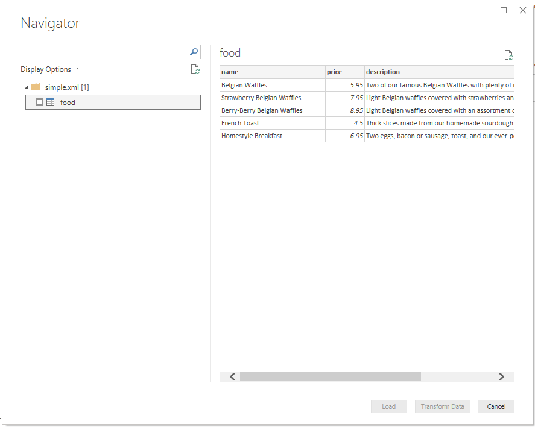

# XML

## Summary

Release State: General Availability
Products: Power BI Desktop, Power BI Service (Enterprise Gateway), Dataflows in PowerBI.com (Enterprise Gateway), Dataflows in PowerApps.com (Enterprise Gateway), Excel

Authentication Types Supported:

Function Reference Documentation: [Xml.Tables](https://docs.microsoft.com/en-us/powerquery-m/xml-tables), [Xml.Document](https://docs.microsoft.com/en-us/powerquery-m/xml-document)

## Capabilities supported

* Import

## Load from XML

### Load from file

To load a local XML file, all you need to do is select the 'XML' option in the connector selection. This will launch a local file browser and allow you to select your XML file. 

You will be presented with the table that the connector loads, which you can then Load or Transform.

### Load from web

If you want to load an XML file from the web, instead of selecting the XML connector you can select the Web connector. Paste in the address of the desired file and you will be prompted with an authentication selection, since you're hitting a website rather than a static file. If there's no authentication, you can just select Anonymous. As in the local case, you will then be presented with the table that the connector loads by default, which you can Load or Transform.

## Troubleshooting

### Data Structure

Due to the fact that many XML documents have ragged or nested data, you will have to do extra data shaping to get it in the sort of form that will make it convenient to do analytics. This holds true whether you use the UI accessible XML.Tables function, or the XML.Document function. Depending on your needs you may find you have to do more or less data shaping.

### Text vs nodes
If you have similarly structured entries, and you have text nodes with a title entry for each, and one of those nodes has extra tags on the title, it drops everything outside the tag. It does text or nodes, not mixed.
