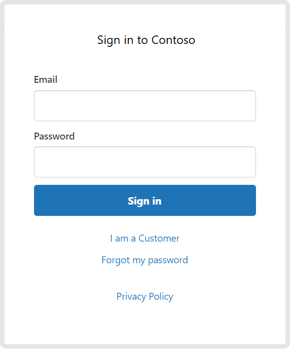

# Zendesk (Beta)

## Summary

| Item | Description |
| ---- | ----------- |
| Release State | General Availability |
| Products | Power BI (Dataflow) |
| Authentication Types Supported | Organizational account |
| | |

## Prerequisites

Before you can sign in to Zendesk, you must have a Zendesk account (username/password).

## Capabilities Supported

* Import

## Connect to Zendesk data

To connect to Zendesk data:

1. Select **Get Data** from the **Home** ribbon in Power BI Desktop. Select **Online Services** from the categories on the left, select **Zendesk (Beta)**, and then select **Connect**.

   

2. If this is the first time you're getting data through the Zendesk connector, a third-party notice will be displayed. Select **Don't warn me again with this connector** if you don't want this message to be displayed again, and then select **Continue**.

3. To sign in to your Zendesk account, select **Sign in**.

   

4. In the Zendesk window that appears, provide your credentials to sign in to your Zendesk account.

   

5. Select **Continue**.

6. Once you've successfully signed in, select **Connect**.

7. In **Navigator**, select the database information you want, then either select **Load** to load the data or **Transform Data** to continue transforming the data in Power Query Editor.

## Limitations and issues

You should be aware of the following limitations and issues associated with accessing Zendesk data.

* Zendesk returns a 422 error status if the instance returns more than 1000 rows.
