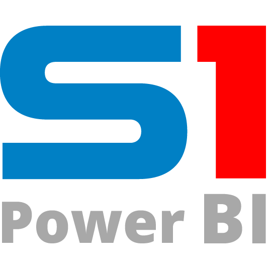

# Connectors in Power Query

The following table contains a list of all the connectors currently available for Power Query. For those connectors that have a reference page in this document, a link is provided under the connector icon and name. 

A checkmark indicates the connector is currently supported in the listed service; an X indicates that the connector is not currently supported in the listed service.

[A](#letter-a) | [B](#letter-b) | [C](#letter-c) | [D](#letter-d) | [E](#letter-e) | [F](#letter-f) | [G](#letter-g) | [H](#letter-h) | [I](#letter-i) | [J](#letter-j) | [K](#letter-k) | [L](#letter-l) | [M](#letter-m) | N | [O](#letter-o) | [P](#letter-p) | [Q](#letter-q) | [R](#letter-r) | [S](#letter-s) | [T](#letter-t) | U | [V](#letter-v) | [W](#letter-w) | [X](#letter-x) | Y | [Z](#letter-z)

| Connector | Excel&nbsp;&nbsp;&nbsp;&nbsp;&nbsp;&nbsp;&nbsp; | Power BI (Datasets) | Power BI (Dataflows) | Power Apps (Dataflows) | Customer Insights (Dataflows) | Analysis Services |
| --- | --- | --- | --- | --- | --- | --- |
| [ **Access Database**](./accessdatabase.md) By Microsoft                           |  |  |  |  |  |  |
|  **Active Directory** By Microsoft                        |  |  |  |   |  |  |
|  **Acterys (Beta)** By Acterys                        |  |  |  |   |  |  |
|  **Actian (Beta)** By Actian                        |  |  |  |   |  |  |
| [ **Adobe Analytics**](./adobeanalytics.md) By Microsoft                           |   |  |   |   |   |   |
|  **Amazon Redshift** By Microsoft                                  |   |  |  |  |  |   |
| [ **Anaplan**](./Anaplan.md) By Anaplan                        |  |  |  |   |  |  |
|  **appFigures (Beta)** By Microsoft                                      |   |  |   |   |   |   |
|  **Asana** By Asana                                                                |   |  |   |   |   |   |
|  **AtScale cubes (Beta)** By Microsoft                             |   |  |   |   |   |   |
|  **Automation Anywhere** By Automation   Anywhere                             |   |  |   |   |   |   |
|  **Azure Analysis Services database** By Microsoft |   |  |   |   |   |   |
|  **Azure Blob Storage** By Microsoft                                         |  |  |  |   |  |  |
|  **Azure CosmosDB (Beta)** By Microsoft                              |   |  |   |   |   |  |
|  **Azure Cost Management ** By Microsoft     |   |  |   |   |   |   |
|  **Azure   Databricks** By Microsoft |  |  |  |  |  |  |
|  **Azure Data Explorer (Beta)** By Microsoft                         |  |  |  |  |   |   |
|  **Azure Data Lake Storage Gen1** By Microsoft                           |  |  |   |   |   |  |
| [ **Azure Data Lake Storage Gen2 (Beta)**](./datalakestorage.md) By Microsoft                                                                                                                             |   |  |  |  |  |  | 
|  **Azure DevOps (Beta)** By Microsoft                                        |   |  |   |   |   |   |
|  **Azure DevOps Server (Beta)** By Microsoft                          |   |  |   |   |   |   |
|  **Azure HDInsight (HDFS)** By Microsoft                        |  |  |   |   |   |  |
|  **Azure HDInsight Spark** By Microsoft                                   |   |  |  |  |  |  |
| [ **Azure Synapse Analytics (SQL DW)**](azuresqldatawarehouse.md) By Microsoft                |  |  |  |  |  |  |
| [ **Azure SQL database**](azuresqldatabase.md) By Microsoft                                  |  |  |  |  |  |  |
|  **Azure Table Storage** By Microsoft                                      |  |  |  |   |  |  |
|  **Azure Time Series Insights  (Beta)** By Microsoft                                                                                                                             |   |  |   |   |   |   | 
|  **BI Connector** By Guidanz                                                 |   |  |   |   |   |   |
|  **BI360** By Solver Global                                                               |   |  |   |   |   |   |
| [ **Bloomberg Data  and Analytics**](./BloombergDataAndAnalytics.md) By Bloomberg                                                               |   |  |   |   |   |   |
|  **Cognite Data Fustion (Beta)** By Cognite                            |   |  |   |   |   |   |
|  **Cherwell (Beta)** By Cherwell                            |   |  |   |   |   |   |
|  **Common Data Service (legacy)** By Microsoft                            |   |  |   |   |   |   |
|  **Data.World - Get Dataset (Beta)** By Microsoft          |   |  |   |   |   |   |
|  **Data Virtuality (Beta)** By Data Virtuality                 |   |  |   |   |   |   |
| [ **Dataverse**](./dataverse.md) By Microsoft                                    |   |  |  |   |  |   |
|  **Denodo** By Denodo                                                       |   |  |   |   |   |   |
|  **Dremio** By Dremio                                                            |   |  |   |   |   |   |
|  **Dynamics 365 (online)** By Microsoft                             |  |  |   |   |   |  |
|  **Dynamics 365 Business Central** By Microsoft                                                                                                                             |   |  |   |   |   |   |
|  **Dynamics 365 Business Central (on-premises)** By Microsoft                                                                                                                             |   |  |   |   |   |   |
|  **Dynamics 365 Customer Insights (Beta)** By Microsoft                                                                                                                             |   |  |   |   |   |   |
|  **Dynamics NAV** By Microsoft                                              |   |  |   |   |   |   |
|  **eWay-CRM** By eWay-CRM                                        |   |  |   |   |   |   
 **Emigo Data Source** By Sagra                                        |   |  |   |   |   |   |
|  **Entersoft Business Suite (Beta)** By Entersoft                                                                                                                             |   |  |   |   |   |   |
| [ **EQuIS (Beta)**](./EQuIS.md) By EarthSoft                                                                                                                             |   |  |   |   |   |   |
|  **Essbase** By Microsoft                                                       |   |  |   |   |   |   |
|  **Exasol** By Exasol                                                                   |   |  |   |   |   |   |
| [ **Excel**](./excel.md) By Microsoft                                            |  |  |  |  1|  |  |
|  **FactSet Analytics (Beta)** By FactSet                             |   |  |   |   |   |   |
| [ **FHIR**](./fhir/fhir.md) By Microsoft                                                    |   |  |   |   |   |   |
| [ **Folder**](./folder.md) By Microsoft                                                 |  |  |  |  |  |  |
|  **Github (Beta)** By Microsoft                                                  |   |  |   |   |   |   |
| [ **Google Analytics**](./googleanalytics.md) By Microsoft                                  |   |  |   |   |   |   |
| [ **Google BigQuery**](./googlebigquery.md) By Microsoft                                            |   |  |  |  |  |   |
|  **Hadoop File (HDFS)** By Microsoft                                |  |  |   |   |   |   |
|  **HDInsight Interactive Query** By Microsoft            |   |  |   |   |   |   |
|  **Hexagon PPM   Smart API** By Hexagon PPM            |   |  |   |   |   |   |
|  **Hive LLAP (Beta)** By Microsoft   |   |  |   |   |   |   |
|  **IBM DB2 database** By Microsoft                                          |  |  |  |  |  |   |
|  **IBM Informix database (Beta)** By Microsoft                  |   |  |   |   |   |  |
|  **IBM Netezza** By Microsoft                                                    |   |  |   |   |   |   |
|  **Impala** By Microsoft                                                                  |   |  |   |  |  |   |
|  **Indexima (Beta)** By Indexima                                                           |   |  |   |   |   |   |
|  **Industrial App Store** By Intelligent Plant              |   |  |   |   |   |   |
|  **Information Grid (Beta)** By Luminis                                    |   |  |   |   |   |   |
|  **InterSystems IRIS (Beta)** By Intersystems                       |   |  |   |   |   |   |
|  **Intune Data Warehouse (Beta)** By Microsoft                                  |   |  |   |   |   |   |
|  **Jamf Pro (Beta)** By Jamf                                                 |   |  |   |   |   |   |
|  **Jethro (Beta)** By JethroData                                  |   |  |   |   |   |   |
| [ **JSON**](json.md) By Microsoft                                                             |  |  |  |  1 |  |  |
|  **Kognitwin (Beta)** By Kongsberg                   |   |  |   |   |   |   |
 **Kyligence** By Kyligence                   |   |  |   |   |   |   |
|  **Linkar PICK Style/MultiValue Databases (Beta)** By Kosday Solutions |   |  |   |   |   |   |
|  **LinkedIn Sales Navigator (Beta)** By Microsoft |   |  |   |   |   |   |
|  **Marketo (Beta)** By Microsoft                                               |   |  |   |   |   |   |
|  **MarkLogic (Beta)** By MarkLogic                                    |   |  |   |   |   |   |
|  **MariaDB** By MariaDB                                    |   |  |   |   |   |   |
| [ **Microsoft Azure Consumption Insights (Beta) (Deprecated)**](MicrosoftAzureConsumptionInsights.md) By Microsoft                                                                                                                             |   |  |   |   |   |   |
|  **Microsoft Exchange** By Microsoft                                      |  |  |   |   |   |   |
|  **Microsoft Exchange Online** By Microsoft                        |  |  |  |   |  |   |
| [ **Microsoft Graph Security (Deprecated)**](MicrosoftGraphSecurity.md) By Microsoft           |   |  |   |   |   |   |
|  **MicroStrategy for Power BI** By MicroStrategy             |   |  |   |   |   |   |
|  **Mixpanel (Beta)** By Microsoft                                            |   |  |   |   |   |   |
| [ **MySQL database**](mysqldatabase.md) By Microsoft                                              |  |  |  |  |  |  |
| [ **OData Feed**](odatafeed.md) By Microsoft                                                         |  |  |  |  1 |  |  |
| [ **ODBC**](./odbc.md) By Microsoft                                                         |  |  |  |  |  |  |
|  **OLE DB** By Microsoft                                                                 |  |  |   |   |   |  |
| [ **Oracle database**](oracledatabase.md) By Microsoft                                            |  |  |  |  |  |  |
|  **Parquet** By Microsoft                                                                         |   |   |   |  |   |   |
|  **Palantir Foundry** By Palantir   |   |  |   |   |   |   |
|  **Paxata** By Paxata                                                     |   |  |   |   |   |   |
|  **PDF** By Microsoft                                                                     |  |  |  |  1 |  |   |
|  **Planview Enterprise One - CTM (Beta)** By Planview                                                                                                                              |   |  |   |   |   |   |
|  **Planview Enterprise One - PRM (Beta)** By Planview                                                                                                                              |   |  |   |   |   |   |
| [ **PostgreSQL database**](./postgresql.md) By Microsoft                 |  |  |  |  |  |  |
|  **Power BI dataflows (Beta)** By Microsoft               |   |  |   |   |   |   |
|  **Power BI datasets** By Microsoft                                        |   |  |   |   |   |   | 
|  **Power Platform dataflows** By Microsoft                                                                                                                             |   |  |   |  |   |   |
|  **Product Insights (Beta)** By Microsoft                    |   |  |   |   |   |   | 
|  **Projectplace for Power BI (Beta)** By Planview               |   |  |   |   |   |   |
|  **Python Script** By Microsoft                                                  |   |  |   |   |   |   |
|  **QubolePresto Beta** By Qubole                                                 |   |  |   |   |   |   |
| [ **Quickbooks Online (Beta)**](quickbooksonline.md) By Microsoft                               |   |  |   |   |   |   |
|  **Quick Base** By Quick Base                                                  |   |  |   |   |   |   |
|  **R Script** By Microsoft                                                                 |   |  |   |   |   |   |
|  **Roamler (Beta)** By Roamler                                            |   |  |   |   |   |   |
| [ **Salesforce Objects**](./salesforceobjects.md) By Microsoft          |  |  |  |  |  |  |
| [ **Salesforce Reports**](./salesforcereports.md) By Microsoft          |  |  |  |  |  |  |
| [ **SAP Business Warehouse Application Server** ](./sap-bw/application-setup-and-connect.md)By Microsoft                                                                                                                             |   |  |  |  |   |   |
| [ **SAP Business Warehouse Message Server**](./sap-bw/message-setup-and-connect.md) By Microsoft                                                                                                                             |   |  |  |  |   |   |
| [ **SAP HANA database**](./sap-hana/overview.md) By Microsoft                                   |  |  |  |  |   |  |
| [ **SharePoint Folder**](./sharepointfolder.md) By Microsoft                                      |  |  |  |  |  |   |
| [ **SharePoint list**](./sharepointlist.md) By Microsoft                   |  |  |  |  |  |  |
| [ **SharePoint Online List**](./sharepointonlinelist.md) By Microsoft                                                                                                                             |  |  |  |  1|  |   |
|  **Shortcuts Business Insights (Beta)** By Shortcuts  |   |  |   |   |   |   |
|  **SiteImprove** By SiteImprove                                 |   |  |   |   |   |   |
|  **Smartsheet** By Microsoft                                                    |   |  |  |   |   |   |
| [ **Snowflake**](snowflake.md) By Microsoft                                                        |   |  |   |  |   |   |
| [ **SoftOneBI (Beta)**](softonebi.md) By SoftOne |   |  |   |   |   |   |
|  **Solver** By BI360 |   |  |   |   |   |   |
|  **Spark** By Microsoft                                                                   |   |  |  |  |  |   |
|  **SparkPost (Beta)** By Microsoft                                         |   |  |   |   |   |   |
|  **Spigit (Beta)** By Spigit                                         |   |  |   |   |   |   |
|  **Starburst   Presto (Beta)** By Starburst Data                                         |   |  |   |   |   |   |
|  **SQL Server Analysis Services database** By Microsoft                                                                                                                             |  |  |   |   |   |   |
| [ **SQL Server database**](./sqlserver.md) By Microsoft                  |  |  |  |  |  |  |
|  **SurveyMonkey (Beta)** By SurveyMonkey                                           |   |  |   |   |   |   |
|  **SweetIQ (Beta)** By Microsoft                                               |   |  |   |   |   |   |
|  **Sybase Database** By Microsoft                                            |  |  |  |   |  |  |
|  **TeamDesk (Beta)** By ForeSoft                                             |   |  |   |   |   |   |
|  **Tenforce (Smart)List** By Tenforce           |   |  |   |   |   |   |
|  **Teradata database** By Microsoft                                        |  |  |  |  |  |  |
| [ **Text/CSV**](./textcsv.md) By Microsoft                                          |  |  |  |  1 |  |  |
|  **TIBCO(R) Data Virtualization (Beta)** By TIBCO                 |   |  |   |   |   |   |
|  **Twilio (Beta)** By Microsoft                                                  |   |  |   |   |   |   |
|  **Vena (Beta)** By Vena                                                             |   |  |   |   |   |   |
|  **Vertica** By Microsoft                                                             |   |  |  |   |  |   |
|  **Vessel Insights (Beta)** By Kongsberg   |   |  |   |   |   |   |
| [ **Web**](./web/web.md) By Microsoft                                                             |  |  |  |  1|  |   |
|  **Webtrends Analytics (Beta)** By Microsoft                                         |   |  |   |   |   |   |
|  **Witivio (Beta)** By Witivio  |   |  |   |   |   |   | 
|  **Workforce Dimensions (Beta)** By Kronos           |   |  |   |   |   |   |
|  **Workplace Analytics (Beta)** By Microsoft           |   |  |   |   |   |   |
| [ **XML**](./xml.md) By Microsoft                                                    |  |  |  |  1 |  |  |
|  **Zendesk (Beta)** By Microsoft                                               |   |  |   |   |   |   |
|  **Zoho Creater (Beta)** By Zoho   |   |  |   |   |   |   |
|  **Zucchetti HR Infinity (Beta)** By Zucchetti                 |   |  |   |   |   |   |
| | | | | | | |

1 Available in [dataflows for Microsoft Teams](../dataflows/dataflows-teams.md).

## Next steps

- [Power BI data sources (datasets)](/power-bi/power-bi-data-sources)
- [Connect to data sources for Power BI dataflows](/power-bi/transform-model/service-dataflows-data-sources#data-sources-for-dataflows)
- [Available data sources (Dynamics 365 Customer Insights)](/dynamics365/ai/customer-insights/data-sources-list)
- [Data sources supported in Azure Analysis Services](/azure/analysis-services/analysis-services-datasource)
