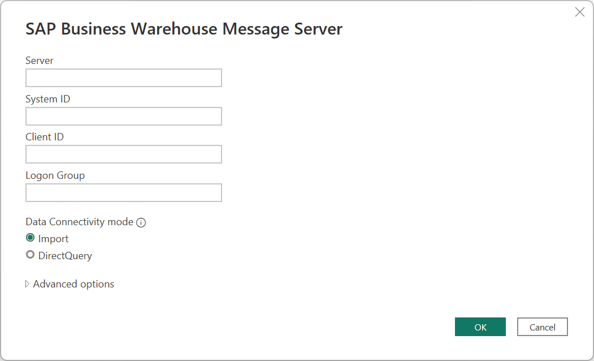
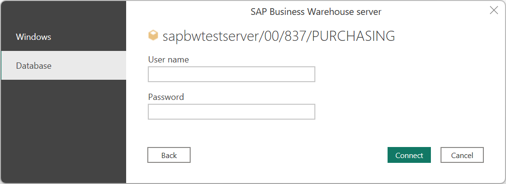

# SAP Business Warehouse Message Server

>[!NOTE]
>The SAP Business Warehouse Message Server connector is now certified for SAP BW/4HANA as of June 2020.
 
## Summary
 
| Item | Description |
| ---- | ----------- |
| Release State | General Availability |
| Products | Power Query Desktop: &nbsp;&nbsp;&nbsp;&nbsp;&nbsp;&nbsp;Power BI Desktop &nbsp;&nbsp;&nbsp;&nbsp;&nbsp;&nbsp;Analysis Services Power Query Online: &nbsp;&nbsp;&nbsp;&nbsp;&nbsp;&nbsp;Datasets in PowerBI.com (on-premises data gateway (standard mode)) &nbsp;&nbsp;&nbsp;&nbsp;&nbsp;&nbsp;Dataflows in PowerBI.com (on-premises data gateway (standard mode)) &nbsp;&nbsp;&nbsp;&nbsp;&nbsp;&nbsp;Dataflows in PowerApps.com (on-premises data gateway (standard mode)) |
| Authentication Types Supported | Windows (desktop) Database (desktop) Basic (online) |
| Function Reference Documentation | [SapBusinessWarehouse.Cubes](https://docs.microsoft.com/powerquery-m/sapbusinesswarehouse-cubes) [sapbusinesswarehouseexecutionmode.datastream](https://docs.microsoft.com/powerquery-m/sapbusinesswarehouseexecutionmode.datastream) [SapBusinessWarehouseExecutionMode.BasXml](https://docs.microsoft.com/powerquery-m/sapbusinesswarehouseexecutionmode.basxml) [SapBusinessWarehouseExecutionMode.BasXmlGzip](https://docs.microsoft.com/powerquery-m/sapbusinesswarehouseexecutionmode.basxmlgzip) |
| | |

>[!Note]
> Some capabilities may be present in one product but not others due to deployment schedules and host-specific capabilities.
 
## Prerequisites

You'll need an SAP account to sign in to the website and download the drivers. If you're unsure, contact the SAP administrator in your organization.

You can use either version 1.0 of the SAP Business Warehouse (BW) Message Server connector or the Implementation 2.0 SAP connector in Power Query Desktop. The following sections describe the installation of each version, in turn. You can choose one or the other connector when connecting to an SAP BW Message Server from Power BI Desktop. We suggest you use the Implementation 2.0 SAP connector whenever possible.

>[!NOTE]
>We suggest you use the Implementation 2.0 SAP connector whenever possible because it provides significant performance, functionality, and reliability improvements over 1.0.

>[!NOTE]
> Power Query Online uses the version 2.0 SAP BW Message Server connector by default. However, version 1.0 of the SAP BW Message Server connector works in the M Engine level if you really need to use it.

### Prerequisites for version 1.0

To use version 1.0 of the SAP BW Message Server connector, you must install the *SAP NetWeaver* library on your local computer. You can get the SAP NetWeaver library from your SAP administrator or directly from the [SAP Software Download Center](https://support.sap.com/swdc). Since the SAP Software Download Center changes its structure frequently, more specific guidance for navigating that site isn't available. The SAP NetWeaver library is usually included in the SAP Client Tools installation.

You can search for *SAP Note #1025361* to get the download location for the most recent version. Make sure the architecture for the SAP NetWeaver library (32-bit or 64-bit) matches your Power BI Desktop installation. Install all files included in the *SAP NetWeaver RFC SDK* according to the SAP Note.

### Prerequisites for version 2.0

To use the version 2.0 SAP BW Message Server connector in Power BI Desktop or Power Query Online, you must install the SAP .NET Connector 3.0. Access to the download requires a valid S-user. Contact your SAP Basis team to get the SAP .NET Connector 3.0. You can download the [SAP .NET Connector 3.0](https://support.sap.com/en/product/connectors/msnet.html) from SAP. The connector comes in 32-bit and 64-bit versions. Choose the version that matches your Power BI Desktop installation. For Power Query Online, choose the 64-bit version. Currently, the website lists two versions for .NET 4.0 framework:

* SAP Connector for Microsoft .NET 3.0.23.0 for Windows 32 bit (x86) as a zip file (6,928 KB), May 28, 2020
* SAP Connector for Microsoft .NET 3.0.23.0 for Windows 64 bit (x64) as a zip file (7,225 KB), May 28, 2020

When you install, in **Optional setup steps**, make sure you select **Install assemblies to GAC**.

>[!Note]
> If you want to use version 1.0 of the SAP BW Message Server connector, you must use the *SAP NetWeaver* library. For more information about installing version 1.0, see [Prerequisites for version 1.0](#prerequisites-for-version-10). We recommend using the Implementation 2.0 SAP BW Message Server connector whenever possible.

## Capabilities Supported
* Import
* Direct Query
* Implementation
    * 2.0 (Requires SAP .NET Connector 3.0)
    * 1.0 (Requires NetWeaver RFC)
* Advanced
    * Language code
    * Execution mode
    * Batch size
    * MDX statement
    * Enable characteristic structures

## Connect to an SAP BW Message Server from Power Query Desktop

To connect to an SAP BW Message Server:

1. From the **Home** tab of Power BI Desktop, select **Get Data > SAP Business Warehouse Message Server**.

2. Enter the server, system number, client ID, and logon group of the SAP BW Message Server you want to connect to. This example uses `SAPBWTestServer` as the server name, a system number of `100`, a client ID of `837`, and a logon group of `PURCHASING`.

    The rest of this example describes how to import your data into Power Query Desktop, which is the default setting for **Data Connectivity mode**. If you want to use DirectQuery to load your data, see [Connect to SAP Business Warehouse by using DirectQuery in Power BI](https://docs.microsoft.com/power-bi/connect-data/desktop-directquery-sap-bw).

    This example also uses the default **Implementation** of **2.0 (requires SAP .NET Connector 3.0)**. If you want to use version 1 of the SAP BW Message Server connector, select **1.0 (requires NetWeaver RFC)**.

    If you want to use any of the advanced options for this connector to fine-tune your query, go to [Use advanced options](use-advanced-options.md).

    When you've finished filling in the relevant information, select **OK**.

   

3. When accessing the database for the first time, the SAP BW Message Server requires database user credentials. Power Query Desktop offers two authentication modes for SAP BW connections&mdash;user name/password authentication (Database), and Windows authentication (single sign-on). SAML authentication isn't currently supported. Select either **Windows** or **Database**. If you select **Database** authentication, enter your user name and password. If you select **Windows** authentication, go to [Windows Authentication and single sign-on](single-sign-on.md) to learn more about the requirements for Windows authentication.

   

   Then select **Connect**.

   For more information about authentication, go to [Authentication with a data source](../../connectorauthentication.md).

4. From the **Navigator** dialog box, select the items you want to use. When you select one or more items from the server, the **Navigator** dialog box creates a preview of the output table. For more information about navigating the SAP BW Message Server query objects in Power Query, go to [Navigate the query objects](navigate-query-objects.md).

   

5. From the **Navigator** dialog box, you can either transform the data in the Power Query Editor by selecting **Transform Data**, or load the data by selecting **Load**.

## Connect to an SAP BW Message Server from Power Query Online
 
To connect to an SAP BW Message Server from Power Query Online:

1. From the **Data sources** page, select **SAP BW Message Server**.

2. Enter the server, system number, client ID, and logo group of the SAP BW Message Server you want to connect to. This example uses `SAPBWTestServer` as the server name, a system number of `100`, a client ID of `837`, and a logon group of `PURCHASING`.

3. Select the [on-premises data gateway](https://docs.microsoft.com/data-integration/gateway/service-gateway-onprem) you want to use to connect to the data.

4. Set **Authentication Kind** to **Basic**. Enter your user name and password.

   

5. You can also select from a set of [advanced options](use-advanced-options.md) to fine-tune your query. 

5. Select **Next** to connect.

6. From the **Navigator** dialog box, select the items you want to use. When you select one or more items from the server, the **Navigator** dialog box creates a preview of the output table. For more information about navigating the SAP BW Message Server query objects in Power Query, go to [Navigate the query objects](navigate-query-objects.md).

7. From the **Navigator** dialog box, you can transform the data in the Power Query Editor by selecting **Transform Data**.

   

### See also

* [Use advanced options](use-advanced-options.md)
* [Navigate the query objects](navigate-query-objects.md)
* [SAP Business Warehouse fundamentals](sap-bw-fundamentals.md)
