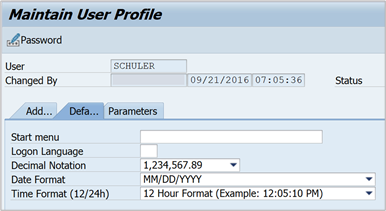

# SAP Business Warehouse connector troubleshooting

This article provides troubleshooting situations (and possible solutions) for working with the SAP Business Warehouse (BW) connector.

## Collect SAP BW advanced traces

>[!NOTE]
> Collecting a trace of a query sent to the SAP BW server requires some options and settings that can only be provided by using Power BI Desktop. If you don't already have a copy of Power BI Desktop, you can obtain a copy at the [Microsoft Download Center](https://www.microsoft.com/download/details.aspx?id=58494). You can set all of the required options and settings for advanced traces using this free version.

Many times when an error occurs, it may be advantageous to collect a trace of the query that was sent to the SAP BW server and its response. The following procedure shows how to set up advanced traces for issues that occur using the SAP BW connector.

1. Close Power BI Desktop if it’s running.

2. Create a new environment variable:

    1. From the Windows Control Panel, select **System** > **Advanced System Settings**.

        You could also open a **Command Prompt** and enter **sysdm.cpl**.
    2. In **System Properties**, select the **Advanced** tab, and then select **Environment Variables**.
    3. In **Environment Variables**, under **System Variables**, select **New**.
    4. In **New System Variable**, under **Variable name**, enter **PBI_EnableSapBwTracing** and under **Variable value**, enter **true**.
    5. Select **OK**.

   When this advanced tracing is activated, an additional folder called **SapBw** will be created in the **Traces** folder. See the rest of this procedure for the location of the **Traces** folder.

3. Open Power BI Desktop.

4. Clear the cache before capturing.

    1. In Power BI desktop, select the **File** tab.
    2. Select **Options and settings** > **Options**.
    3. Under **Global** settings, choose **Data Load**.
    4. Select **Clear Cache**.

5. While you're still in **Options and settings**, enable tracing.

    1. Under **Global** settings, choose **Diagnostics**.
    2. Select **Enable tracing**.

6. While you're still in **Options and settings** > **Global** > **Diagnostics**, select **Open crash dump/traces folder**. Ensure the folder is clear before capturing new traces.

7. Reproduce the issue.

8. Once done, close Power BI Desktop so the logs are flushed to disk.

9. You can view the newly captured traces under the **SapBw** folder (the **Traces** folder that contains the **SapBw** folder is shown by selecting **Open crash dump/traces folder** on the **Diagnostics** page in Power BI Desktop).

10. Make sure you deactivate this advanced tracing once you’re done, by either removing the environment variable or setting PBI_EnableSapBwTracing to false.

## Collect SAP BW advanced traces with CPIC traces

If you're investigating authentication or single sign-on (SSO) issues, use the same procedure as described in [Collect SAP BW advanced traces](#collect-sap-bw-advanced-traces), except in step 2d, enter the following additional system variables and values:

* CPIC_TRACE&mdash;3
* CPIC_TRACE_DIR&mdash;a valid folder, for example: E:\traces\CPIC

The rest of the procedure remains the same. You can view the CPIC traces in the folder you specified in the CPIC_TRACE_DIR environment variable. You can also view the regular traces under the **SapBw** folder.

Also make sure you deactivate this advanced tracing once you’re done, by either removing the environment variables or setting BI_EnableSapBwTracing to false and CPIC_TRACE to 0.

## Perform clean installation of SAP .NET connector

If it becomes necessary to reinstall the SAP .NET connector:

1. Remove (uninstall) the SAP .NET Connector.

2. After removing, verify that the SAP .NET Connector isn't installed in the Global Assembly Cache (GAC), by making sure the following paths do NOT exist or do NOT contain DLLs:

   * 32 bit GAC:

     C:\Windows\Microsoft.NET\assembly\GAC_32\sapnco\v4.0_3.0.0.42__50436dca5c7f7d23

     C:\Windows\Microsoft.NET\assembly\GAC_32\sapnco_utils\v4.0_3.0.0.42__50436dca5c7f7d23

   * 64 bit GAC:

     C:\Windows\Microsoft.NET\assembly\GAC_64\sapnco\v4.0_3.0.0.42__50436dca5c7f7d23

     C:\Windows\Microsoft.NET\assembly\GAC_64\sapnco_utils\v4.0_3.0.0.42__50436dca5c7f7d23

3. Verify that the binaries aren't in **Program Files**. Make sure the following locations do NOT exist or are empty:

    C:\Program Files\SAP\SAP_DotNetConnector3_Net40_x64

    C:\Program Files (x86)\sap\SAP_DotNetConnector3_Net40_x86

4. Reinstall the connector, and remember to select the **Install assemblies to GAC** option. We recommend you use the latest, 3.0.23.

## Troubleshooting error messages

### SAP BW ErrorCode method not found

`Method not found: 'Int32 SAP.Middleware.Connector.RfcBaseException.get_ErrorCode()'`

This error is thrown when an error occurs on the SAP BW server and the SAP .NET connector tries to retrieve information about that error. However, this error may be hiding the real error. This error can occur when:

* Using an old version of the SAP .NET connector.

* Multiple versions of the SAP .NET connector are installed.

* The SAP .NET connector was installed twice, once in the Global Assembly Cache (GAC) and once not in the GAC.

Follow the instructions under [Perform clean installation of SAP .NET connector](#perform-clean-installation-of-sap-net-connector) to reinstall the connector.

This won't solve the problem, but will provide the actual error message.

### Exception: The type initializer for 'Microsoft.Mashup.Engine1.Library.SapBusinessWarehouse.<br/>SapBwMicrosoftProviderFactoryService' threw an exception.

Follow instructions under [Perform clean installation of SAP .NET connector](#perform-clean-installation-of-sap-net-connector) to reinstall the connector.

### This connector requires one or more additional components

If you receive this error message, use the following troubleshooting steps:

1. Verify that the version of the SAP .NET connector is installed in the correct bit length. If you have Power BI Desktop 64-bit installed, make sure you installed the 64-bit SAP .NET connector.

2. Verify that, while installing the SAP .NET Connector, the [**Install assemblies to GAC**](application-setup-and-connect.md#app-gac-install) was checked. To verify GAC is installed, open Windows Explorer and go to:

    &nbsp;&nbsp;&nbsp;&nbsp;&nbsp;&nbsp;C:\Windows\Microsoft.NET\assembly\GAC_64\sapnco

    For example, the full path might be:

    &nbsp;&nbsp;&nbsp;&nbsp;&nbsp;&nbsp;C:\Windows\Microsoft.NET\assembly\GAC_64\sapnco\v4.0_3.0.0.42__50436dca5c7f7d23\sapnco.dll

If you installed the 32-bit version of the SAP .NET connector, it would be C:\Windows\Microsoft.NET\assembly\GAC_32\sapnco\v4.0_3.0.0.42__50436dca5c7f7d23\sapnco.dll (and you’d need a 32-bit version of Power BI Desktop).

Another way to check the GAC is to use gacutil (one of the options for disabling strong name signing). You’d need to run it from a 64-bit command prompt. You can check the contents of the GAC by opening a command prompt, navigating to the gacutil.exe path and executing:

&nbsp;&nbsp;&nbsp;&nbsp;&nbsp;&nbsp;**gacutil -l**
  
For example, in the output you should see:

&nbsp;&nbsp;&nbsp;&nbsp;&nbsp;&nbsp;**sapnco, Version=3.0.0.42, Culture=neutral, PublicKeyToken=50436dca5c7f7d23, processorArchitecture=AMD64 sapnco_utils, Version=3.0.0.42, Culture=neutral, PublicKeyToken=50436dca5c7f7d23, processorArchitecture=AMD64**

### “No RFC authorization for function …*

Implementation 2.0 requires access to the following BAPIs. To resolve, contact the SAP Basis team and request permissions to these BAPIs and RFCs for the user.

* Connectivity:

   * RFC_PING
   * RFC_METADATA_GET

* MDX execution:

   * RSR_MDX_CREATE_OBJECT
   * BAPI_MDDATASET_CREATE_OBJECT
   * BAPI_MDDATASET_SELECT_DATA
   * BAPI_MDDATASET_DELETE_OBJECT
   * RSR_MDX_GET_AXIS_INFO
   * RSR_MDX_GET_AXIS_DATA
   * RSR_MDX_GET_CELL_DATA
   * BAPI_MDDATASET_GET_AXIS_INFO
   * BAPI_MDDATASET_GET_AXIS_DATA
   * BAPI_MDDATASET_GET_CELL_DATA

* ExecutionMode flattening:

   * RSR_MDX_GET_FLAT_DATA
   * RSR_MDX_GET_FS_DATA
   * BAPI_MDDATASET_GET_FLAT_DATA
   * BAPI_MDDATASET_GET_FS_DATA

* ExecutionMode streaming:

   * BAPI_MDDATASET_GET_STREAMDATA
   * BAPI_MDDATASET_GET_STREAMINFO

* ExecutionMode BasXml:

   * RSR_MDX_BXML_GET_DATA
   * RSR_MDX_BXML_GET_GZIP_DATA
   * RSR_MDX_BXML_GET_INFO
   * RSR_MDX_BXML_SET_BINDING

* Metadata:

   * BAPI_MDPROVIDER_GET_DIMENSIONS
   * BAPI_MDPROVIDER_GET_CATALOGS
   * BAPI_MDPROVIDER_GET_CUBES
   * BAPI_MDPROVIDER_GET_MEASURES
   * BAPI_MDPROVIDER_GET_HIERARCHYS
   * BAPI_MDPROVIDER_GET_LEVELS
   * BAPI_MDPROVIDER_GET_PROPERTIES
   * BAPI_MDPROVIDER_GET_MEMBERS
   * BAPI_MDPROVIDER_GET_VARIABLES

* Information:

   * BAPI_IOBJ_GETDETAIL (required for typed dimensions (DATS, TIMS))
   * BAPI_USER_GET_DETAIL (only used for flattening interface)
   * RFC_READ_TABLE (required for catalog names and certain variable values calls)

* Might be called by the underlying SAP .NET connector:

   * RFC_GET_FUNCTION_INTERFACE
   * FUNCTION_IMPORT_INTERFACE
   * DDIF_FIELDINFO_GET
   * SYSTEM_FINISH_ATTACH_GUI
   * BGRFC_DEST_CONFIRM
   * BGRFC_CHECK_UNIT_STATE_SERVER
   * BGRFC_DEST_SHIP
   * ARFC_DEST_SHIP
   * RFC_FUNCTION_SEARCH
   * RFC_SYSTEM_INFO
   * RFC_SET_REG_SERVER_PROPERTY
   * RFC_DOCU
   * SEO_GET_CLIF_REMOTE
   * SYSTEM_PREPARE_ATTACH_GUI
   * API_CLEAR_TID
   * ARFC_DEST_CONFIRM

### Method not found 'Int32 SAP.Middleware.Connector.RfcBaseException.get_ErrorCode()

Verify that the SAP .NET connector is installed properly. Refer to [Perform clean installation of SAP .NET connector](#perform-clean-installation-of-sap-net-connector).

This error appears when the installed version in the GAC is lower than the expected 3.0.18.0 version. [SAP Note 2417315](https://apps.support.sap.com/sap/support/knowledge/en/2417315) discusses this scenario.

### Connection string properties set by the connector

When *both* SNC Partner Name and SNC Library are provided, the SAP BW Application Server connector (implementation 2.0) will set these properties in the connection string:

* SNC_MODE&mdash;SncModeApply
* SNC_LIB&mdash;with the library path specified; if it's an environment variable, it's expanded at this point
* SNC_PARTNERNAME&mdash;with the value provided
* SNC_QOP = RfcConfigParameters.RfcSncQOP.Default

These are used for both SAP BW Application Server and SAP BW Message Server connections.

For both connection types, the connector sets:

* LANG (Language)
* CLIENT

For the SAP BW Application Server connection, the connector sets:

* ASHOST (AppServerHost)
* SYSNR (SystemNumber)

For SAP BW Message Server connections, the connector sets:

* MSHOST (MessageServerHost)
* SYSID (SystemID)
* GROUP (LogonGroup)

### Invalid MDX command with \<internal>

This error comes directly from the SAP BW server. Implementation 1 of the connector, based on Netweaver RFC, didn't expose these errors to the user, returning an empty result set instead.

This issue is discussed in the following SAP Notes. Access to these notes requires an S-user. Contact your SAP Basis team to apply the relevant fixes for this issue.

* [1084454&mdash;MDX: System error "Invalid MDX command with \<internal>"](https://launchpad.support.sap.com/#/notes/1084454)
* [1282785&mdash;MDX: System error "Invalid MDX command with \<internal>"](https://launchpad.support.sap.com/#/notes/1282785)
* [401607&mdash;Errors at MDX command with CROSSJOIN in the slicer](https://launchpad.support.sap.com/#/notes/401607)
* [1786009&mdash;Invalid MDX when using a member formula with special char](https://launchpad.support.sap.com/#/notes/1786009)

Additionally, for other similar errors, you can review the contents of the following SAP notes, and apply them as appropriate for your environment:

* [1142664&mdash;MDX: Composite SAP Note about performance improvements](https://launchpad.support.sap.com/#/notes/1142664)
* [1156101&mdash;MDX: Composite SAP Note about incorrect data](https://launchpad.support.sap.com/#/notes/1156101)

## Issues and limitations

### Changing variable names on an SAP cube puts DirectQuery report in a broken, unrecoverable state

The following symptoms occur:

* Error message&mdash;`[Expression.Error] The import [XXXX] matches no exports.`
* In the logs&mdash;`Message: [Expression.Error] The key didn't match any rows in the table.`
* StackTrace: 

   ```
   at Microsoft.Mashup.Engine1.Runtime.TableValue.get_Item(Value key)
   at Microsoft.Mashup.Engine1.Library.Cube.CubeParametersModule.Cube.ApplyParameterFunctionValue.GetParameterValue(CubeValue cubeValue, Value parameter)
   at Microsoft.Mashup.Engine1.Library.Cube.CubeParametersModule.Cube.ApplyParameterFunctionValue.TypedInvoke(TableValue cube, Value parameter, Value arguments)
   Detail: [Key = [Id = \"[!V000004]\"], Table = #table({...}, {...})]
   ```

One possible workaround is to:

1. Make a copy of the PBIX file (as things might break).

2. Add an environment variable called PBI_AlwaysEnableQueryEditor with a value of true. This setting will allow access to the query editor even in DirectQuery mode.

   >[!NOTE]
   >This environment variable is unsupported, so should only be used as outlined here.

3. Right-click on the "Cube" query and select **Advanced Editor**.

4. The query there should have a line that starts with "{Cube.ApplyParameter, "[!V000004]" *(the missing parameter)*. Remove that line. 

5. Select **Done**. 

6. Close the Power Query Editor.

7. Refresh the affected visual.

If the above workaround doesn't work, the only alternative fix is for you to recreate the report.

### Numeric data from SAP BW

>[!NOTE]
> The following information only applies when using Implementation 1.0 of the SAP BW connector or Implementation 2.0 of the SAP BW connector with Flattening mode (when ExecutionMode=67).

User accounts in SAP BW have default settings for how decimal or date/time values are formatted when displayed to the user in the SAP GUI.

The default settings are maintained in the SAP system in the User Profile for an account, and the user can view or change these settings in the SAP GUI with the menu path **System** > **User Profile** > **Own Data**.



Power BI Desktop queries the SAP system for the decimal notation of the connected user and uses that notation to format decimal values in the data from SAP BW.

SAP BW returns decimal data with either a `,` (comma) or a `.` (dot) as the decimal separator. To specify which of those SAP BW should use for the decimal separator, the driver used by Power BI Desktop makes a call to `BAPI_USER_GET_DETAIL`. This call returns a structure called `DEFAULTS`, which has a field called `DCPFM` that stores *Decimal Format Notation*. The field takes one of the following values:

* ' ' (space) = Decimal point is comma: N.NNN,NN
* 'X' = Decimal point is period: N,NNN.NN
* 'Y' = Decimal point is N NNN NNN,NN

Customers who have reported this issue found that the call to `BAPI_USER_GET_DETAIL` is failing for a particular user, which is showing the incorrect data, with an error message similar to the following message:

```xml
   You are not authorized to display users in group TI:
      <item>
         <TYPE>E</TYPE>
         <ID>01</ID>
         <NUMBER>512</NUMBER>
         <MESSAGE>You are not authorized to display users in group TI</MESSAGE>
         <LOG_NO/>
         <LOG_MSG_NO>000000</LOG_MSG_NO>
         <MESSAGE_V1>TI</MESSAGE_V1>
         <MESSAGE_V2/>
         <MESSAGE_V3/>
         <MESSAGE_V4/>
         <PARAMETER/>
         <ROW>0</ROW>
         <FIELD>BNAME</FIELD>
         <SYSTEM>CLNTPW1400</SYSTEM>
      </item>
```

To solve this error, users must ask their SAP admin to grant the SAP BW user being used in Power BI the right to execute `BAPI_USER_GET_DETAIL`. It’s also worth verifying that the user has the required `DCPFM` value, as described earlier in this troubleshooting solution.

### Connectivity for SAP BEx queries
   
You can perform BEx queries in Power BI Desktop by enabling a specific property, as shown in the following image:
   


### MDX interface limitation

A limitation of the MDX interface is that long variables lose their technical name and are replaced by V00000#.

### No data preview in Navigator window
   
In some cases, the **Navigator** dialog box doesn't display a data preview and instead provides an *object reference not set to an instance of an object* error message.
   
SAP users need access to specific BAPI function modules to get metadata and retrieve data from SAP BW's InfoProviders. These modules include:

* BAPI_MDPROVIDER_GET_CATALOGS
* BAPI_MDPROVIDER_GET_CUBES
* BAPI_MDPROVIDER_GET_DIMENSIONS
* BAPI_MDPROVIDER_GET_HIERARCHYS
* BAPI_MDPROVIDER_GET_LEVELS
* BAPI_MDPROVIDER_GET_MEASURES
* BAPI_MDPROVIDER_GET_MEMBERS
* BAPI_MDPROVIDER_GET_VARIABLES
* BAPI_IOBJ_GETDETAIL

To solve this issue, verify that the user has access to the various MDPROVIDER modules and `BAPI_IOBJ_GETDETAIL`. To further troubleshoot this or similar issues, you can enable tracing. Select **File** > **Options and settings** > **Options**. In **Options**, select **Diagnostics**, then select **Enable tracing**. Attempt to retrieve data from SAP BW while tracing is active, and examine the trace file for more detail.

### Memory Exceptions

In some cases, you might encounter one of the following memory errors:

* `Message: No more memory available to add rows to an internal table.`
* `Message: [DataSource.Error] SAP Business Warehouse: The memory request for [number] bytes could not be complied with.`
* `Message: The memory request for [number] bytes could not be complied with.`

These memory exceptions are from the SAP BW server and are due to the server running out of available memory to process the query. This might happen when the query returns a large set of results or when the query is too complex for the server to handle, for example, when a query has many crossjoins.

To resolve this error, the recommendation is to simplify the query or divide it into smaller queries. If possible, push more aggregation to the server. Alternatively, contact your SAP Basis team to increase the resources available in the server.

### Loading text strings longer than 60 characters in Power BI Desktop fails

In some cases you may find that text strings are being truncated to 60 characters in Power BI Desktop.

First, follow the instructions in [2777473 - MDX: FAQ for Power BI accessing BW or BW/4HANA](https://apps.support.sap.com/sap/support/knowledge/2777473) and see if that resolves your issue.

Because the Power Query SAP Business Warehouse connector uses the MDX interface provided by SAP for 3rd party access, you'll need to contact SAP for possible solutions as they own the layer between the MDX interface and the SAP BW server. Ask how "long text is XL" can be specified for your specific scenario.


### CHAR limit of 60 despite "long text" in SAP BW

There's a known limitation where "long text" characteristics in SAP BW appear with a 60 character limit in Power BI. This character limit is due to a limitation in the MDX interface, and there's no known workaround available. SAP has documented this MDX limitation in this [SAP Note](https://launchpad.support.sap.com/services/pdf/notes/2096749/E).

### Migrating to implementation 2.0 when using Direct Query

Due to the deprecation of implementation 1.0 of the SAP Business Warehouse connector, you might need to update your queries to take advantage of implementation 2.0. When you use Direct Query, access to the query editor is restricted. So you can't easily transition to implementation 2.0 without recreating your entire query. The workaround is to add a system environment variable to allow access to the query editor. Note that the following steps aren't officially supported, and should only be used as outlined here.

1. Create a new environment variable either by navigating to **File Explorer** > **This PC** > **Properties** > **Advanced system settings** > **Environment Variables** > **System Variables** > **New**, or by opening a command prompt and entering `sysdm.cpl` and then selecting **New** under **System Variables**.
2. Name the environment variable `PBI_AlwaysEnableQueryEditor` and set the value `true`. This variable setting allows access to the query editor even in Direct Query mode.
3. In Power BI Desktop, in the **Home** tab, select **Transform Data** to open the Power Query editor.
4. Update the query to use implementation 2.0 by following these [instructions](implementation-details.md#changing-existing-reports-to-use-implementation-20), starting with Step 2 in that article.

Your end query should look something like `SapBusinessWarehouse.Cubes("server", "system", "clientId", [Implementation = "2.0"])`.
