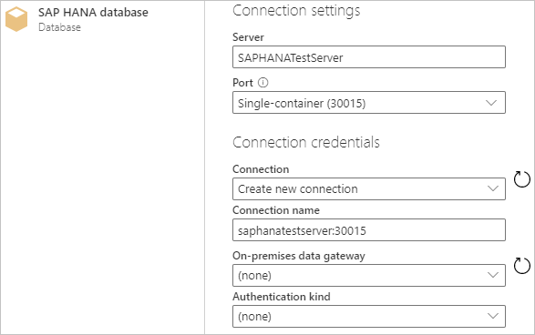

# SAP HANA database
 
## Summary
 
Release State: General Availability

Products: Power BI Desktop, Power BI Service (Enterprise Gateway), Dataflows in PowerBI.com (Enterprise Gateway), Dataflows in PowerApps.com (Enterprise Gateway), Excel

Authentication Types Supported: Basic, Database, Windows

>[!Note]
> Some capabilities may be present in one product but not others due to deployment schedules and host-specific capabilities.
 
## Prerequisites

You'll need an SAP account to sign in to the website and download the drivers. If you are unsure, contact the SAP administrator in your organization.

To use SAP HANA in Power BI Desktop or Excel, you must have the SAP HANA ODBC driver installed on the local client computer for the SAP HANA data connection to work properly. You can download the SAP HANA Client tools from [SAP Development Tools](https://tools.hana.ondemand.com/#hanatools), which contains the necessary ODBC driver. Or you can get it from the [SAP Software Download Center](https://support.sap.com/en/my-support/software-downloads.html). In the Software portal, search for the SAP HANA CLIENT for Windows computers. Since the SAP Software Download Center changes its structure frequently, more specific guidance for navigating that site isn't available. For instructions about installing the SAP HANA ODBC driver, see [Installing SAP HANA ODBC Driver on Windows 64 Bits](https://help.sap.com/viewer/e9146b36040844d0b1f309bc8c1ba6ab/3.2/en-US/734759c0c1c9440c857da0d366e47dda.html).

To use SAP HANA in Excel, you must have either the 32-bit or 64-bit SAP HANA ODBC driver (depending on whether you're using the 32-bit or 64-bit version of Excel) installed on the local client computer.

This feature is only available in Excel for Windows if you have Office 2019 or a [Microsoft 365 subscription](https://products.office.com/en-us/buy/compare-microsoft-office-products). If you are a Microsoft 365 subscriber, [make sure you have the latest version of Office](https://support.office.com/en-us/article/how-do-i-upgrade-office-ee68f6cf-422f-464a-82ec-385f65391350).
 
## Capabilities Supported
* Import
* Direct Query
* Advanced
    * SQL Statement

## Connect to a SAP HANA database from Power Query Desktop

To connect to a SAP HANA database from Power Query Desktop:

1. Select **Get Data > SAP HANA database** in Power BI Desktop or **From Database > From SAP HANA Database** in the **Data** ribbon in Excel.

2. Enter the name and port of the SAP HANA server you want to connect to. The example in the following figure uses `SAPHANATestServer` on port `30015`. 

   

   By default, the port number is set to support a single container database. If your SAP HANA database is capable of containing more than one multitenant database container, select **Multi-container system database (30013**. If you want to connect to a tenant database or a database with a non-default instance number, select **Custom** from the **Port** drop-down menu. 

   If you are connecting to a SAP HANA database from Power BI Desktop, you are also given the option of selecting either **Import** or **DirectQuery**. The example in this article uses **Import**, which is the default (and the only process for Excel). For more information about connecting to the database using DirectQuery in Power BI Desktop, see [Connect to SAP HANA data sources by using DirectQuery in Power BI](https://docs.microsoft.com/power-bi/connect-data/desktop-directquery-sap-hana).

   If you select **Advanced options**, you can also enter an SQL statement. For more information on using this SQL statement, see [Import data from a database using native database query](../../native-database-query.md).

   Once you have entered all of your options, select **OK**.

3. If you are accessing accessing a database for the first time, you'll be asked to enter your credentials for authentication. In this example, the SAP HANA server requires database user credentials, so select **Database** and enter your user name and password. If necessary, enter your server certificate information.

   

   Also, you may need to validate the server certificate. For more information about using validate server certificate selections, see [Using SAP HANA encryption](sap-hana-encryption.md). In Power BI Desktop and Excel, the validate server certificate selection is enabled by default. However, all of the validate server certificate selections in the authentication dialog box in Power Query Desktop are optional. They're optional in case you've already used ODBC Data Source Administrator to set them up at the driver level. If you've already set up these selections in ODBC Data Source Administrator, clear the **Validate server certificate** check box. Otherwise, you can override the validate server certificate selections you've set up in ODBC Data Source Administrator by entering new selections here.
   
   For more information about authentication, see [Authentication with a data source](../../connectorauthentication.md).

   Once you've filled in all required infomation, select **Connect**.

4. From the **Navigator** dialog box, you can either transform the data in the Power Query editor by selecting **Transform Data**, or load the data by selecting **Load**.

## Connect to a SAP HANA database Power Query Online
 
To connect to SAP HANA data from Power Query Online:

1. From the **Data sources** page, select **SAP HANA database**.

2. Enter the name and port of the SAP HANA server you want to connect to. The example in the following figure uses `SAPHANATestServer` on port `30015`. 

   If you want to connect to a tenant database or a database with a non-default instance number, select **Custom** from the **Port** drop-down menu. 

   <kbd>

3. Select the name of the on-premises data gateway to use for accessing the database. 

   >[!Note]
   > You must use an on-premises data gateway with this connector, whether your data is local or online.

   Your 

4. Choose the authentication kind you want to use to access your data. You'll also need to enter a username and password.

   >[!Note]
   > Currently, Power Query Online does not support Windows authentication. Windows authentication support is planned to become available in a few months.

5. Select **Next** to continue.

6. From the **Navigator** dialog box, you can either transform the data in the Power Query editor by selecting **Transform Data**, or load the data by selecting **Load**.

## Supported features for SAP HANA

The following list shows the supported features for SAP HANA. Note that not all features listed here are supported in all implementations of the SAP HANA database connector.

* Both the Power BI Desktop and Excel connector for a SAP HANA database use the SAP ODBC driver to provide the best user experience.

* In Power BI Desktop, SAP HANA supports both DirectQuery and Import options.

* Power BI Desktop supports HANA information models, such as Analytic and Calculation Views, and has optimized navigation.

* With SAP HANA, you can also use the direct SQL feature to connect to Row and Column Tables.

* Power BI Desktop includes Optimized Navigation for HANA Models.

* Power BI Desktop supports SAP HANA Variables and Input parameters.

* Power BI Desktop supports HDI-container-based Calculation Views.

   * To access your HDI-container-based Calculation Views in Power BI, ensure that the HANA database users you use with Power BI have permission to access the HDI runtime container that stores the views you want to access. To grant this access, create a Role that allows access to your HDI container. Then assign the role to the HANA database user you'll use with Power BI. (This user must also have permission to read from the system tables in the _SYS_BI schema, as usual.) Consult the official SAP documentation for detailed instructions on how to create and assign database roles. This [SAP blog post](https://blogs.sap.com/2018/01/24/the-easy-way-to-make-your-hdi-container-accessible-to-a-classic-database-user/) may be a good place to start.

   * There are currently some limitations for HANA variables attached to HDI-based Calculation Views. These limitations are because of errors on the HANA side. First, it isn't possible to apply a HANA variable to a shared column of an HDI-container-based Calculation View. To fix this limitation, upgrade to HANA 2 version 37.02 and onwards or to HANA 2 version 42 and onwards. Second, multi-entry default values for variables and parameters currently don't show up in the Power BI UI. An error in SAP HANA causes this limitation, but SAP hasn't announced a fix yet.

## Next steps

* [Enable encryption for SAP HANA](sap-hana-encryption.md)

The following articles contain more information that you may find useful when connecting to a SAP HANA debase.

- [Manage your data source - SAP HANA](https://docs.microsoft.com/power-bi/connect-data/service-gateway-enterprise-manage-sap)
- [Use Kerberos for single sign-on (SSO) to SAP HANA](https://docs.microsoft.com/power-bi/connect-data/service-gateway-sso-kerberos-sap-hana)