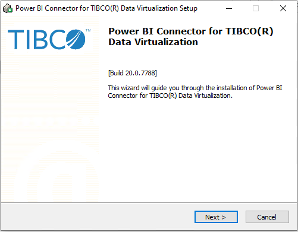
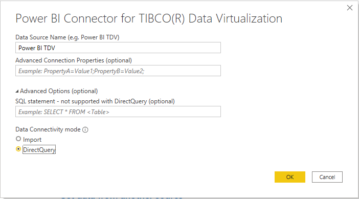
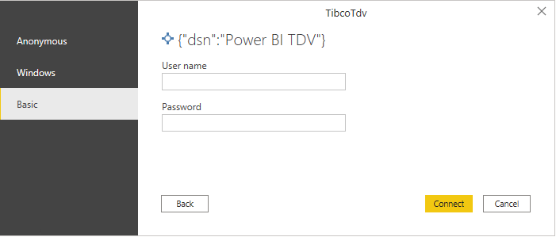

# TIBCO(R) Data Virtualization

## Summary

| Item | Description |
| ---- | ----------- |
| Release State | Preview |
| Products | Power BI (Datasets) Power BI (Dataflows) |
| Authentication Types Supported | Database (Username/Password) Windows Authentication (NTLM/Kerberos) |
| Function Reference Documentation | TBD |
| | |

## Prerequisites

The Power BI Connector for TIBCO(R) Data Virtualization must first be downloaded from <a href="https://edelivery.tibco.com">https://edelivery.tibco.com</a> and installed on the machine running Power BI Desktop.  

Once the connector is installed, a DSN must be configured to specify the connection properties needed to connect to the TIBCO(R) Data Virtualization server.  Note: The DSN architecture (32-bit or 64-bit) needs to match the architecture of the product where you intend to use the connector.

## Capabilities Supported

- Import
- DirectQuery (Power BI only, learn more)
- Advanced Connection Properties
- Advanced
  - Native SQL statement

## Connect to a TIBCO(R) Data Virtualization server from Power Query Desktop

Once the matching connector is installed and a DSN is configured, you can connect to a TIBCO(R) Data Virtualization server. To make the connection, take the following steps:

1. Select the **TIBCO(R) Data Virtualization** option in the connector selection.

2. In the **Power BI Connector for TIBCO(R) Data Virtualization** dialog that appears, provide the Data Source Name.

   

3. Select either the **Import** or **DirectQuery** data connectivity mode.

4. If this is the first time you're connecting to this database, select the desired authentication type and if applicable enter the needed credentials. Then select **Connect**.
   - **Anonymous**: Uses the credentials stored in the DSN.
   - **Basic**: Username/Password are submitted when creating the connection.
   - **Windows**: Authenticates using the current Windows user.  This authentication type requires the **SSO** connection property to be set.  When using Kerberos, the **Use Platform Kerberos API** must be set to true to use the current Windows user.

    

5. In **Navigator**, select the database information you want, then either select **Load** to load the data or **Transform Data** to continue transforming the data in Power Query Editor.

   

## Connect using advanced options

Power Query Desktop provides a set of advanced options that you can add to your query if needed.

The following table lists all of the advanced options you can set in Power Query Desktop.

| Advanced option	| Description |
| --------------- | ----------- |
| Advanced Connection Properties | Takes a semi-colon separated list of connection properties.  This is used to specify additional desired connection properties not configured in the DSN. |
| SQL statement | For information, go to [Import data from a database using native database query](../native-database-query.md). |
| | |

Once you've selected the advanced options you require, select **OK** in Power Query Desktop to connect to your TIBCO(R) Data Virtualization Server.
