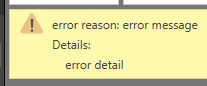
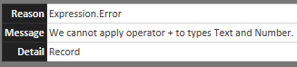

# Handling errors
Errors in Power Query generally halt query evaluation and display a message to the user.

## Throwing an error with the `error` expression
Throwing an error in Power Query is as simple as invoking the `error` expression.
```
let
    Source = "foo",
    Output = error "error message"
in
    Output
```


The [`Error.Record`](/powerquery-m/error-record) function can be used for more control.
```
let
    Source = "foo",
    Output = error Error.Record("error reason", "error message", "error detail")
in
    Output
```



## Catching an error with `try` and `otherwise`
The `try` expression converts values and errors into a record value that indicates whether the `try` expression handled an error or not, as well as the proper value of the error record.

If no error is found, the following record is returned from the `try` expression:
```
try "foo"
```


If an error is found, the following record is returned from the `try` expression:
```
try "foo"+1
```


The Error record contains **Reason**, **Message**, and **Detail** fields.



Depending on the error, the **Detail** field may contain additional information.

The `otherwise` clause can be used with a `try` expression to perform some action if an error occurs:
```
try "foo"+1 otherwise "There was an error"
```
is a more compact form of:
```
result = try "foo"+1,
if result[HasError] then "There was an error" else result[Value]
``` 
