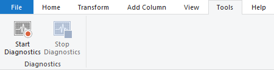
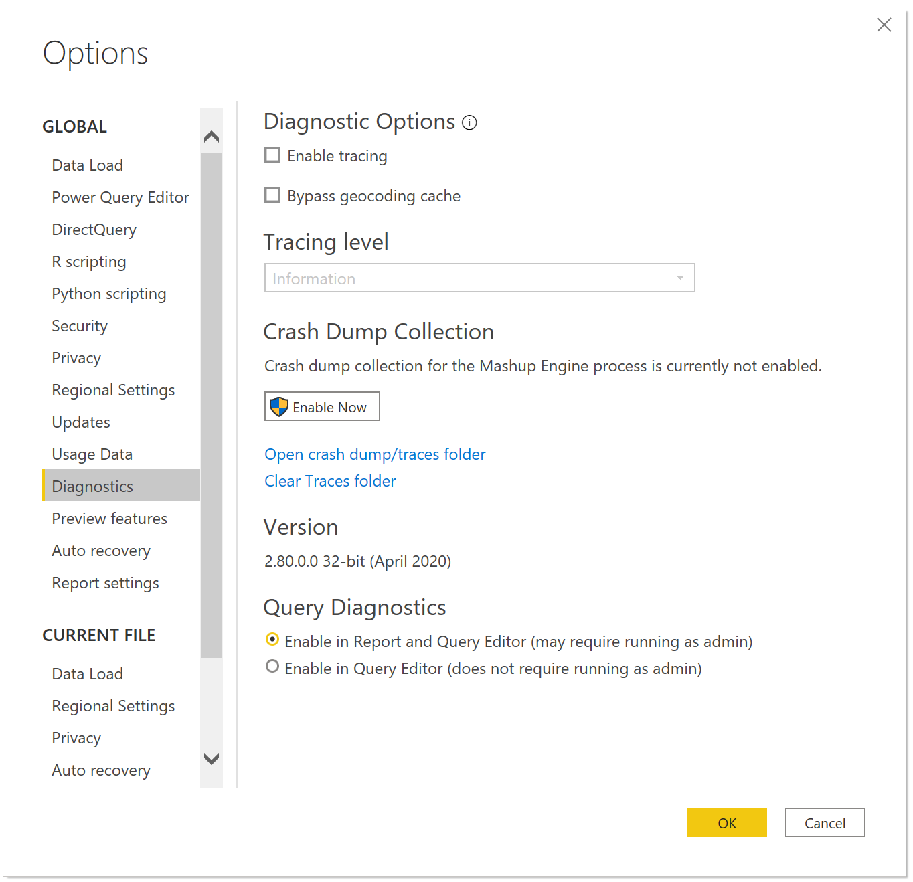

# Query Diagnostics

Query Diagnostics allows you to better understand what Power Query is doing at authoring and at refresh time in Power BI Desktop. While we will be expanding on this feature in the future, including allowing you to use it during full refreshes, at this time it allows you to understand what sort of queries you are emitting, what slowdowns you might run into during authoring refresh, and what kind of background events are happening.

To use Query Diagnostics, go to the 'Tools' tab in the Power Query Editor ribbon.

By default, Query Diagnostics may require administrative rights to run (depending on IT policy). If you find yourself unable to run Query Diagnostics, open the Power BI options page, Diagnostics tab, and select 'Enable in Query Editor (does not require running as admin)'. This will constrain you from being able to trace diagnostics when doing a full refresh into Power BI rather than the Power Query editor, but will allow you to still use it when previewing, authoring, etc.

Whenever you start diagnostics, Power Query will begin tracing any evaluations that you cause. The evaluation that most users think of is when you press refresh, or when you retrieve data for the first time, but there are many actions that can cause evaluations depending on the connector. For example, with the SQL connector, when you retrieve a list of values to filter, that would kick off an evaluation as well—but it doesn’t associate with a user query, and that’s represented in the diagnostics. Other system generated queries might include Navigator or “Get Data” experience.

When you press 'Diagnose Step', Power Query runs a special evaluation of just the step you're looking at and shows you the diagnostics for that step, without showing you the diagnostics for other steps in the query. This can make it much easier to get a narrow view into a problem.

It's important that if you're recording all traces that from 'Start Diagnostics' that you press 'Stop diagnostics'. This will allow the engine to collect the recorded traces and parse them into the proper output. Without this step you'll lose your traces.

## Types of Diagnostics

We currently provide three types of diagnostics, one of which has two levels of detail.

The first of these are the primary diagnostics, which have a detailed view and a summarized view: The summarized view is aimed to give you an immediate insight into where time is being spent in your query. The detailed view is much deeper, line by line, and will generally only be needed for serious diagnosing by power users.

For this view, some capabilities, like the “Data Source Query” column, are currently available only on certain connectors. We will be working to extend the breadth of this coverage in the future.

Data privacy partitions allow you to understand the logical partitions used for data privacy.

> [!NOTE]
> Power Query may perform evaluations that you may not have directly triggered. Some of these evaluations are performed in order to retrieve metadata so we can best optimize our queries or to provide a better user experience (such as retrieving the list of distinct values within a column that are displayed in the Filter Rows experience), and others might be related to how a connector handles parallel evaluations. At the same time, if you see in your query diagnostics repeated queries that you don't believe make sense, feel free to reach out through normal support channels--your feedback is how we improve our product.

## Summarized vs Detailed View

Query diagnostics provides two views:  summarized and detailed. The summarized view “collapses” multiple related operations into a single operation. In this process, details collected by each operation are combined, and the exclusive durations are summed. No information is lost as part of this process.

The summarized view provides an overview of what occurred during an evaluation for easy high level review. If for a specific operation, further breakdown is desired, the user can look at the group id and view the corresponding operations that were grouped within the detail view.

## Explaining Multiple Evaluations

When refreshing in the Power Query Editor, there's a lot done behind the scenes to attempt to give you a fluent user experience. As an example, when you ‘Refresh Preview’ the evaluator will execute the final step of each given Query, but then in the background it will sequentially run n-1 steps, n-2, steps, etc., so that if you step back through your steps it’s already available.

To keep this performant, currently some caching happens so that it doesn’t have to rerun every part of the final query plan as it goes back through the steps. While this is useful for normal authoring, it means that you will not always get correct step comparison information due to later evaluations pulling on cached data.

## Diagnostics Schema

### Id

When analyzing the results of a recording, it’s important to filter the recording session by Id, so that columns such as Exclusive Duration % make sense. 

Id is a composite identifier. It’s comprised of two numbers—one before the dot, and one after. The first number will be the same for all evaluations that resulted from a single user action. In other words, if I press refresh twice there’ll be two different numbers leading the dot, one for each user activity taken. This will be sequential for a given diagnostics recording.

The second number represents an evaluation by the engine. This will be sequential for the lifetime of the process where the evaluation is queued. If you run multiple diagnostics recording sessions, you will see this number continue to grow across the different sessions.
To summarize, if I start recording, press evaluation once, and stop recording, I’ll have some number of Ids in my diagnostics, but since I only took one action, they’ll all be 1.1, 1.2, 1.3, etc.

The combination of the activityId and the evaluationId, separated by the dot, provides a unique identifier for an evaluation for a single recording session.

### Query

The name of the Query in the left-hand pane of the Power Query editor.

### Step

The name of the Step in the right-hand pane of the Power Query editor. Things like filter dropdowns will generally associate with the step you’re filtering on, even if you’re not refreshing the step.

### Category

The category of the operation.

### Data Source Kind

This tells you what sort of data source you’re accessing, such as SQL or Oracle.
### Operation

The actual operation being performed. This can include evaluator work, opening connections, sending queries to the data source, and many more.

### Start Time

The time that the operation started.

### End Time

The time that the operation ended.

### Exclusive Duration (%)

The Exclusive Duration column of an event is the amount of time the event was active. This contrasts with the "duration" value that results from subtracting the values in an event's Start Time column and End Time column. This "duration" value represents the total time the elapsed between when an event began and when it ended, which may include times the event was in a suspended or inactive state and another event was consuming resources.

Exclusive duration % will add up to approximately 100% within a given evaluation, as represented by the “Id” column. For example, if you filter on rows with Id 1.x, the Exclusive Duration percentages would sum to approximately 100%. This will not be the case if you sum the Exclusive Duration % values of all rows in a given diagnostic table.

### Exclusive Duration

The absolute time, rather than %, of exclusive duration. The total duration (i.e. exclusive duration + time when the event was inactive) of an evaluation can be calculated in one of two ways:

1. Find the operation called “Evaluation”. The difference between End Time - Start Time will result in the total duration of an event.
2. Subtract the minimum start time of all operations within an event from the maximum end time. Note that in cases when the information collected for an event does not account for the total duration, an operation called “Trace Gaps” will be generated to account for this time gap.

### Resource

The resource you’re accessing for data. The exact format of this resource will depend on the data source.

### Data Source Query

Power Query does something called ‘Folding’, which is the act of running as many parts of the query against the back-end data source as possible. In Direct Query mode (over Power Query), where enabled, only transforms that fold will run. In import mode, transforms that can’t fold will instead be run locally.

The Data Source Query column allows you to see the query or HTTP request/response sent against the back-end data source. As you author your Query in the Editor, many Data Source Queries will be emitted. Some of these are the actual final Data Source Query to render the preview, but others may be for Data Profiling, Filter dropdowns, information on joins, retrieving metadata for schemas, and any number of other small queries.

In general, you shouldn’t be concerned by the number of Data Source Queries emitted unless there are specific reasons to be concerned, and should focus instead on making sure the proper content is being retrieved. This column might also help determine if the Power Query evaluation was fully folded. 

### Additional Info

There is a lot of information retrieved by our connectors. Many of it is ragged and doesn’t fit well into a standard columnar hierarchy. This is put in a record in the additional info column. Information logged from custom connectors will also appear here.

### Row Count

The number of rows returned by a Data Source Query. Not enabled on all connectors.

### Content Length

Content length returned by HTTP Requests, as commonly defined. This isn’t enabled in all connectors, and it won’t be accurate for connectors that retrieve requests in chunks.

### Is User Query
Boolean, indicates if it is a query authored by the user, and present  in the left hand pane or if it was generated by some other user action. Other user actions can include things such as Filter selection, or using the Navigator in the Get Data experience.

### Path

Path represents the relative route of the operation when viewed as part of an interval tree for all operations within a single evaluation. At the top (root) of the tree there’s a single operation called “Evaluation” with path “0”. The start time of this evaluation corresponds to the start of this evaluation as a whole. The end time of this evaluation shows when the whole evaluation finished. This top level operation has an exclusive duration of 0, as its only purpose it to serve as the root of the tree.
Further operations branch from the root. For example, an operation may have “0/1/5” as a path. This would be understood as:

* 0: tree root
* 1: current operation’s parent
* 5: index of current operation

Operation “0/1/5”, might have a child node, in which case, the path will have the form “0/1/5/8”, with 8 representing the index of the child.

### Group ID

Combining two (or more) operations will not occur if it leads to detail loss. The grouping is designed to approximate “commands” executed during the evaluation. In the detailed view, multiple operations will share a Group Id, corresponding to the groups that are aggregated in the Summary view. 

As with most columns, the group id is only relevant within a specific evaluation, as filtered by the Id column.

## Data Privacy Partitions Schema

### Id

Same as the id for the other query diagnostics results. The integer part represents a single activity id, while the fractional part represents a single evaluation.

### Partition Key

Corresponds to the Query/Step that is used as a firewall partition.

### Firewall Group

Categorization that explains why this partition has to be evaluated separately, includes details on the privacy level of the partition.

### Accessed Resources

List of resource paths of all the resources accessed by this partition, generally uniquely identifying a data source.

### Partition Inputs

List of partition keys upon which the current partition depends. (this could be used to build a graph)

### Expression

The expression that gets evaluated on top of the partition’s query/step. In several cases it coincides with the query/step.

### Start Time

Time when evaluation started for this partition.

### End Time

Time when evaluation ended for this partition.

### Duration

End Time – Start Time

### Exclusive Duration

If partitions are assumed to execute in a single thread, exclusive duration is the “real” duration that can be attributed to this partition.

### Exclusive duration %

Exclusive duration as a percentage.

### Diagnostics

This column only appears when the query diagnostics “Aggregated” or “Detailed” is also captured, allowing the user to correspond between the two diagnostics outputs.

## Performance Counters Schema

When you run performance counters, every half second Power Query will take a snapshot of resource utilization. This isn’t useful for very fast queries but can be helpful for queries that use up a lot more resources.

### Processor Time

### Total Processor Time

### IO Data Bytes per Second

### Commit (Bytes)

### Working Set (Bytes)

## Additional Reading

[How to record diagnostics in various use cases](RecordingQueryDiagnostics.md)

[More about reading and visualizing your recorded traces](ReadingQueryDiagnostics.md)

[How to understand what query operations are folding using Query Diagnostics](QueryDiagnosticsFolding.md)
